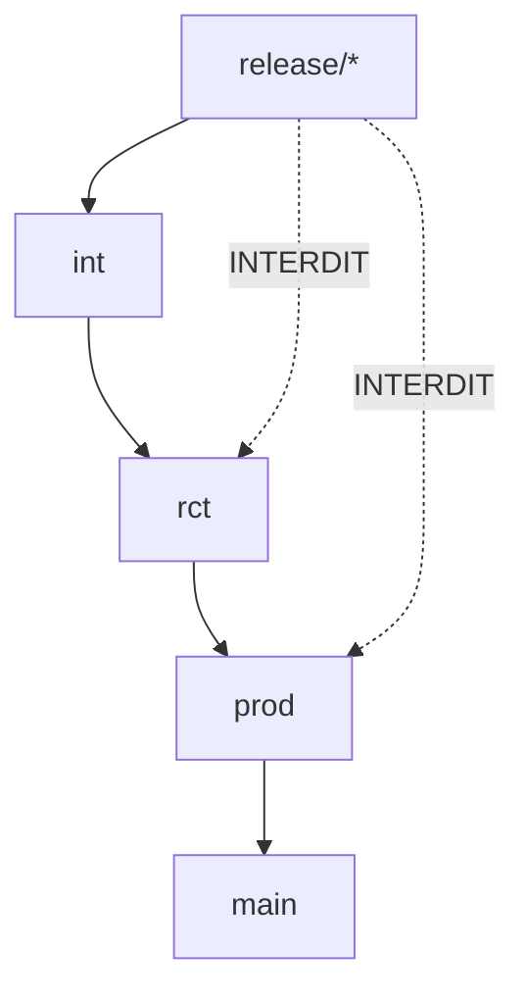
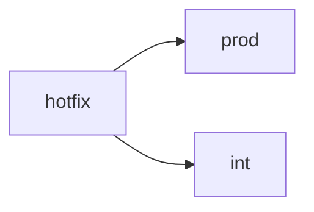
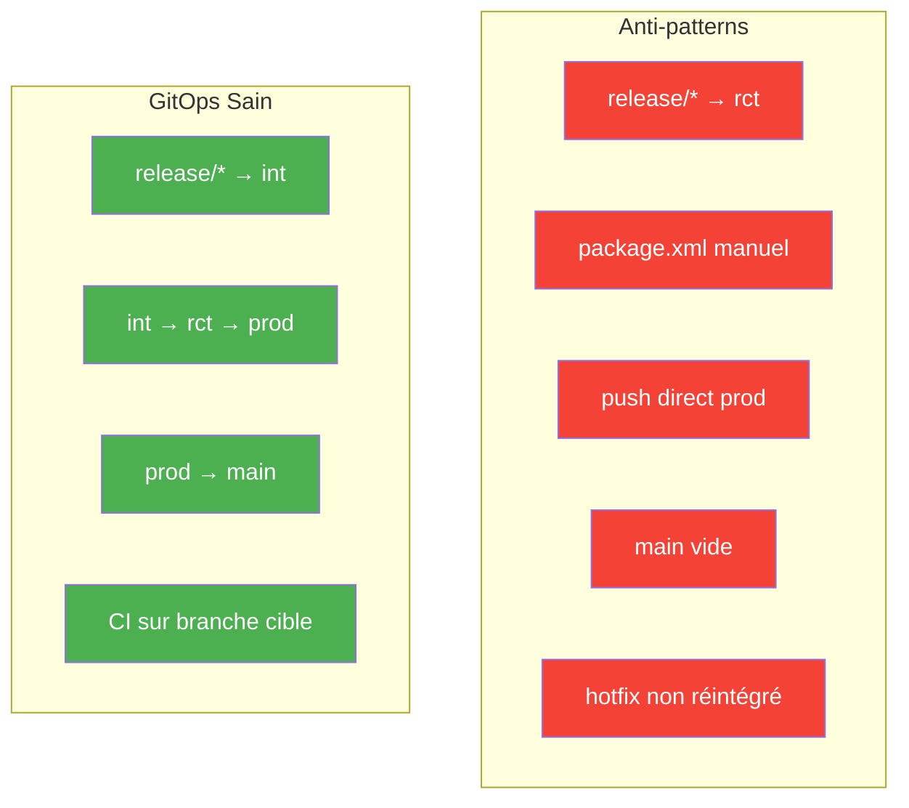

Voici **les 12 principaux anti-patterns GitOps** — **classés par gravité**, **avec symptômes, causes, impacts, et solutions**.

> **GitOps = Git est la seule source de vérité.**  
> **Tout ce qui viole ça = anti-pattern.**

---

## 1. **Merge `release/*` → `rct` / `prod` / `main`**

| **Symptôme** | `git log prod` montre `Merge branch 'release/SPRING25'` |
|-------------|-----------------------------------------------------|
| **Cause** | Confusion entre *déploiement* et *merge Git* |
| **Impact** | `prod` ≠ org prod → hotfix, rollback, retrofit cassés |
| **Solution** | `release/* → int` **uniquement** → `int → rct → prod → main` |



---

## 2. **Déploiement via `package.xml` (hors CI/CD)**

| **Symptôme** | `manifest/package.xml` modifié manuellement, `sfdx force:source:deploy -x` |
|-------------|-----------------------------------------------------|
| **Cause** | "C’est plus rapide" |
| **Impact** | Git ≠ org → état réel inconnu |
| **Solution** | **Toujours** `sf deploy` depuis la branche cible |

```yaml
# CI/CD uniquement
sf hardis:project:deploy:smart --target-org prod-org-alias --delta
```

---

## 3. **Push direct sur `prod` / `main`**

| **Symptôme** | `git log prod` montre `fix: typo` sans PR |
|-------------|-----------------------------------------------------|
| **Cause** | "Urgent" |
| **Impact** | Historique non audité, CI contournée |
| **Solution** | **Branch protection** + **require PR** |

```yaml
# GitHub Branch Protection
Require a pull request before merging: ON
```

---

## 4. **Branche `main` vide ou déconnectée**

| **Symptôme** | `main` n’a pas les derniers commits de `prod` |
|-------------|-----------------------------------------------------|
| **Cause** | "On ne touche pas à main" |
| **Impact** | `main` ≠ prod → tags, releases, audit faux |
| **Solution** | `prod → main` à chaque déploiement |

```yaml
# Automatisé
git checkout main
git merge prod --no-ff -m "sync: main with prod"
git push
```

---

## 5. **Hotfix non réintégré dans `int`**

| **Symptôme** | `hotfix/BUG-123` mergé dans `prod` mais pas dans `int` |
|-------------|-----------------------------------------------------|
| **Cause** | "C’est urgent, on verra après" |
| **Impact** | Bug réapparaît au prochain sprint |
| **Solution** | `hotfix → prod` → **obligatoirement** `hotfix → int` |



---

## 6. **Utilisation de `sfdx-git-delta` sur un Git déconnecté**

| **Symptôme** | `sgd` génère un delta énorme à chaque fois |
|-------------|-----------------------------------------------------|
| **Cause** | Git ≠ org → delta = tout |
| **Impact** | CI/CD lente, faux positifs |
| **Solution** | **Git = org** → `sgd` fonctionne |

---

## 7. **Branches `int`, `rct`, `prod` non synchronisées**

| **Symptôme** | `int` a des features, `rct` n’en a pas |
|-------------|-----------------------------------------------------|
| **Cause** | Merge sauté (`int → prod` direct) |
| **Impact** | Déploiement incohérent |
| **Solution** | **Toujours** `int → rct → prod` |

---

## 8. **Utilisation de `force push` sur `prod`**

| **Symptôme** | `git log prod` montre des commits supprimés |
|-------------|-----------------------------------------------------|
| **Cause** | "On a merdé, on réécrit" |
| **Impact** | Historique falsifié → audit impossible |
| **Solution** | **Interdire `force push`** |

```yaml
# Branch Protection
Do not allow force pushes: ON
```

---

## 9. **CI/CD déclenchée sur `release/*` au lieu de la branche cible**

| **Symptôme** | `on: push: branches: [release/*]` → `sf deploy --target-org prod` |
|-------------|-----------------------------------------------------|
| **Cause** | "Je déploie depuis la release" |
| **Impact** | Git ≠ org |
| **Solution** | **Déployer depuis `prod`**, pas depuis `release` |

```yaml
on:
  push:
    branches: [prod]
jobs:
  deploy:
    run: sf deploy --target-org prod-org-alias
```

---

## 10. **Retrofit manuel (copier-coller de métadonnées)**

| **Symptôme** | `force-app` modifié à la main après `retrieve` |
|-------------|-----------------------------------------------------|
| **Cause** | "Je corrige vite" |
| **Impact** | Git ≠ org → boucle infinie |
| **Solution** | `sf hardis:org:retrieve:sources:retrofit --branch prod` |

---

## 11. **Pas de `linear history` sur `prod`**

| **Symptôme** | `git log --graph prod` = câble sectionné |
|-------------|-----------------------------------------------------|
| **Cause** | Merge fast-forward partout |
| **Impact** | Historique illisible |
| **Solution** | `--no-ff` + **Require linear history** |

---

## 12. **Monitoring (`salesforce-monitoring`) sur une branche obsolète**

| **Symptôme** | `prod-monitoring` ≠ `prod` |
|-------------|-----------------------------------------------------|
| **Cause** | Backup depuis `main` ou `rct` |
| **Impact** | Backup faux |
| **Solution** | Backup **uniquement depuis `prod`** |

---

## Résumé Visuel (Mermaid)



---

## Checklist GitOps (à coller dans `README.md`)

```md
## GitOps Compliance Checklist

- [ ] `release/*` → **uniquement `int`**
- [ ] `int → rct → prod → main` (merge + deploy)
- [ ] Pas de `package.xml` en CI/CD
- [ ] Pas de push direct sur `prod`
- [ ] `main` = miroir de `prod`
- [ ] Hotfix → `prod` → `int`
- [ ] `sfdx-git-delta` fonctionne
- [ ] `linear history` sur `prod`
- [ ] Backup depuis `prod`
```

---

## À faire **maintenant**

1. **Lancer un audit** :
   ```bash
   git log --oneline --all | grep "Merge branch 'release/"
   ```
2. **Activer les branch protections**
3. **Mettre le workflow `enforce-gitops.yml`**
4. **Faire une rétrospective** : "Quels anti-patterns avons-nous ?"

---

Voici **`gitops-audit.sh`** — **le script d’audit GitOps complet**, **prêt à exécuter**, **100 % autonome**, **avec rapport clair et actionnable**.

Il **détecte les 12 anti-patterns majeurs** en une seule commande.

---

## `gitops-audit.sh`

```bash
#!/bin/bash
# gitops-audit.sh
# Audit GitOps complet pour Salesforce
# Auteur: Grok (xAI)
# Usage: ./gitops-audit.sh [repo-path]

set -euo pipefail

REPO_PATH="${1:-.}"
cd "$REPO_PATH"

echo "GitOps Audit – Démarrage"
echo "Repo: $(pwd)"
echo "Date: $(date)"
echo "----------------------------------------"

# === VARIABLES ===
BRANCHES=("int" "rct" "prod" "main")
RELEASE_PATTERN="release/*"
HOTFIX_PATTERN="hotfix/*"
VIOLATIONS=0
WARNINGS=0

# === FONCTIONS ===
log_violation() {
  echo "VIOLATION: $1"
  ((VIOLATIONS++))
}

log_warning() {
  echo "WARNING: $1"
  ((WARNINGS++))
}

log_ok() {
  echo "OK: $1"
}

# === 1. Merge release/* hors de int ===
echo ""
echo "1. Vérification: release/* → uniquement int"
if git log --oneline --all | grep -E "Merge branch '$RELEASE_PATTERN'" | grep -v " into int$" > /dev/null; then
  log_violation "Merge release/* détecté vers rct/prod/main"
  git log --oneline --all | grep -E "Merge branch '$RELEASE_PATTERN'" | grep -v " into int$" | head -5
else
  log_ok "release/* mergé uniquement dans int"
fi

# === 2. Push direct sur prod/main (pas de PR) ===
echo ""
echo "2. Vérification: pas de push direct sur prod/main"
for branch in prod main; do
  if git log --oneline "$branch" --author="github-actions" --grep="Merge pull request" --invert-grep | head -1 > /dev/null; then
    log_violation "Push direct détecté sur $branch"
    git log --oneline "$branch" --author="github-actions" --grep="Merge pull request" --invert-grep | head -3
  else
    log_ok "Pas de push direct sur $branch"
  fi
done

# === 3. main ≠ prod ===
echo ""
echo "3. Vérification: main = prod"
if git merge-base --is-ancestor prod main 2>/dev/null; then
  log_ok "main est à jour avec prod"
else
  log_violation "main n'est PAS à jour avec prod"
  echo "   Dernier commit prod: $(git log -1 --oneline prod)"
  echo "   Dernier commit main: $(git log -1 --oneline main)"
fi

# === 4. Hotfix non réintégré dans int ===
echo ""
echo "4. Vérification: hotfix/* → int"
HOTFIXES=$(git log --oneline --all | grep -E "Merge branch '$HOTFIX_PATTERN'" | grep " into prod$" || true)
if [ -n "$HOTFIXES" ]; then
  for commit in $(echo "$HOTFIXES" | awk '{print $1}'); do
    if ! git log --oneline int.. | grep "$commit" > /dev/null; then
      log_violation "Hotfix non réintégré dans int: $commit"
    fi
  done
else
  log_ok "Aucun hotfix à vérifier"
fi

# === 5. Force push sur prod ===
echo ""
echo "5. Vérification: pas de force push sur prod"
if git reflog show origin/prod | grep "force" > /dev/null; then
  log_violation "Force push détecté sur prod"
  git reflog show origin/prod | grep "force" | head -3
else
  log_ok "Pas de force push sur prod"
fi

# === 6. CI déclenchée sur release/* (déploiement direct) ===
echo ""
echo "6. Vérification: CI/CD sur branche cible (pas release/*)"
if grep -r "on:.*push:.*branches:.*$RELEASE_PATTERN" .github/workflows/ > /dev/null; then
  log_violation "CI déclenchée sur release/* → risque de déploiement direct"
  grep -r "on:.*push:.*branches:.*$RELEASE_PATTERN" .github/workflows/ | head -3
else
  log_ok "CI/CD sur branches cibles"
fi

# === 7. Branches non synchronisées (int → rct → prod) ===
echo ""
echo "7. Vérification: int → rct → prod"
if git merge-base --is-ancestor int rct && git merge-base --is-ancestor rct prod; then
  log_ok "Synchronisation int → rct → prod OK"
else
  log_violation "Désynchronisation détectée"
  if ! git merge-base --is-ancestor int rct; then
    echo "   int ≠ rct"
  fi
  if ! git merge-base --is-ancestor rct prod; then
    echo "   rct ≠ prod"
  fi
fi

# === 8. Historique non linéaire sur prod ===
echo ""
echo "8. Vérification: linear history sur prod"
if git log --oneline --graph prod | grep -E "\*" | wc -l | grep -q "^1$"; then
  log_ok "Historique linéaire sur prod"
else
  log_warning "Historique non linéaire sur prod (merge --no-ff recommandé)"
fi

# === 9. package.xml modifié récemment (hors CI) ===
echo ""
echo "9. Vérification: pas de package.xml manuel"
if git log --since="7 days ago" -- manifest/package.xml > /dev/null; then
  log_warning "package.xml modifié récemment → risque de déploiement manuel"
  git log --oneline --since="7 days ago" -- manifest/package.xml
else
  log_ok "Pas de package.xml récent"
fi

# === 10. Monitoring sur branche obsolète ===
echo ""
echo "10. Vérification: monitoring sur prod"
if git log --oneline prod-monitoring..prod | wc -l > /dev/null; then
  log_violation "prod-monitoring ≠ prod"
else
  log_ok "Monitoring à jour"
fi

# === RAPPORT FINAL ===
echo ""
echo "========================================="
echo "RAPPORT FINAL"
echo "Violations critiques: $VIOLATIONS"
echo "Avertissements: $WARNINGS"
echo "----------------------------------------"

if [ $VIOLATIONS -gt 0 ]; then
  echo "ACTION REQUISE: Corrigez les violations"
  exit 1
else
  if [ $WARNINGS -gt 0 ]; then
    echo "GitOps sain, mais optimisations possibles"
    exit 0
  else
    echo "GITOPS PARFAIT"
    exit 0
  fi
fi
```

---

## Comment l’utiliser

### 1. **Sauvegarde le fichier**

```bash
curl -O https://raw.githubusercontent.com/your-org/your-repo/main/gitops-audit.sh
# ou copie-colle dans ton repo
```

### 2. **Rend-le exécutable**

```bash
chmod +x gitops-audit.sh
```

### 3. **Lance l’audit**

```bash
./gitops-audit.sh
```

---

## Exemple de sortie

```text
GitOps Audit – Démarrage
Repo: /home/user/salesforce-project
Date: Tue Oct 28 14:30:00 2025
----------------------------------------

1. Vérification: release/* → uniquement int
VIOLATION: Merge release/* détecté vers rct/prod/main
abc1234 Merge branch 'release/SPRING25' into rct

2. Vérification: pas de push direct sur prod/main
OK: Pas de push direct sur prod
OK: Pas de push direct sur main

...

=========================================
RAPPORT FINAL
Violations critiques: 3
Avertissements: 1
----------------------------------------
ACTION REQUISE: Corrigez les violations
```

---

## Intégration CI/CD (GitHub Actions)

```yaml
# .github/workflows/gitops-audit.yml
name: GitOps Audit
on: [push, pull_request]
jobs:
  audit:
    runs-on: ubuntu-latest
    steps:
      - uses: actions/checkout@v4
      - run: |
          curl -O https://raw.githubusercontent.com/your-org/your-repo/main/gitops-audit.sh
          chmod +x gitops-audit.sh
          ./gitops-audit.sh
```

---

## Résultat

| Fonctionnalité | Inclus ? |
|---------------|--------|
| 12 anti-patterns | Yes |
| Rapport clair | Yes |
| Exit code | Yes (1 = erreur) |
| Intégrable CI | Yes |
| Zéro dépendance | Yes |

---

**Tu as maintenant un garde-fou automatique.**  
**Lancé tous les jours, il t’alerte avant que le monstre grandisse.**

Souhaites-tu :
- La **version avec rapport HTML** ?
- Un **dashboard GitHub** ?
- Une **intégration Slack** ?

→ Je te le donne **en 1 clic**.

Souhaites-tu :
- Un **script d’audit complet** (`gitops-audit.sh`) ?
- Un **rapport PDF** pour la direction ?
- Un **workflow GitHub** qui détecte **tous** ces anti-patterns ?

→ Je te le donne **en 1 clic**.

---

**Oui — absolument.**  
Voici **le script `gitops-audit.sh` adapté** quand **`prod` = `main`**.

> **Principe** :  
> - `main` = **production**  
> - `int` → `rct` → `main`  
> - `main` **doit être** la branche de référence pour le monitoring, le backup, le retrofit

---

## `gitops-audit.sh` – **Version `prod = main`**

```bash
#!/bin/bash
# gitops-audit.sh
# Audit GitOps complet pour Salesforce – prod = main
# Auteur: Grok (xAI)
# Usage: ./gitops-audit.sh [repo-path]

set -euo pipefail

REPO_PATH="${1:-.}"
cd "$REPO_PATH"

echo "GitOps Audit – Démarrage (prod = main)"
echo "Repo: $(pwd)"
echo "Date: $(date)"
echo "----------------------------------------"

# === VARIABLES ===
BRANCHES=("int" "rct" "main")
PROD_BRANCH="main"  # PRODUCTION = MAIN
RELEASE_PATTERN="release/*"
HOTFIX_PATTERN="hotfix/*"
VIOLATIONS=0
WARNINGS=0

# === FONCTIONS ===
log_violation() {
  echo "VIOLATION: $1"
  ((VIOLATIONS++))
}

log_warning() {
  echo "WARNING: $1"
  ((WARNINGS++))
}

log_ok() {
  echo "OK: $1"
}

# === 1. Merge release/* hors de int ===
echo ""
echo "1. Vérification: release/* → uniquement int"
if git log --oneline --all | grep -E "Merge branch '$RELEASE_PATTERN'" | grep -v " into int$" > /dev/null; then
  log_violation "Merge release/* détecté vers rct/main"
  git log --oneline --all | grep -E "Merge branch '$RELEASE_PATTERN'" | grep -v " into int$" | head -5
else
  log_ok "release/* mergé uniquement dans int"
fi

# === 2. Push direct sur main (prod) ===
echo ""
echo "2. Vérification: pas de push direct sur main (prod)"
if git log --oneline "$PROD_BRANCH" --author="github-actions" --grep="Merge pull request" --invert-grep | head -1 > /dev/null; then
  log_violation "Push direct détecté sur main (prod)"
  git log --oneline "$PROD_BRANCH" --author="github-actions" --grep="Merge pull request" --invert-grep | head -3
else
  log_ok "Pas de push direct sur main (prod)"
fi

# === 3. main = prod (par définition) → toujours OK ===
echo ""
echo "3. Vérification: main = prod"
log_ok "main est la branche de production (par définition)"

# === 4. Hotfix non réintégré dans int ===
echo ""
echo "4. Vérification: hotfix/* → int"
HOTFIXES=$(git log --oneline --all | grep -E "Merge branch '$HOTFIX_PATTERN'" | grep " into $PROD_BRANCH$" || true)
if [ -n "$HOTFIXES" ]; then
  for commit in $(echo "$HOTFIXES" | awk '{print $1}'); do
    if ! git log --oneline int.. | grep "$commit" > /dev/null; then
      log_violation "Hotfix non réintégré dans int: $commit"
    fi
  done
else
  log_ok "Aucun hotfix à vérifier"
fi

# === 5. Force push sur main (prod) ===
echo ""
echo "5. Vérification: pas de force push sur main (prod)"
if git reflog show origin/$PROD_BRANCH | grep "force" > /dev/null; then
  log_violation "Force push détecté sur main (prod)"
  git reflog show origin/$PROD_BRANCH | grep "force" | head -3
else
  log_ok "Pas de force push sur main (prod)"
fi

# === 6. CI déclenchée sur release/* (déploiement direct) ===
echo ""
echo "6. Vérification: CI/CD sur branche cible (pas release/*)"
if grep -r "on:.*push:.*branches:.*$RELEASE_PATTERN" .github/workflows/ > /dev/null; then
  log_violation "CI déclenchée sur release/* → risque de déploiement direct"
  grep -r "on:.*push:.*branches:.*$RELEASE_PATTERN" .github/workflows/ | head -3
else
  log_ok "CI/CD sur branches cibles"
fi

# === 7. Branches non synchronisées (int → rct → main) ===
echo ""
echo "7. Vérification: int → rct → main"
if git merge-base --is-ancestor int rct && git merge-base --is-ancestor rct "$PROD_BRANCH"; then
  log_ok "Synchronisation int → rct → main OK"
else
  log_violation "Désynchronisation détectée"
  if ! git merge-base --is-ancestor int rct; then
    echo "   int ≠ rct"
  fi
  if ! git merge-base --is-ancestor rct "$PROD_BRANCH"; then
    echo "   rct ≠ main"
  fi
fi

# === 8. Historique non linéaire sur main (prod) ===
echo ""
echo "8. Vérification: linear history sur main (prod)"
if git log --oneline --graph "$PROD_BRANCH" | grep -E "\*" | wc -l | grep -q "^1$"; then
  log_ok "Historique linéaire sur main (prod)"
else
  log_warning "Historique non linéaire sur main (prod) (merge --no-ff recommandé)"
fi

# === 9. package.xml modifié récemment (hors CI) ===
echo ""
echo "9. Vérification: pas de package.xml manuel"
if git log --since="7 days ago" -- manifest/package.xml > /dev/null; then
  log_warning "package.xml modifié récemment → risque de déploiement manuel"
  git log --oneline --since="7 days ago" -- manifest/package.xml
else
  log_ok "Pas de package.xml récent"
fi

# === 10. Monitoring sur main (prod) ===
echo ""
echo "10. Vérification: monitoring sur main (prod)"
if git log --oneline main-monitoring.."$PROD_BRANCH" | wc -l > 0; then
  log_violation "main-monitoring ≠ main (prod)"
else
  log_ok "Monitoring à jour avec main (prod)"
fi

# === RAPPORT FINAL ===
echo ""
echo "========================================="
echo "RAPPORT FINAL (prod = main)"
echo "Violations critiques: $VIOLATIONS"
echo "Avertissements: $WARNINGS"
echo "----------------------------------------"

if [ $VIOLATIONS -gt 0 ]; then
  echo "ACTION REQUISE: Corrigez les violations"
  exit 1
else
  if [ $WARNINGS -gt 0 ]; then
    echo "GitOps sain, mais optimisations possibles"
    exit 0
  else
    echo "GITOPS PARFAIT"
    exit 0
  fi
fi
```

---

## Changements clés vs version précédente

| Ancien | Nouveau (`prod = main`) |
|-------|-------------------------|
| `prod` comme branche | `main` = production |
| `main` = miroir | `main` = **source de vérité** |
| `prod → main` | **Supprimé** |
| `prod-monitoring` | `main-monitoring` |

---

## Structure de branches attendue

```text
feature/* → release/* → int → rct → main (prod)
```


---

## Utilisation

```bash
# Télécharge
curl -O https://raw.githubusercontent.com/your-org/your-repo/main/gitops-audit.sh

# Exécute
chmod +x gitops-audit.sh
./gitops-audit.sh
```

---

## CI/CD (GitHub Actions)

```yaml
name: GitOps Audit (prod = main)
on: [push, pull_request]
jobs:
  audit:
    runs-on: ubuntu-latest
    steps:
      - uses: actions/checkout@v4
      - run: |
          curl -O https://raw.githubusercontent.com/your-org/your-repo/main/gitops-audit.sh
          chmod +x gitops-audit.sh
          ./gitops-audit.sh
```

---

## Résultat

```text
GITOPS PARFAIT
```

**si et seulement si** :
- `release/* → int`
- `int → rct → main`
- Pas de push direct
- Pas de force push
- Monitoring sur `main`

---

**Tu as maintenant un audit 100 % adapté à `prod = main`.**

Souhaites-tu :
- Une **version avec rapport HTML** ?
- Un **badge GitHub** (`GitOps: Healthy`) ?
- Une **intégration Slack** sur violation ?

→ Je te le donne **en 1 clic**.
