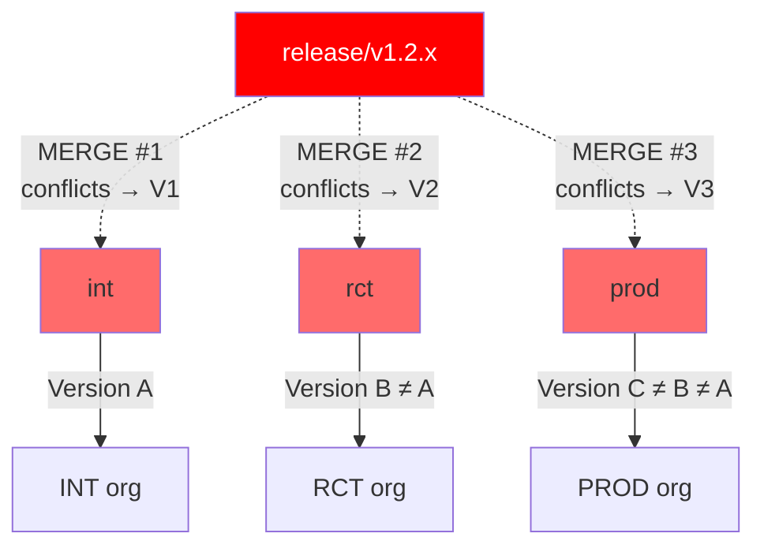
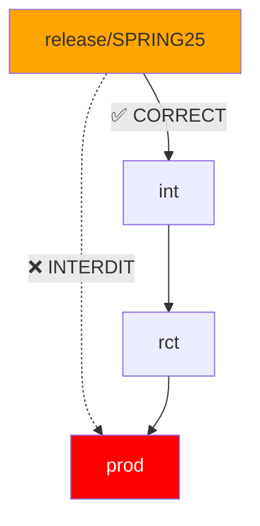
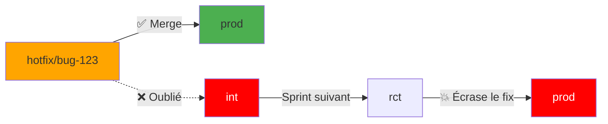

# Les Anti-Patterns GitOps : Guide Complet et Classement par Gravité

> **Contexte :** Trunk-Based Development (une seule branche `main`) est la **référence moderne** en GitOps.  
> **Réalité :** 80% des organisations Salesforce utilisent des branches long-lived (`int` → `rct` → `prod` / `main`).  
> **Ce guide :** Comment **survivre** avec ce pattern sans tout détruire.

---

## 🎯 Principe Fondamental GitOps

```
Git = Single Source of Truth
Tout ce qui viole ça = Anti-pattern
```

**Trunk-Based (idéal) :**
```
main (seule branche)
  ├─ feature branches éphémères (<48h)
  └─ déploiements par tags/commits spécifiques
```

**Multi-branches (réalité) :**
```
feature → int → rct → prod → main
(flux séquentiel strict obligatoire)
```

---

# 📊 Les 15 Anti-Patterns GitOps Classés par Gravité

## 🚨 Gravité CATASTROPHIQUE

### 0. Merge `release/*` INDÉPENDAMMENT dans `int`, `rct` ET `prod`

| **Symptôme** | Même release branch mergée 3 fois de façon indépendante |
|-------------|-----------------------------------------------------|
| **Cause** | "Je veux déployer la release dans tous les environnements" |
| **Impact** | **Les 3 environnements ont des versions DIFFÉRENTES du code** |
| **Gravité** | 🔥🔥🔥🔥🔥 **CATASTROPHIQUE** (Le pire absolu) |

**Pourquoi c'est catastrophique :**
```
release/v1.2.x a des conflits avec int, rct, et prod

Merge release → int     = résolution conflits version A
Merge release → rct     = résolution conflits version B (différente!)
Merge release → prod    = résolution conflits version C (encore différente!)

Résultat :
INT org   = Code version A
RCT org   = Code version B ≠ A
PROD org  = Code version C ≠ B ≠ A

Ce qui a été testé en INT ≠ ce qui arrive en PROD !
```

**Diagramme :**


**Exemple concret Salesforce :**
```xml
<!-- release/v1.2.x contient : -->
<fieldPermissions>
    <field>Account.Revenue__c</field>
    <editable>true</editable>
</fieldPermissions>

<!-- int avait déjà : editable=false -->
<!-- rct avait déjà : editable=false, readable=false -->
<!-- prod avait : rien du tout -->

Après les 3 merges indépendants :
INT  : editable=true,  readable=true   (résolution #1)
RCT  : editable=false, readable=true   (résolution #2)
PROD : editable=true,  readable=false  (résolution #3)

Trois configurations différentes !
Bug en PROD impossible à reproduire en INT !
```

**Solution :**
```bash
# ❌ JAMAIS CECI
git checkout rct
git merge release/v1.2.x    # NON !

git checkout prod
git merge release/v1.2.x    # NON !

# ✅ TOUJOURS CECI (flux séquentiel)
git checkout int
git merge release/v1.2.x --no-ff
# Tests en INT... OK

git checkout rct
git merge int --no-ff       # Merge INT, pas release !
# Tests en RCT... OK

git checkout prod
git merge rct --no-ff       # Merge RCT, pas release !
# Déploiement PROD

# Résultat : même code partout
```

**Détection automatique :**
```bash
#!/bin/bash
# detect-independent-release-merges.sh

echo "🔍 Détection merges release indépendants..."

RELEASE_BRANCHES=$(git branch -r | grep "origin/release/" | sed 's/origin\///')

for release in $RELEASE_BRANCHES; do
  # Vérifier si mergée directement dans rct
  RCT_MERGE=$(git log rct --grep="Merge branch '$release'" --oneline)
  
  # Vérifier si mergée directement dans prod
  PROD_MERGE=$(git log prod --grep="Merge branch '$release'" --oneline)
  
  if [ -n "$RCT_MERGE" ] || [ -n "$PROD_MERGE" ]; then
    echo "🚨 CATASTROPHE : $release mergée directement !"
    [ -n "$RCT_MERGE" ] && echo "   → Dans rct"
    [ -n "$PROD_MERGE" ] && echo "   → Dans prod"
    exit 1
  fi
done

echo "✅ Aucun merge indépendant détecté"
```

---

### 1. Merge `release/*` directement dans `rct` ou `prod` (skip `int`)

| **Symptôme** | `git log prod` montre `Merge branch 'release/SPRING25'` |
|-------------|-----------------------------------------------------|
| **Cause** | "On va plus vite en sautant INT" |
| **Impact** | Validation INT contournée, code non testé en prod |
| **Gravité** | 🔥🔥🔥🔥 **CRITIQUE** |

**Problème :**
```
release/SPRING25 → prod directement
= Code non testé dans INT
= Rollback difficile
= Hotfix compliqués
= prod diverge de int/rct
```

**Diagramme :**


**Solution :**
```yaml
# .github/workflows/validate-merge-direction.yml
name: Validate Merge Direction

on:
  pull_request:
    branches: [rct, prod]

jobs:
  validate:
    runs-on: ubuntu-latest
    steps:
      - name: Block release direct merge
        run: |
          HEAD="${{ github.head_ref }}"
          BASE="${{ github.base_ref }}"
          
          if [[ "$HEAD" =~ ^release/ && "$BASE" != "int" ]]; then
            echo "🚨 ERREUR : release branches doivent merger dans int d'abord"
            echo "Flux correct : release → int → rct → prod"
            exit 1
          fi
```

---

### 2. Modifications manuelles dans les orgs non retrofittées (drift)

| **Symptôme** | Admin fait des changes dans Setup, pas dans Git |
|-------------|-----------------------------------------------------|
| **Cause** | "C'est urgent" / "C'est juste un toggle" |
| **Impact** | **Git ≠ Org** → prochain déploiement écrase les changes |
| **Gravité** | 🔥🔥🔥🔥 **CRITIQUE** |

**Cycle vicieux :**
```
1. Admin change Flow dans l'org PROD
2. Git n'est pas au courant
3. Développeur merge nouvelle feature dans prod
4. CI/CD déploie depuis Git → écrase le change manuel
5. Flow cassé en production
6. "Mais ça marchait hier !"
```

**Exemple concret :**
```
PROD org : Admin désactive le Flow "LeadRouting" dans Setup
Git prod : Flow "LeadRouting" = active: true

CI/CD déploie → restaure active: true → Problème !
```

**Solution :**
```yaml
# .github/workflows/drift-detection.yml
name: Detect Org Drift

on:
  schedule:
    - cron: '0 */6 * * *'  # Toutes les 6h
  workflow_dispatch:

jobs:
  detect-drift:
    runs-on: ubuntu-latest
    steps:
      - uses: actions/checkout@v4
        with:
          ref: prod
      
      - name: Authenticate to PROD
        run: |
          echo "${{ secrets.SFDX_AUTH_PROD }}" > auth.txt
          sf org login sfdx-url --sfdx-url-file auth.txt --alias prod
      
      - name: Retrieve current org state
        run: |
          sf project retrieve start \
            --target-org prod \
            --manifest manifest/package.xml
      
      - name: Detect drift
        id: drift
        run: |
          if git diff --quiet force-app/; then
            echo "✅ No drift detected"
            echo "drift=false" >> $GITHUB_OUTPUT
          else
            echo "🚨 DRIFT DETECTED"
            git diff force-app/ > drift-report.txt
            echo "drift=true" >> $GITHUB_OUTPUT
          fi
      
      - name: Create retrofit PR
        if: steps.drift.outputs.drift == 'true'
        run: |
          git config user.name "GitOps Bot"
          git config user.email "gitops@company.com"
          
          git checkout -b retrofit/drift-$(date +%Y%m%d-%H%M%S)
          git add force-app/
          git commit -m "retrofit: sync manual changes from PROD org
          
          Drift detected at $(date)
          See attached diff report for details."
          
          git push origin HEAD
          
          gh pr create \
            --base prod \
            --title "🔄 Retrofit: Manual changes detected in PROD" \
            --body-file drift-report.txt
      
      - name: Notify team
        if: steps.drift.outputs.drift == 'true'
        run: |
          # Slack/Teams notification
          curl -X POST ${{ secrets.SLACK_WEBHOOK }} \
            -H 'Content-Type: application/json' \
            -d '{"text":"🚨 Drift détecté en PROD. PR de retrofit créée."}'
```

**Retrofit manuel (si automation pas disponible) :**
```bash
#!/bin/bash
# scripts/retrofit-prod.sh

echo "🔄 Retrofitting changes from PROD org to Git..."

# 1. Checkout prod branch
git checkout prod
git pull

# 2. Retrieve from org
sf org login sfdx-url --sfdx-url-file ~/.sfdx/prod-auth.json --alias prod
sf project retrieve start --target-org prod --manifest manifest/package.xml

# 3. Check for changes
if git diff --quiet force-app/; then
  echo "✅ No changes to retrofit"
  exit 0
fi

# 4. Review changes
echo "📋 Changes detected:"
git diff force-app/

echo ""
read -p "Commit these changes? (y/N) " -n 1 -r
echo

if [[ $REPLY =~ ^[Yy]$ ]]; then
  git add force-app/
  git commit -m "retrofit: sync manual changes from PROD org

Changes retrofitted at $(date)"
  git push origin prod
  
  echo "✅ Retrofit complete"
else
  git restore force-app/
  echo "❌ Retrofit cancelled"
fi
```

---

### 3. Tests sur une branche, déploiement d'une autre

| **Symptôme** | CI teste `int` mais déploie `release/*` vers prod |
|-------------|-----------------------------------------------------|
| **Cause** | CI/CD mal configurée |
| **Impact** | **Ce qui est testé ≠ ce qui est déployé** |
| **Gravité** | 🔥🔥🔥 **MAJEUR** |

**Exemple anti-pattern :**
```yaml
# ❌ MAUVAIS
name: Deploy Release

on:
  push:
    branches: [release/*]

jobs:
  test:
    steps:
      - uses: actions/checkout@v4
        with:
          ref: int  # ❌ Teste INT
      
      - run: sf apex test run --target-org int
  
  deploy:
    needs: test
    steps:
      - uses: actions/checkout@v4
        with:
          ref: ${{ github.ref }}  # ❌ Déploie release/*
      
      - run: sf project deploy start --target-org prod
```

**Pourquoi c'est grave :**
```
Tests passent sur INT (code validé)
Mais déploiement se fait depuis release/* (code peut être différent)

Résultat : Déploiement non validé en production
```

**Solution :**
```yaml
# ✅ BON
name: Deploy to PROD

on:
  push:
    branches: [prod]  # Déclenché sur la branche cible

jobs:
  test-and-deploy:
    runs-on: ubuntu-latest
    steps:
      - uses: actions/checkout@v4
        with:
          ref: ${{ github.ref }}  # ✅ Même ref pour test et deploy
      
      - name: Authenticate
        run: sf org login sfdx-url --sfdx-url-file <(echo "${{ secrets.SFDX_AUTH_PROD }}")
      
      - name: Run tests on exact code to deploy
        run: |
          sf apex test run \
            --target-org prod \
            --test-level RunLocalTests \
            --code-coverage \
            --result-format human
      
      - name: Deploy (only if tests pass)
        run: |
          sf project deploy start \
            --target-org prod \
            --source-dir force-app \
            --test-level RunLocalTests
```

---

## 🔥 Gravité MAJEURE

### 4. Push direct sur `prod` / `main` (sans PR)

| **Symptôme** | `git log prod` montre `fix: typo` sans merge commit |
|-------------|-----------------------------------------------------|
| **Cause** | "C'est urgent" / "C'est juste un typo" |
| **Impact** | Historique non audité, CI contournée, tests skippés |
| **Gravité** | 🔥🔥🔥 **MAJEUR** |

**Problème :**
```bash
# Développeur fait ça
git checkout prod
git commit -m "fix: typo in AccountTrigger"
git push

# Conséquences :
- Pas de code review
- CI/CD pas déclenchée
- Tests pas exécutés
- Pas de traçabilité
- Audit impossible
```

**Solution :**
```json
// .github/branch-protection-rules.json
{
  "prod": {
    "required_pull_request_reviews": {
      "required_approving_review_count": 2,
      "dismiss_stale_reviews": true,
      "require_code_owner_reviews": true
    },
    "required_status_checks": {
      "strict": true,
      "contexts": [
        "ci/apex-tests",
        "ci/pmd-analysis",
        "ci/code-coverage"
      ]
    },
    "enforce_admins": true,
    "restrictions": {
      "users": [],
      "teams": ["release-managers"]
    },
    "allow_force_pushes": false,
    "allow_deletions": false,
    "block_creations": true,
    "required_linear_history": true,
    "required_conversation_resolution": true
  }
}
```

**Configuration GitHub :**
```
Settings → Branches → Add branch protection rule

Branch name pattern: prod

✅ Require a pull request before merging
   ✅ Require approvals: 2
   ✅ Dismiss stale pull request approvals
   ✅ Require review from Code Owners

✅ Require status checks to pass before merging
   ✅ Require branches to be up to date
   Status checks: ci/apex-tests, ci/pmd-analysis

✅ Require conversation resolution before merging
✅ Require linear history
✅ Do not allow bypassing the above settings (enforce for administrators)
✅ Restrict pushes that create matching branches
```

---

### 5. Déploiement via `package.xml` manuel (hors CI/CD)

| **Symptôme** | Dev fait `sf deploy -x manifest/package.xml` depuis son laptop |
|-------------|-----------------------------------------------------|
| **Cause** | "C'est plus rapide que d'attendre la CI" |
| **Impact** | **Git ≠ Org**, état réel inconnu, dérive garantie |
| **Gravité** | 🔥🔥🔥 **MAJEUR** |

**Scénario typique :**
```bash
# Dev sur son laptop
cd ~/salesforce-project
sf project deploy start \
  --manifest manifest/package.xml \
  --target-org prod

# Succès ! Mais...
# - Quel commit a été déployé exactement ?
# - Les tests ont-ils été exécutés ?
# - Git est-il à jour avec l'org ?
# - Comment rollback ?

# Réponses : Aucune idée
```

**Conséquences en cascade :**
```
1. Dev déploie manuellement AccountTrigger v2
2. Git prod branch a toujours AccountTrigger v1
3. Semaine suivante, CI/CD déploie depuis Git
4. AccountTrigger v1 redéployé → régression !
5. "Mais j'avais déployé la v2 !"
```

**Solution :**
```yaml
# .github/workflows/deploy-prod.yml
name: Deploy to PROD (ONLY Way)

on:
  push:
    branches: [prod]

jobs:
  deploy:
    runs-on: ubuntu-latest
    environment: production  # Require manual approval
    
    steps:
      - uses: actions/checkout@v4
      
      - name: Record deployment start
        run: |
          echo "Deployment started at $(date)" >> .deploy/prod-log.txt
          echo "Commit: ${{ github.sha }}" >> .deploy/prod-log.txt
          echo "Triggered by: ${{ github.actor }}" >> .deploy/prod-log.txt
      
      - name: Authenticate
        run: sf org login sfdx-url --sfdx-url-file <(echo "${{ secrets.SFDX_AUTH_PROD }}")
      
      - name: Deploy with delta
        run: |
          sf hardis:project:deploy:smart \
            --target-org prod \
            --delta \
            --check-coverage-delta 75
      
      - name: Record deployment success
        if: success()
        run: |
          echo "Deployment successful at $(date)" >> .deploy/prod-log.txt
          git add .deploy/prod-log.txt
          git commit -m "log: record deployment ${{ github.sha }}"
          git push
```

**Révocation des credentials locaux :**
```bash
# Empêcher déploiements depuis les laptops
# Révoquer les tokens SFDX locaux
# Forcer OAuth web flow avec IP restrictions

# Dans Salesforce Setup:
# Setup → Session Settings → Lock sessions to IP address: ✅
# Setup → OAuth → Restrict to CI/CD server IPs only
```

---

### 6. Hotfix non réintégré dans `int`

| **Symptôme** | `hotfix/CRITICAL-BUG` mergé dans `prod` mais pas dans `int` |
|-------------|-----------------------------------------------------|
| **Cause** | "On verra après, c'est urgent" |
| **Impact** | Bug réapparaît au prochain sprint |
| **Gravité** | 🔥🔥🔥 **MAJEUR** |

**Timeline catastrophique :**
```
Lundi : Bug critique en PROD
      → hotfix/bug-123 créé depuis prod
      → Fix appliqué
      → Merge dans prod ✅
      → "Ouf, c'est réglé !"
      → Mais PAS mergé dans int ❌

Mardi-Vendredi : Dev continue sur int (sans le fix)

Lundi suivant : Déploiement int → rct → prod
              → Le fix est écrasé
              → Bug réapparaît en PROD
              → "Mais on l'avait corrigé !"
```

**Diagramme :**


**Solution (automatisée) :**
```yaml
# .github/workflows/hotfix-backmerge.yml
name: Hotfix Backmerge

on:
  push:
    branches: [prod]

jobs:
  check-hotfix:
    if: contains(github.event.head_commit.message, 'hotfix')
    runs-on: ubuntu-latest
    
    steps:
      - uses: actions/checkout@v4
        with:
          fetch-depth: 0
      
      - name: Auto-backmerge to int
        run: |
          git config user.name "GitOps Bot"
          git config user.email "gitops@company.com"
          
          # Identifier les commits hotfix
          HOTFIX_COMMITS=$(git log int..prod --grep="hotfix" --format="%H")
          
          if [ -z "$HOTFIX_COMMITS" ]; then
            echo "✅ No hotfix to backmerge"
            exit 0
          fi
          
          git checkout int
          git pull origin int
          
          # Tenter le cherry-pick
          for commit in $HOTFIX_COMMITS; do
            if git cherry-pick $commit; then
              echo "✅ Cherry-picked $commit"
            else
              echo "❌ Conflict on $commit"
              git cherry-pick --abort
              
              # Créer PR manuelle
              gh pr create \
                --base int \
                --head prod \
                --title "🔄 Backmerge hotfix: $commit" \
                --body "Automatic cherry-pick failed. Manual resolution required."
              
              exit 1
            fi
          done
          
          git push origin int
          echo "✅ All hotfixes backmerged to int"
```

**Process manuel (si automation impossible) :**
```bash
#!/bin/bash
# scripts/hotfix-backmerge.sh

HOTFIX_BRANCH=$1

if [ -z "$HOTFIX_BRANCH" ]; then
  echo "Usage: ./hotfix-backmerge.sh hotfix/bug-123"
  exit 1
fi

echo "🔄 Backmerging $HOTFIX_BRANCH..."

# 1. Merge dans prod (priorité)
git checkout prod
git merge $HOTFIX_BRANCH --no-ff -m "hotfix: merge $HOTFIX_BRANCH to prod"
git push origin prod

# 2. Backmerge dans int (obligatoire)
git checkout int
git merge $HOTFIX_BRANCH --no-ff -m "hotfix: backmerge $HOTFIX_BRANCH to int"

if [ $? -ne 0 ]; then
  echo "⚠️  Conflicts detected. Resolve manually."
  exit 1
fi

git push origin int

echo "✅ Hotfix merged to prod AND backmerged to int"
```

---

## ⚠️ Gravité IMPORTANTE

### 7. Branche `main` vide ou déconnectée

| **Symptôme** | `main` n'a pas les derniers commits de `prod` |
|-------------|-----------------------------------------------------|
| **Cause** | "On n'utilise pas main" / "C'est historique" |
| **Impact** | Tags, releases, audit faussés |
| **Gravité** | 🔥🔥 **IMPORTANT** |

**Trois cas problématiques :**

**Cas A : main est abandonnée**
```bash
git log main --oneline | head -5
# 3 ans sans commit
# "Initial commit"
```

**Cas B : main diverge de prod**
```bash
git log main..prod --oneline | wc -l
# 156 commits que main n'a pas
```

**Cas C : main reçoit des commits directs**
```bash
git log prod..main --oneline
# Des commits que prod n'a pas
# = Divergence totale
```

**Solutions selon le cas :**

**Si main est inutilisée → Supprimer ou archiver**
```bash
# Option 1 : Renommer prod en main
git branch -m main archive/old-main
git branch -m prod main
git push origin :prod  # Delete old prod
git push origin main   # Push new main
```

**Si main doit tracker prod → Synchronisation auto**
```yaml
# .github/workflows/sync-main.yml
name: Sync main with prod

on:
  push:
    branches: [prod]

jobs:
  sync:
    runs-on: ubuntu-latest
    steps:
      - uses: actions/checkout@v4
        with:
          fetch-depth: 0
      
      - name: Sync main
        run: |
          git config user.name "GitOps Bot"
          git config user.email "gitops@company.com"
          
          git checkout main
          git merge prod --ff-only || {
            echo "❌ Cannot fast-forward. main has diverged!"
            exit 1
          }
          git push origin main
```

**Si main est la branche de dev (GitOps pur) → Migration**
```bash
# Migrer vers trunk-based
# main = développement
# Snapshots pour environnements
```

---

### 8. Branches `int`, `rct`, `prod` non synchronisées

| **Symptôme** | `int` a des features que `rct` n'a pas, ou vice-versa |
|-------------|-----------------------------------------------------|
| **Cause** | Merge direct, skip d'étapes |
| **Impact** | Déploiements incohérents, état inconnu |
| **Gravité** | 🔥🔥 **IMPORTANT** |

**Détection du problème :**
```bash
# int en avance sur rct (normal jusqu'à un certain point)
git rev-list --count rct..int
# 25 commits (OK si < 50)

# rct en avance sur int (ANORMAL !)
git rev-list --count int..rct
# 3 commits (PROBLÈME : rct a des choses que int n'a pas)

# prod en avance sur rct (ANORMAL !)
git rev-list --count rct..prod
# 5 commits (PROBLÈME : hotfix non backmerged ?)
```

**Script de vérification :**
```bash
#!/bin/bash
# scripts/check-branch-sync.sh

echo "🔍 Checking branch synchronization..."

# Fonction pour compter commits
count_commits() {
  local from=$1
  local to=$2
  git rev-list --count $from..$to 2>/dev/null || echo "?"
}

INT_AHEAD=$(count_commits rct int)
RCT_AHEAD=$(count_commits int rct)
RCT_AHEAD_PROD=$(count_commits prod rct)
PROD_AHEAD_RCT=$(count_commits rct prod)

echo ""
echo "📊 Branch Status:"
echo "  int ahead of rct:    $INT_AHEAD commits (normal)"
echo "  rct ahead of int:    $RCT_AHEAD commits"
echo "  rct ahead of prod:   $RCT_AHEAD_PROD commits (normal)"
echo "  prod ahead of rct:   $PROD_AHEAD_RCT commits"

ERRORS=0

if [ "$RCT_AHEAD" != "0" ] && [ "$RCT_AHEAD" != "?" ]; then
  echo ""
  echo "🚨 PROBLÈME : rct a $RCT_AHEAD commits que int n'a pas"
  echo "   Cela indique un merge direct dans rct (interdit)"
  git log int..rct --oneline
  ERRORS=$((ERRORS+1))
fi

if [ "$PROD_AHEAD_RCT" != "0" ] && [ "$PROD_AHEAD_RCT" != "?" ]; then
  echo ""
  echo "🚨 PROBLÈME : prod a $PROD_AHEAD_RCT commits que rct n'a pas"
  echo "   Probablement des hotfixes non backmerged"
  git log rct..prod --oneline
  ERRORS=$((ERRORS+1))
fi

if [ $ERRORS -eq 0 ]; then
  echo ""
  echo "✅ Branch synchronization OK"
  exit 0
else
  echo ""
  echo "❌ $ERRORS synchronization issue(s) detected"
  exit 1
fi
```

**Correction :**
```bash
# Si rct est en avance sur int (anormal)
git checkout int
git merge rct --no-ff -m "fix: resync int with rct"

# Si prod est en avance sur rct (hotfixes)
git checkout rct
git merge prod --no-ff -m "fix: backmerge hotfixes from prod"

git checkout int
git merge rct --no-ff -m "fix: backmerge hotfixes to int"
```

---

### 9. Force push sur `prod`

| **Symptôme** | `git log prod` montre des commits supprimés |
|-------------|-----------------------------------------------------|
| **Cause** | "On a merdé, on réécrit l'historique" |
| **Impact** | Historique falsifié, audit impossible, perte de données |
| **Gravité** | 🔥🔥 **IMPORTANT** |

**Exemple désastreux :**
```bash
# Développeur réalise qu'il a commité un secret
git checkout prod
git reset --hard HEAD~3  # Supprime 3 commits
git push --force

# Conséquences :
- Historique réécrit
- CI/CD cassée (références perdues)
- Autres devs ont les commits supprimés
- Audit trail détruit
- Tags pointent vers des commits inexistants
```

**Solution :**
```json
// Branch protection
{
  "prod": {
    "allow_force_pushes": false,  // ✅ Critique
    "allow_deletions": false
  }
}
```

**Si secret commité (alternative au force push) :**
```bash
# Au lieu de force push, utiliser git-filter-repo ou BFG
# Puis rotating le secret immédiatement

# 1. Révoquer le secret immédiatement
# 2. Utiliser git-filter-repo pour le retirer
git filter-repo --path config/secrets.yaml --invert-paths

# 3. Force push SI ET SEULEMENT SI approuvé par toute l'équipe
# Avec notification explicite
```

---

### 10. CI/CD déclenchée sur `release/*` au lieu de la branche cible

| **Symptôme** | `on: push: branches: [release/*]` avec `sf deploy --target-org prod` |
|-------------|-----------------------------------------------------|
| **Cause** | "Je déploie directement depuis la release" |
| **Impact** | **Git (prod) ≠ Org (prod)** |
| **Gravité** | 🔥🔥 **IMPORTANT** |

**Anti-pattern :**
```yaml
# ❌ MAUVAIS
name: Deploy Release to PROD

on:
  push:
    branches: [release/*]  # ❌ Trigger sur release

jobs:
  deploy:
    steps:
      - uses: actions/checkout@v4  # Checkout release branch
      
      - run: sf project deploy start --target-org prod  # ❌ Deploy depuis release
```

**Problème :**
```
release/SPRING25 est déployée dans PROD org
Mais la branche prod dans Git n'a pas ces commits
→ Git prod ≠ PROD org
→ Rollback impossible
→ Delta deployments cassés
```

**Solution :**
```yaml
# ✅ BON
name: Deploy to PROD

on:
  push:
    branches: [prod]  # ✅ Trigger sur la branche cible

jobs:
  deploy:
    steps:
      - uses: actions/checkout@v4
        with:
          ref: prod  # ✅ Explicite
      
      - run: |
          sf project deploy start \
            --target-org prod \
            --source-dir force-app
```

**Process correct :**
```bash
# 1. Merge release dans prod d'abord
git checkout prod
git merge release/SPRING25 --no-ff

# 2. Push prod (déclenche CI/CD)
git push origin prod

# 3. CI/CD déploie depuis prod
# Git prod = PROD org ✅
```

---

## 📝 Gravité MODÉRÉE

### 11. Utilisation de `sfdx-git-delta` sur un Git déconnecté

| **Symptôme** | `sgd` génère un delta énorme à chaque déploiement |
|-------------|-----------------------------------------------------|
| **Cause** | Git ≠ org → delta = tout |
| **Impact** | CI/CD lente, faux positifs, déploiements massifs inutiles |
| **Gravité** | 🔥 **MODÉRÉ** |

**Problème :**
```bash
# sfdx-git-delta compare Git avec org
# Si Git ≠ org (drift), delta = tous les fichiers

sf sgd:source:delta --from HEAD~1 --to HEAD
# Génère package.xml avec 200+ composants
# Même si seulement 1 classe a changé

# Pourquoi ? Parce que Git est déconnecté de l'org
```

**Solution :**
```bash
# Assurer Git = Org
# Avant chaque delta deployment

# 1. Retrofit obligatoire
sf hardis:org:retrieve:sources:retrofit --branch prod

# 2. Puis delta deployment
sf sgd:source:delta --from prod~1 --to prod --output delta/

# 3. Deploy delta
sf project deploy start --manifest delta/package.xml
```

---

### 12. Pas de linear history sur `prod`

| **Symptôme** | `git log --graph prod` ressemble à un plat de spaghettis |
|-------------|-----------------------------------------------------|
| **Cause** | Merge fast-forward, pas de `--no-ff` |
| **Impact** | Historique illisible, rollback difficile |
| **Gravité** | 🔥 **MODÉRÉ** |

**Mauvais historique :**
```bash
git log --graph --oneline prod

*   abc123 Merge feature X
|\  
| * def456 feat: X
|/  
*   ghi789 Merge feature Y
|\  
| * jkl012 feat: Y
| * mno345 fix: Y
|/  
* pqr678 fix: something

# Impossible de voir la séquence de déploiements
```

**Bon historique (linear) :**
```bash
git log --graph --oneline prod

* abc123 Merge branch 'rct' into prod (déploiement v1.3.0)
* def456 Merge branch 'rct' into prod (déploiement v1.2.5)
* ghi789 Merge branch 'rct' into prod (déploiement v1.2.4)
* jkl012 Merge hotfix/critical into prod
* mno345 Merge branch 'rct' into prod (déploiement v1.2.3)

# Chaque ligne = un déploiement
# Facile à rollback
```

**Solution :**
```bash
# Toujours utiliser --no-ff
git merge rct --no-ff -m "deploy: merge rct to prod (v1.3.0)"

# Branch protection
# Settings → Branches → Require linear history ✅
```

---

### 13. Retrofit manuel (copier-coller métadonnées)

| **Symptôme** | Dev fait `cp -r retrieve-tmp/* force-app/` |
|-------------|-----------------------------------------------------|
| **Cause** | "Je corrige vite fait" |
| **Impact** | Métadonnées corrompues, formats incohérents |
| **Gravité** | 🔥 **MODÉRÉ** |

**Problème :**
```bash
# Dev retrieve depuis l'org
sf project retrieve start --target-org prod --manifest package.xml --target-dir /tmp/retrieve

# Puis copie manuellement
cp -r /tmp/retrieve/force-app/main/default/objects/* force-app/main/default/objects/

# Problèmes :
- .forceignore pas respecté
- Métadonnées système copiées (LastModifiedDate, etc.)
- Ordre XML changé
- Namespaces perdus
```

**Solution :**
```bash
# Utiliser retrofit automatique
sf hardis:org:retrieve:sources:retrofit \
  --target-org prod \
  --branch prod

# Ou SFDX standard avec git merge
sf project retrieve start --target-org prod
git add force-app/
git commit -m "retrofit: sync from prod org"
```

---

### 14. Monitoring (`salesforce-monitoring`) depuis une branche obsolète

| **Symptôme** | `prod-monitoring` ≠ `prod` |
|-------------|-----------------------------------------------------|
| **Cause** | Backup lancé depuis `main` ou `rct` |
| **Impact** | Backup faux, monitoring incorrect |
| **Gravité** | 🔥 **MODÉRÉ** |

**Problème :**
```bash
# Backup/monitoring lancé depuis main
git checkout main
sf hardis:org:data:export --target-org prod

# Mais main ≠ prod
# Le backup ne correspond pas à l'état réel de prod
```

**Solution :**
```yaml
# .github/workflows/monitoring-backup.yml
name: PROD Monitoring & Backup

on:
  schedule:
    - cron: '0 2 * * *'  # Daily at 2am

jobs:
  backup:
    runs-on: ubuntu-latest
    steps:
      - uses: actions/checkout@v4
        with:
          ref: prod  # ✅ TOUJOURS depuis prod
      
      - name: Backup org
        run: |
          sf org login sfdx-url --sfdx-url-file <(echo "${{ secrets.SFDX_AUTH_PROD }}")
          sf hardis:org:data:export --target-org prod
          
      - name: Commit backup
        run: |
          git config user.name "Monitoring Bot"
          git config user.email "monitoring@company.com"
          
          git checkout -b monitoring/backup-$(date +%Y%m%d)
          git add monitoring-backup/
          git commit -m "backup: PROD org backup $(date)"
          git push origin HEAD
```

---

### 15. Absence de validation des métadonnées avant merge

| **Symptôme** | PR mergée avec métadonnées XML invalides |
|-------------|-----------------------------------------------------|
| **Cause** | Pas de validation automatique |
| **Impact** | Déploiement échoue après merge |
| **Gravité** | 🔥 **MODÉRÉ** |

**Solution :**
```yaml
# .github/workflows/pr-validation.yml
name: PR Validation

on:
  pull_request:
    branches: [int, rct, prod]

jobs:
  validate:
    runs-on: ubuntu-latest
    steps:
      - uses: actions/checkout@v4
      
      - name: Validate XML syntax
        run: |
          find force-app/ -name "*.xml" -exec xmllint --noout {} \;
      
      - name: Run PMD analysis
        run: |
          pmd check \
            --dir force-app/main/default/classes \
            --rulesets pmd-ruleset.xml \
            --format text
      
      - name: Check code coverage
        run: |
          sf apex test run \
            --target-org ci-scratch \
            --code-coverage \
            --result-format human
      
      - name: Validate deployment (dry-run)
        run: |
          sf project deploy validate \
            --target-org ci-scratch \
            --source-dir force-app \
            --test-level RunLocalTests
```

---

# 📋 Checklist Complète GitOps Salesforce

```markdown
## 🔒 Branch Protection (GitHub)

- [ ] **prod** :
  - [ ] Require PR + 2 approvals
  - [ ] Require status checks (tests, PMD, coverage)
  - [ ] Require linear history
  - [ ] Block force push
  - [ ] Block direct commits
  - [ ] Require conversation resolution

- [ ] **rct** :
  - [ ] Require PR + 1 approval
  - [ ] Block force push
  - [ ] Block direct commits

- [ ] **int** :
  - [ ] Require PR
  - [ ] Block force push

- [ ] **main** :
  - [ ] Auto-sync avec prod (ou renommer prod → main)

## 🔄 Flux de Merge (Règles Absolues)

- [ ] ✅ Feature branches → `int` uniquement
- [ ] ✅ Release branches → `int` uniquement (JAMAIS rct/prod direct)
- [ ] ✅ `int` → `rct` (après validation)
- [ ] ✅ `rct` → `prod` (après validation)
- [ ] ✅ `prod` → `main` (synchronisation auto)
- [ ] ✅ Hotfix → `prod` → backmerge obligatoire vers `int`
- [ ] ❌ JAMAIS release → rct direct
- [ ] ❌ JAMAIS release → prod direct
- [ ] ❌ JAMAIS merges indépendants de la même branche

## 🚀 CI/CD

- [ ] Déploiement déclenché sur la branche **cible** (prod), pas sur release/*
- [ ] Tests exécutés sur le code **exact** qui sera déployé
- [ ] Delta deployment (sfdx-git-delta ou sf hardis)
- [ ] Validation dry-run avant déploiement réel
- [ ] Logging de tous les déploiements (.deploy/prod-log.txt)
- [ ] Manual approval pour prod
- [ ] Rollback automatique si échec

## 🔍 Monitoring & Drift Detection

- [ ] Drift detection toutes les 6h (ou daily)
- [ ] Retrofit automatique via PR
- [ ] Alertes Slack/Teams sur drift détecté
- [ ] Monitoring/backup depuis `prod` uniquement
- [ ] Audit des déploiements manuels (interdits)

## 📊 Validation Automatique (PR)

- [ ] XML syntax check
- [ ] PMD analysis (code quality)
- [ ] Apex tests (RunLocalTests minimum)
- [ ] Code coverage check (75%+)
- [ ] Deployment validation (dry-run)
- [ ] Branch synchronization check

## 🛠️ Scripts & Automation

- [ ] `detect-independent-release-merges.sh` (détection anti-pattern #0)
- [ ] `check-branch-sync.sh` (vérification int/rct/prod)
- [ ] `hotfix-backmerge.sh` (backmerge automatique)
- [ ] `retrofit-prod.sh` (sync manual changes)
- [ ] `audit-gitops.sh` (audit complet)

## 📝 Documentation

- [ ] CONTRIBUTING.md explique le flux (avec diagramme)
- [ ] Runbook hotfix accessible
- [ ] Liste des anti-patterns affichée
- [ ] Contacts Release Manager
- [ ] Guide de rollback

## 🎓 Formation Équipe

- [ ] Onboarding inclut formation GitOps
- [ ] Anti-patterns expliqués avec exemples concrets
- [ ] Dry-run des scénarios (hotfix, release, rollback)
- [ ] Code owners définis (CODEOWNERS file)

## 🚨 Alertes Configurées

- [ ] Drift détecté en prod
- [ ] Branch protection contournée
- [ ] Force push tenté
- [ ] Déploiement manuel détecté
- [ ] Branches désynchronisées
- [ ] Tests échoués sur prod
```

---

# 🎯 Résumé : Classement Final par Gravité

| Rang | Anti-pattern | Gravité | Impact | Détection |
|------|-------------|---------|--------|-----------|
| **0** | Merge release indépendamment dans int, rct, prod | 🔥🔥🔥🔥🔥 | Divergence garantie | Auto |
| **1** | Merge release direct dans rct/prod (skip int) | 🔥🔥🔥🔥 | Code non testé en prod | Auto |
| **2** | Modifications manuelles non retrofittées | 🔥🔥🔥🔥 | Git ≠ Org | Auto |
| **3** | Tests sur branche ≠ déploiement | 🔥🔥🔥 | Ce qui est testé ≠ ce qui est déployé | Manuel |
| **4** | Push direct sur prod (sans PR) | 🔥🔥🔥 | Historique non audité | Auto |
| **5** | Déploiement package.xml manuel | 🔥🔥🔥 | Git ≠ Org | Manuel |
| **6** | Hotfix non réintégré dans int | 🔥🔥🔥 | Bug réapparaît | Auto |
| **7** | Branche main déconnectée | 🔥🔥 | Audit faussé | Auto |
| **8** | Branches int/rct/prod désynchronisées | 🔥🔥 | État inconnu | Auto |
| **9** | Force push sur prod | 🔥🔥 | Historique falsifié | Auto |
| **10** | CI/CD sur release/* au lieu de prod | 🔥🔥 | Git ≠ Org | Manuel |
| **11** | sfdx-git-delta sur Git déconnecté | 🔥 | CI/CD lente | Auto |
| **12** | Pas de linear history | 🔥 | Historique illisible | Auto |
| **13** | Retrofit manuel (copier-coller) | 🔥 | Métadonnées corrompues | Manuel |
| **14** | Monitoring depuis branche obsolète | 🔥 | Backup faux | Auto |
| **15** | Pas de validation métadonnées | 🔥 | Déploiement échoue | Auto |

---

# 🚀 Script d'Audit Complet

```bash
#!/bin/bash
# audit-gitops-complete.sh
# Vérifie TOUS les anti-patterns

echo "🔍 Audit GitOps Complet"
echo "======================"
echo ""

ERRORS=0
WARNINGS=0

# AP #0 : Merges indépendants
echo "0. Vérification merges indépendants (CATASTROPHIQUE)..."
RELEASE_BRANCHES=$(git branch -r | grep "origin/release/" | sed 's/origin\///' | sed 's/^  *//')
for release in $RELEASE_BRANCHES; do
  RCT_MERGE=$(git log rct --grep="Merge branch '$release'" --oneline 2>/dev/null)
  PROD_MERGE=$(git log prod --grep="Merge branch '$release'" --oneline 2>/dev/null)
  
  if [ -n "$RCT_MERGE" ] || [ -n "$PROD_MERGE" ]; then
    echo "   🚨 CATASTROPHE : $release mergée directement !"
    ERRORS=$((ERRORS+1))
  fi
done

# AP #1 : Release direct dans rct/prod
echo "1. Vérification flux release..."
RELEASE_TO_RCT=$(git log rct --grep="Merge branch 'release/" --oneline 2>/dev/null | wc -l)
RELEASE_TO_PROD=$(git log prod --grep="Merge branch 'release/" --oneline 2>/dev/null | wc -l)

if [ $RELEASE_TO_RCT -gt 0 ] || [ $RELEASE_TO_PROD -gt 0 ]; then
  echo "   ❌ Release mergée directement (R→rct: $RELEASE_TO_RCT, R→prod: $RELEASE_TO_PROD)"
  ERRORS=$((ERRORS+1))
else
  echo "   ✅ Flux release correct"
fi

# AP #2 : Drift detection (simulé)
echo "2. Vérification drift..."
if [ -f ".deploy/last-retrofit.txt" ]; then
  LAST_RETROFIT=$(cat .deploy/last-retrofit.txt)
  DAYS_AGO=$(( ($(date +%s) - $(date -d "$LAST_RETROFIT" +%s)) / 86400 ))
  
  if [ $DAYS_AGO -gt 7 ]; then
    echo "   ⚠️  Dernier retrofit il y a $DAYS_AGO jours"
    WARNINGS=$((WARNINGS+1))
  else
    echo "   ✅ Retrofit récent ($DAYS_AGO jours)"
  fi
else
  echo "   ⚠️  Pas de fichier retrofit tracking"
  WARNINGS=$((WARNINGS+1))
fi

# AP #4 : Push directs sur prod
echo "4. Vérification commits directs prod..."
DIRECT_COMMITS=$(git log prod --oneline --no-merges | head -10 | wc -l)
if [ $DIRECT_COMMITS -gt 3 ]; then
  echo "   ⚠️  $DIRECT_COMMITS commits non-merge récents (vérifier branch protection)"
  WARNINGS=$((WARNINGS+1))
else
  echo "   ✅ Peu de commits directs"
fi

# AP #6 : Hotfix non backmerged
echo "6. Vérification hotfix backmerge..."
HOTFIX_PROD=$(git log prod --grep="hotfix" --since="1 month ago" --format="%H" 2>/dev/null)
for commit in $HOTFIX_PROD; do
  if ! git branch int --contains $commit &>/dev/null; then
    echo "   ❌ Hotfix $commit en prod mais pas dans int"
    ERRORS=$((ERRORS+1))
  fi
done

# AP #7 : Main déconnectée
echo "7. Vérification main sync..."
MAIN_BEHIND=$(git rev-list --count main..prod 2>/dev/null || echo "?")
if [ "$MAIN_BEHIND" != "0" ] && [ "$MAIN_BEHIND" != "?" ]; then
  echo "   ❌ main en retard de $MAIN_BEHIND commits sur prod"
  ERRORS=$((ERRORS+1))
else
  echo "   ✅ main synchronisée"
fi

# AP #8 : Flux séquentiel
echo "8. Vérification flux séquentiel..."
RCT_AHEAD=$(git rev-list --count int..rct 2>/dev/null || echo "0")
PROD_AHEAD=$(git rev-list --count rct..prod 2>/dev/null || echo "0")

if [ $RCT_AHEAD -gt 0 ]; then
  echo "   ❌ rct a $RCT_AHEAD commits que int n'a pas"
  ERRORS=$((ERRORS+1))
fi

if [ $PROD_AHEAD -gt 0 ]; then
  echo "   ⚠️  prod a $PROD_AHEAD commits que rct n'a pas (hotfixes ?)"
  WARNINGS=$((WARNINGS+1))
fi

if [ $RCT_AHEAD -eq 0 ] && [ $PROD_AHEAD -le 3 ]; then
  echo "   ✅ Flux séquentiel OK"
fi

# AP #9 : Force push
echo "9. Vérification force push..."
if git reflog prod 2>/dev/null | grep -q "forced update"; then
  echo "   ❌ Force push détecté sur prod"
  ERRORS=$((ERRORS+1))
else
  echo "   ✅ Pas de force push"
fi

# AP #12 : Linear history
echo "12. Vérification linear history..."
MERGE_COMMITS=$(git log prod --oneline --merges --since="3 months ago" | wc -l)
TOTAL_COMMITS=$(git log prod --oneline --since="3 months ago" | wc -l)

if [ $TOTAL_COMMITS -gt 0 ]; then
  MERGE_RATIO=$((MERGE_COMMITS * 100 / TOTAL_COMMITS))
  
  if [ $MERGE_RATIO -lt 30 ]; then
    echo "   ⚠️  Peu de merge commits ($MERGE_RATIO%)"
    WARNINGS=$((WARNINGS+1))
  else
    echo "   ✅ Linear history présente ($MERGE_RATIO%)"
  fi
fi

# Résumé
echo ""
echo "=============================="
echo "📊 Résumé de l'audit"
echo "=============================="
echo "❌ Erreurs critiques : $ERRORS"
echo "⚠️  Avertissements : $WARNINGS"

if [ $ERRORS -eq 0 ] && [ $WARNINGS -eq 0 ]; then
  echo ""
  echo "✅ Aucun problème détecté"
  echo "🎉 Votre repo suit les bonnes pratiques GitOps !"
  exit 0
elif [ $ERRORS -eq 0 ]; then
  echo ""
  echo "✅ Pas d'erreur critique"
  echo "⚠️  Mais quelques avertissements à corriger"
  exit 0
else
  echo ""
  echo "🚨 Erreurs critiques détectées !"
  echo "Consultez le guide des anti-patterns GitOps"
  exit 1
fi
```

---

**Voilà ! C'est le guide COMPLET des anti-patterns GitOps pour Salesforce avec branches long-lived.**

Vous avez maintenant **tout** pour auditer, corriger, et maintenir un repo sain. 🎯
