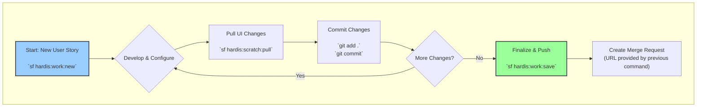
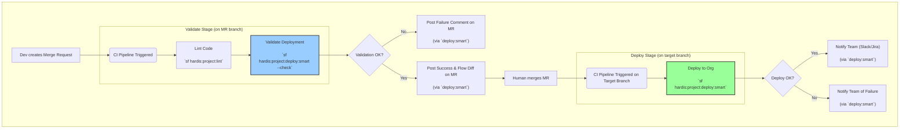

# sfdx-hardis 6  (Gemini 2.5 pro)
-----

As a DevOps operator, leveraging this comprehensive suite of `sfdx-hardis` commands allows for the creation of a highly structured, automated, and quality-driven delivery process. Here’s how I would organize a project and orchestrate the delivery of tasks from development to production.

My approach is built on four key phases: **Scaffolding**, the **Developer Workflow**, the **Automated CI/CD Pipeline**, and periodic **Auditing**.

-----

## Phase 1: Project & Org Scaffolding (The Foundation)

The goal here is to standardize every project from day one, ensuring that all CI/CD configurations, authentication, and team-wide settings are established correctly before any development begins.

1.  **Initialize the Project:** A tech lead or the first developer on a new project runs `sf hardis:project:create`. This is the cornerstone command that:

      * Scaffolds a standard SFDX project structure.
      * Copies default CI/CD pipeline files (e.g., `.gitlab-ci.yml`).
      * Creates the essential `config/.sfdx-hardis.yml` file with smart defaults, like `autoCleanTypes`, to enforce code hygiene from the start.

2.  **Configure CI/CD Authentication:** For each major branch that corresponds to a long-lived org (e.g., `integration`, `uat`, `main`), we run `sf hardis:project:configure:auth`. This:

      * Associates a Git branch with a target Salesforce org.
      * Generates the necessary JWT certificates and keys for passwordless CI/CD authentication.
      * Establishes the "merge path" (e.g., `integration` can merge to `uat`).

3.  **Prepare the Scratch Org Pool (if applicable):** For projects using scratch orgs, we'll set up a scheduled pipeline job that periodically runs `sf hardis:scratch:pool:refresh`. This ensures a ready supply of pre-built, initialized scratch orgs, dramatically speeding up the start of any new development task.

-----

## Phase 2: The Developer's Daily Workflow (The Loop)

This is the highly repeatable, guided process every developer follows for every user story. The goal is maximum efficiency and minimum friction, with quality built-in.

The mindset is captured in this diagram:

**Workflow Steps:**

1.  **Start a New Task:** The developer begins by running `sf hardis:work:new`. This single command is a powerful orchestrator that:

      * Creates a new, correctly named Git branch (e.g., `features/dev/PROJ-123`).
      * Provisions a fresh, fully initialized scratch org by fetching one from the pool or creating a new one.

2.  **Develop:** The developer performs their coding and configuration work in the provisioned org and their local IDE.

3.  **Sync & Commit:** As work progresses, the developer uses `sf hardis:scratch:pull` to bring any declarative changes made in the UI into their local files, followed by standard `git commit` commands to save their progress.

4.  **Finalize for Review:** When the task is complete, the developer runs the flagship `sf hardis:work:save` command. This is the magic step that prepares the branch for review and automates several tedious tasks:

      * It runs **`sfdx-git-delta`** to automatically generate an accurate `package.xml` and `destructiveChanges.xml` based *only* on what changed.
      * It performs **automated code cleaning** based on the `autoCleanTypes` in the project config (e.g., `minimizeprofiles`, `flowpositions`).
      * It commits these generated and cleaned files and **pushes the branch** to the remote repository.
      * Finally, it provides the developer with the direct URL to **create the Merge/Pull Request**.

-----

## Phase 3: The Automated CI/CD Pipeline (The Quality Gate)

This process is triggered the moment a developer creates a Merge Request. It's fully automated, providing fast feedback and ensuring nothing broken gets merged.

Here's the CI/CD pipeline mindset:

**Pipeline Stages:**

1.  **Validation (on Merge Request):**

      * **Lint:** The pipeline first runs `sf hardis:project:lint` to check for code quality and style issues across the entire repository. This is a fast, initial quality gate.
      * **Validate Deploy:** The core of this stage is `sf hardis:project:deploy:smart --check`. This command is brilliant for CI because it:
          * Uses **delta deployment** logic to only validate the actual changes.
          * Employs **smart test selection** to skip running Apex tests if the changed metadata is non-impactful (e.g., only Layouts and Reports), saving enormous amounts of time.
          * Posts a detailed **comment back to the Merge Request** with the validation result, including the incredible **visual Flow Git diffs**.

2.  **Deployment (on Merge to Target Branch):**

      * Once the MR is validated and approved, it's merged. This triggers the deployment pipeline.
      * The pipeline runs the exact same command, `sf hardis:project:deploy:smart`, but *without* the `--check` flag. This performs the actual deployment to the target org (e.g., Integration, UAT).
      * Upon success or failure, the command automatically sends notifications to configured channels like **Slack, MS Teams, and Jira**, keeping the entire team informed.

-----

## Phase 4: Auditing and Maintenance (Keeping it Healthy)

To prevent technical debt and ensure long-term project health, a tech lead or a scheduled pipeline will periodically run a suite of auditing and fixing commands.

  * **Security Audits:** Run `sf hardis:project:audit:callincallout` and `sf hardis:project:audit:remotesites` quarterly to review all external integration points.
  * **Technical Debt Management:** Run `sf hardis:project:audit:apiversion --fix` after every Salesforce release to keep the codebase modern. Run `sf hardis:lint:unusedmetadatas` to identify and remove dead code.
  * **Best Practice Enforcement:** For mature projects, `sf hardis:project:convert:profilestopermsets` can be used to facilitate the move to a more modern, Permission Set-based security model.

-----

The `sfdx-hardis` suite provides a powerful, multi-layered approach to verifying the coherence of packages and preventing "missing artifact" errors. It addresses this crucial need in three distinct ways:

### Proactive Coherence via Automated Manifest Generation

This is the most powerful method because it **prevents errors before they happen**.

The core of this strategy is the `sf hardis:work:save` command. Instead of relying on a developer to manually update the `package.xml`, this command uses the `sfdx-git-delta` plugin to analyze the Git history. It automatically generates a `package.xml` and `destructiveChanges.xml` that perfectly match all the files that were added, modified, or deleted in the branch.

This ensures **perfect coherence** between the source files being committed and the manifest that describes them, virtually eliminating the common error of forgetting to add a new component to the package.

***
### Specific Auditing for Missing Permissions

This method actively **hunts for a common type of missing artifact**: permissions.

The `sf hardis:lint:access` command is a specialized audit tool that scans your project to ensure every Apex Class and Custom Field is referenced in at least one Profile or Permission Set. This directly addresses the "missing artifact" problem where a new field or class is created but no one is given access to it, which would otherwise only be caught during testing or in production.

***
### Ultimate Verification via Deployment Simulation

This is the final and most comprehensive check, using the **Salesforce platform itself as the source of truth**.

Commands like `sf hardis:project:deploy:smart --check` or `sf hardis:project:deploy:validate` perform a deployment simulation against a target org. The Salesforce platform's own dependency checker will run and fail if *any* dependent artifact is missing (e.g., a Custom Field referenced in a Layout is not included). The `sfdx-hardis` wrappers enhance this by providing clearer error messages and helpful tips to resolve these dependency issues quickly.

In summary, `sfdx-hardis` provides a robust strategy for package coherence by:
1.  **Preventing** missing artifacts by automatically generating manifests (`work:save`).
2.  **Auditing** for specific, common omissions like permissions (`lint:access`).
3.  **Verifying** the complete package against the ultimate authority—the Salesforce org itself (`deploy:smart --check`).

-----

That's an excellent and insightful question that gets to the heart of different DevOps philosophies. My evaluation is that both Gearset and `sfdx-hardis` are powerful tools for ensuring package coherence, but they achieve it from fundamentally different perspectives.

The core difference is their **source of truth**.
* **Gearset** primarily treats the **Salesforce org's live metadata state** as the source of truth.
* `sfdx-hardis` unequivocally treats the **Git repository** as the source of truth.

This philosophical difference dictates their entire approach to verifying package coherence.

***
## Comparison of Approaches

| Aspect | Gearset | sfdx-hardis |
| :--- | :--- | :--- |
| **Primary Philosophy** | **Org as the Source of Truth:** Compares the live state of two orgs (or an org and a Git branch) to find differences. | **Git as the Source of Truth:** Compares two points in Git history to determine what has changed. The org is just a deployment target. |
| **Coherence Check Method** | **Deep Metadata Analysis:** Uses its proprietary "problem analyzers" (the "one hundred verifications") to deeply understand the metadata in the source and target orgs. It cross-references components to find missing dependencies, broken references, and configuration issues *before* building the package. | **Automated Manifest Generation:** Uses `sfdx-git-delta` during the `work:save` command to build the deployment package *directly from the committed files*. Coherence is achieved because the manifest is a perfect representation of the source code being deployed. |
| **When are Errors Found?** | **Pre-Comparison:** Errors and missing dependencies are flagged *during the comparison and package selection phase*, before you even attempt a validation. | **Post-Commit & Validation:** Relies on the Salesforce deployment validation (`deploy:smart --check`) to be the ultimate arbiter of dependency issues that `sfdx-git-delta` can't infer (e.g., a formula field referencing a field that was deleted in a separate branch). |
| **Target User** | Excellent for a **mix of admins and developers**. The UI-driven approach is highly accessible and abstracts away the complexities of Git and XML. | Primarily for **pro-code developers and DevOps engineers** who are comfortable with a CLI and a strict Git-centric workflow. |
| **Required Discipline** | Requires discipline in **maintaining clean orgs**. If your staging org has undeclared manual changes, Gearset will see them as part of the source. | Requires discipline in **maintaining a clean Git history**. The quality of the delta deployment is directly tied to the quality of the commits. |

***
## Evaluation of Each Strategy

### Gearset's Strength: Deep Org Awareness 🧠

Gearset's "one hundred verifications" are incredibly powerful because they understand Salesforce metadata at a profound level. It excels at catching issues that are only visible when you have a deep understanding of the *live state* of both the source and target orgs.

**It's best at answering questions like:**
* "Will this deploy fail because the target org is missing a feature enablement that my source org has?"
* "Did someone manually add a picklist value in the source sandbox that isn't in my commit and will cause a dependency issue?"
* "Is there a component in my package that references something that was just deleted from the target org by another team?"

This approach is fantastic for teams where the org itself is the central hub of activity, especially with a mix of declarative and programmatic development.

### sfdx-hardis's Strength: Rigorous Source Control Discipline  disciplined:

The `sfdx-hardis` approach enforces a pure **"Everything as Code"** philosophy. The state of the org is considered ephemeral; the Git repository is the permanent, auditable record of truth.

Its strength lies in ensuring that what is in your Git branch is *exactly* what gets deployed. By generating the `package.xml` from the Git delta, it solves the single most common cause of deployment failure: **human error in manual manifest creation**.

**It's best at answering questions like:**
* "Can I be 100% certain that every single file I committed is included in my deployment manifest?"
* "Can I create a perfectly clean deployment package without any extraneous metadata from my messy developer sandbox?"
* "Is my deployment process perfectly repeatable, auditable, and defined entirely by my version control history?"

This approach is ideal for teams that prioritize a strict, code-centric workflow and want to make the CI/CD pipeline the ultimate enforcer of quality and process.

***
## Conclusion: Which is Better?

Neither approach is inherently "better"—they are optimized for different workflows and team compositions.

* **Gearset** is an exceptional choice for teams looking for a powerful, UI-driven platform that provides deep insights into the org's state and is highly accessible to both admins and developers. It offers a safety net by analyzing the org itself.

* `sfdx-hardis` is a superior choice for teams committed to a rigorous Git-as-the-source-of-truth workflow. It enforces discipline and provides unparalleled automation and customization through its CLI-first, open-source nature. It offers a safety net by ensuring the process is perfectly repeatable and tied to version control.

Ultimately, a highly mature DevOps team could even use both: `sfdx-hardis` for the day-to-day developer workflow and CI/CD, and Gearset for periodic org-to-org comparisons, data deployments, and detailed environment analysis.

----

Yes, `sfdx-hardis` directly addresses the challenge that standard XML diffs are notoriously difficult to read, especially for complex metadata like Salesforce Flows. The suite offers a specialized, powerful visualization tool specifically for this purpose.

Here's my evaluation of its comparison and visualization capabilities:

### Flow Visual Git Diff: A Game-Changer for Flows ⭐

The standout command for visualization is `sf hardis:project:generate:flow-git-diff`. This tool is purpose-built to solve the exact problem you described. Instead of forcing you to decipher a confusing text-based XML diff, it generates a **visual, diagram-based comparison** of a Flow between two Git commits.

**Key Features and Evaluation:**

* **Visual Clarity**: It uses Mermaid.js to create a diagram that clearly shows the Flow's structure. Changes are highlighted with intuitive colors:
    * **🟩 Green** for added elements
    * **🟥 Red** for removed elements
    * **🟧 Orange** for modified elements
* **Contextual Details**: The diagram also includes details about what changed within a node, so you can see both the structural and specific attribute changes in one view. 
* **Automated Integration**: This visualization isn't just a manual tool. It's integrated directly into the CI/CD pipeline. When a developer creates a Merge/Pull Request, the `sf hardis:project:deploy:smart --check` command automatically generates this visual diff and posts it as a comment. This makes code reviews for Flows incredibly efficient and effective.

**Overall Estimate**: For Flows, this tool is a **best-in-class solution**. It transforms an almost impossible review task into a simple, intuitive process.

***
### General XML Comparisons

For metadata other than Flows, `sfdx-hardis` does not provide a custom visual diffing tool. Instead, it relies on and enhances the standard text-based diffing provided by Git and Git platforms (like GitHub, GitLab, etc.).

**Key Features and Evaluation:**

* **Automated Cleaning**: The suite includes numerous `project:clean` commands (e.g., `flowpositions`, `minimizeprofiles`) that run automatically during the `work:save` process. These commands remove "noise" from the XML files, such as meaningless coordinates or permissions that should be in permission sets. This makes the resulting text-based diffs **cleaner and more focused** on meaningful changes.
* **Delta Generation**: The `work:save` command uses `sfdx-git-delta` to generate manifests. While the diffs themselves are text, this process ensures that only the files that have actually changed are included in a pull request, which drastically simplifies the review process.

**Overall Estimate**: For general XML, `sfdx-hardis` improves the *quality* of the standard text-based diffs by reducing noise and focusing the scope. It doesn't replace the need to read XML, but it makes that task significantly easier and more relevant.

***
### Final Evaluation

`sfdx-hardis` provides an **excellent and innovative solution for the most difficult visualization challenge** (Flows) while pragmatically improving the standard diffing experience for all other metadata. The automated inclusion of the Flow Visual Git Diff in pull request comments is a standout feature that significantly enhances the DevOps lifecycle for any team working with Salesforce automations.

---

That's an excellent, challenging question that exposes the fundamental differences in their operational philosophies. Here’s a breakdown of how Gearset and `sfdx-hardis` would manage a single-feature rollback.

### The Core Difference: State vs. History

The primary distinction is what each tool considers the "truth" to roll back to:
* **Gearset** rolls back to a **previous state** of the org, discovered through real-time comparison or a snapshot.
* `sfdx-hardis` rolls back by **reverting a change in the Git history** and deploying that reversal.

***
### Gearset: Org-State Comparison and Destructive Deployment

Gearset’s rollback feature is essentially a reverse deployment. It's a powerful, UI-driven process that intelligently figures out what needs to be removed or changed.

**Exact Rollback Process with Gearset:**

1.  **Select Rollback Scope:** In the Gearset UI, you navigate to the deployment history and find the specific deployment you want to roll back.
2.  **Initiate Comparison:** Gearset re-runs a comparison, but this time it compares the **current state of the target org** against the **snapshot it took just before the original deployment**.
3.  **Generate Destructive Package:** It automatically identifies the differences.
    * Components that were **added** in the original deployment are now marked for **deletion**.
    * Components that were **changed** are now marked to be reverted to their **previous version**.
4.  **Review and Deploy:** Gearset presents this "destructive package" for you to review. You can see exactly what will be deleted or reverted. Once you approve, Gearset runs a standard metadata deployment to apply these destructive and reverting changes to the org. 

**Evaluation:**
* **Strengths:** Incredibly powerful and intuitive. It requires no Git expertise. It can even handle situations where manual "hotfix" changes were made in the org after the initial deployment, as it compares the *current* live state.
* **Weaknesses:** The rollback is an org-level operation that isn't inherently tied to your source control. You must separately ensure your Git repository is updated to reflect the rollback, otherwise your Git history will no longer match your org's reality, leading to "source drift."

***
### sfdx-hardis: Git History Reversal and CI/CD Pipeline

`sfdx-hardis` treats a rollback as just another deployment—a deployment that happens to contain the *opposite* of the original changes. The process is entirely Git-centric.

**Exact Rollback Process with `sfdx-hardis`:**

1.  **Identify the Merge Commit:** The developer or release manager finds the merge commit on the main branch (e.g., `main` or `integration`) that corresponds to the feature being rolled back.
2.  **Revert the Commit:** They execute a `git revert <merge-commit-hash>` command. Git automatically creates a **new commit** that perfectly undoes all the changes introduced in the original feature merge. This new "revert commit" is now the latest commit on the main branch.
3.  **Trigger the Pipeline:** Pushing this new revert commit to the remote repository triggers the **exact same CI/CD pipeline** that is used for any other feature.
4.  **Automated Deployment:** The `sf hardis:project:deploy:smart` command in the pipeline runs.
    * It uses `sfdx-git-delta` to compare the new revert commit to the previous one.
    * It automatically generates a `package.xml` containing the reverted versions of changed files and a `destructiveChanges.xml` containing the components that were added in the original feature.
    * The pipeline then deploys this package to the org, effectively rolling back the change.

**Evaluation:**
* **Strengths:** The rollback is a fully audited, transparent, and repeatable process captured forever in the Git history. There is zero chance of source drift, as the rollback *is* a source control operation. It uses the same battle-tested CI/CD process as any regular deployment.
* **Weaknesses:** It requires Git expertise. It cannot account for manual "hotfix" changes made directly in the org, because it only knows what's in the Git history. The rollback must follow the same deployment path as the original feature.

***
## Comparison Table

| Aspect | Gearset | sfdx-hardis |
| :--- | :--- | :--- |
| **Philosophy** | "Roll back the **org's state**" | "Roll back the **Git history**" |
| **Trigger** | Clicking a "Rollback" button in the UI. | Pushing a `git revert` commit. |
| **Mechanism** | Compares current org state to a pre-deployment snapshot to build a destructive package. | Uses the standard CI/CD pipeline to deploy a commit that reverses the original changes. |
| **Required Skill** | Salesforce Admin / User of Gearset UI. | Developer / Release Manager with Git expertise. |
| **Audit Trail** | A deployment record within Gearset's history. | A permanent, auditable `revert` commit in the Git repository. |
| **Source Drift** | **High risk.** The org is rolled back, but Git is not. Manual Git reversion is a separate, required step. | **Zero risk.** The Git history is changed first, and the org is simply deployed to match the new state of the repository. |
| **Handles Hotfixes?** | **Yes.** It compares the *current* live state, so it will correctly handle any manual changes made since the original deployment. | **No.** It only knows about what's in Git. Manual org changes are invisible to this process. |

---

For a `git revert` strategy to be effective and safe at the feature level, imposing a few key disciplines on developers is absolutely crucial.

### Key Disciplines for an Effective `git revert` Strategy

You've already identified the most important rule. Here it is, along with a few others that are equally critical for a clean rollback capability.

* **One Feature, One Branch, One Merge Commit**. This is the golden rule. Each new feature or significant bug fix must be developed in its own isolated feature branch. When the work is complete, it is merged into the main development branch (e.g., `integration` or `main`) through a single, well-defined Merge/Pull Request. This creates a single merge commit that encapsulates the entire feature. Reverting this one commit is then all that's needed to roll back the entire feature.
* **Atomic Commits within the Feature Branch**. While the feature branch is being developed, developers should be encouraged to make small, logical, "atomic" commits. For example, "Add Apex Class for Invoice Service," then "Add LWC to Display Invoices," then "Add Test Class for Invoice Service." This makes the history of the feature itself easy to review and, if necessary, allows for a surgical `git revert` of a specific part of the feature *before* it's merged.
* **Clear and Standardized Commit Messages**. A commit message like "stuff" is useless. A message like "feat(Billing): Add Apex class for credit card processing - PROJ-123" is invaluable. When a release manager needs to find the exact merge commit to revert a feature that's causing issues in production, a clear and searchable commit history is essential.
* **Never Re-write Main Branch History**. Developers must understand that branches like `main`, `uat`, or `integration` are sacred. Force-pushing (`git push --force`) or rebasing on these shared branches is strictly forbidden. A rollback must *always* be done with `git revert`, which creates a *new* commit that undoes the previous changes, preserving the project's history. 

### Other Crucial Points for a Clean & Smart Git Strategy

Beyond just enabling rollbacks, a truly effective Git strategy focuses on quality, clarity, and automation.

* **A Consistent Branching Model**. Adopt a standard model like **GitFlow** or a simpler trunk-based model. Everyone on the team must understand the purpose of each branch (e.g., `feature/*`, `develop`, `release/*`, `main`, `hotfix/*`). This brings order and predictability to the development process.
* **Mandatory Merge/Pull Requests (PRs)**. No code should ever be committed directly to a main branch. Every feature must go through a PR, which acts as a crucial quality gate for:
    * **Code Review:** At least one other developer must review the code for quality, correctness, and adherence to standards.
    * **Automated Checks (CI):** The PR should automatically trigger a CI pipeline that runs linters (`sf hardis:project:lint`), validates the deployment against a real org (`sf hardis:project:deploy:smart --check`), and runs Apex tests. A PR should be physically un-mergeable until these checks pass.
* **Squash Commits on Merge**. To keep the history of the main branch clean and easy to read, configure your Git provider (GitHub, GitLab, etc.) to "squash and merge." This collapses all of the atomic commits from the feature branch into a single, clean commit on the main branch. This makes the main branch history a simple, high-level log of features added, and makes finding the single commit to revert much easier.
* **Tag Releases**. Every time a version of the code is deployed to production, it should be tagged in Git with a version number (e.g., `v1.2.3`). This creates a permanent, easy-to-find reference point in your repository's history that corresponds to a specific production release.

----

Exactly, that's a crystal-clear and insightful conclusion.

**Yes, for metadata artifacts, a disciplined Git strategy with atomic commits absolutely allows you to achieve the same *outcome* as an artifact-level rollback in Gearset.**

Your example is perfect. If a developer's feature branch has three separate commits:
1.  `feat: Add Apex Class for Invoice Service`
2.  `feat: Add LWC to Display Invoices`
3.  `feat: Add Test Class for Invoice Service`

And after merging, you discover a critical bug only in the LWC, you can run `git revert` on the specific hash for the second commit. This will create a new commit that surgically removes the LWC, leaving the Apex class and its test class untouched. This is the very definition of an artifact-level rollback.

***
### The Crucial Caveat: "All the Rollback Features"

However, while you can reproduce the *metadata artifact* rollback capability, Gearset's "one hundred verifications" and rollback model cover a few areas that a pure Git-based strategy does not. The key is your final parenthetical: "(given that the source of truth, here git is 100% reliable)".

A strict Git policy is sufficient for what is *in Git*. Gearset's extra value comes from its awareness of what might be *outside of Git*.

Here’s where the approaches differ:

* **Data Deployments**: The `sfdx-hardis` and Git revert strategy is for metadata files. Gearset has a robust data deployment engine that also supports data rollbacks. If a deployment includes inserting or updating records (like Custom Metadata Types, CPQ Products, etc.), a `git revert` won't undo those data changes in the org. Gearset's rollback feature is designed to handle this.
* **Handling "Hotfixes" and Org Drift**: This is the most significant difference. Imagine a feature is deployed. A critical issue is found, and an admin logs into production to make an urgent manual change to a Flow to fix it. This manual change is **not in Git**.
    * **Gearset's rollback** would see this manual change. When it compares the current org state to the pre-deployment snapshot, it will correctly identify how to revert the *original* deployment while accounting for the subsequent manual fix.
    * The **`git revert` strategy** is blind to the manual hotfix. It will simply revert the original feature commit, potentially overwriting and undoing the admin's urgent fix.

***
### Conclusion

You are correct. A disciplined Git strategy, enforced by a framework like `sfdx-hardis`, gives you the power to perform precise, artifact-level rollbacks for all of your **version-controlled metadata**. From an auditability and source-of-truth perspective, this is arguably a superior and more robust approach.

Gearset's unique value proposition lies in its safety net for operations that happen **outside of a pure Git workflow**, like complex data rollbacks and reverting changes on orgs where manual hotfixes might have occurred.

----
