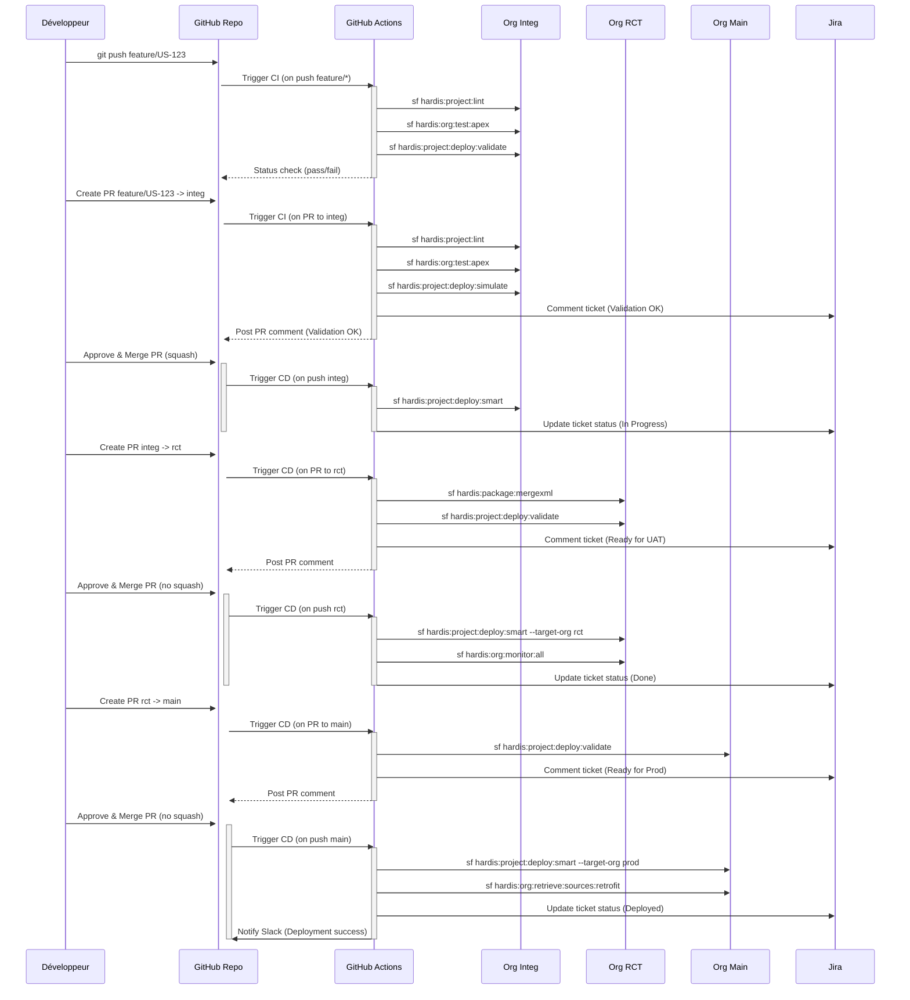

Voici un résumé des **bonnes pratiques DevOps pour Salesforce** en 2025, adaptées à un projet de taille moyenne avec sfdx-hardis et des branches long-lived (`integ`, `rct`, `main`). Ces pratiques sont alignées sur les principes GitOps, CI/CD, et les spécificités Salesforce, tirées de la documentation sfdx-hardis et des retours communautaires.

1. **Source de Vérité dans Git (GitOps)** :
   - Utilisez un repo Git (e.g., `salesforce-project`) comme source unique pour code et métadonnées, avec branches `integ` (intégration), `rct` (recette/UAT), et `main` (production).
   - Versionnez tout : métadonnées (`package.xml`), configs (`.sfdx-hardis.yml`), scripts CI/CD.
   - Protégez les branches long-lived avec des règles GitHub (require PR, 1+ approvals, status checks).

2. **Pipelines CI/CD Automatisés** :
   - Configurez des GitHub Actions pour builds, tests, et déploiements intelligents (`sf hardis:project:deploy:smart` pour deltas via sfdx-git-delta).
   - Intégrez des quality gates : tests Apex (`hardis:org:test:apex`), linting (`hardis:project:lint`), coverage >80%.
   - Validez avant déploiement avec `hardis:project:deploy:validate`.

3. **Monitoring Dédié et GitOps** :
   - Créez un repo séparé (`salesforce-monitoring`) pour backups et diagnostics, avec branches par org (`integ-monitoring`, `rct-monitoring`, `main-monitoring`).
   - Exécutez `sf hardis:org:monitor:all` sur schedule (e.g., toutes 6h) pour limites, audit trail, API legacy.
   - Versionnez backups metadata (`hardis:org:retrieve:sources:metadata --backup`) pour diffs historiques.

4. **Gestion des Conflits Précoce** :
   - Détectez les conflits (e.g., sur classes Apex) via PR reviews et validations CI (`hardis:project:deploy:simulate`).
   - Résolvez dans VS Code (3-way Merge Editor) sans branches additionnelles pour garder un historique clair.
   - Utilisez `hardis:package:mergexml` pour conflits XML (e.g., profiles).

5. **Authentification Sécurisée et Gouvernance** :
   - Configurez des connected apps OAuth2 (JWT flow) pour chaque org, avec secrets GitHub (`SFDX_AUTH_URL_*`).
   - Activez le Dev Hub (même sans scratch orgs) pour gérer auth et limites, ou optez pour des outils tiers (Gearset, Flosum) si non-DX.

6. **Modularité et Tests** :
   - Modularisez via unlocked packages pour isoler les artefacts (e.g., classes Apex).
   - Testez tôt : unit tests Apex, E2E si possible, et simulez déploiements.

7. **Intégrations et Notifications** :
   - Intégrez Jira pour traçabilité (`hardis:work:publish` commente tickets).
   - Configurez Slack/email pour alertes monitoring (e.g., limites org >80%).

8. **Branches Courtes et Merges Fréquents** :
   - Utilisez des branches features éphémères, squashées dans `integ` pour un historique propre.
   - Mergez sans squash entre `integ`, `rct`, `main` pour traçabilité.

En résumé, combinez GitOps (repo dédié, PR-driven), CI/CD automatisé, monitoring versionné, et sécurité pour un workflow Salesforce fluide et scalable. Testez en sandbox avant prod, et adaptez via `.sfdx-hardis.yml` pour vos besoins spécifiques.

---

Voici une explication détaillée des pipelines CI/CD pour Salesforce avec **sfdx-hardis**, adaptée à un projet de taille moyenne utilisant des branches long-lived (`integ` pour intégration, `rct` pour recette/UAT, `main` pour production) et GitHub Enterprise. Ces pipelines suivent les meilleures pratiques DevOps, en s'appuyant sur les principes GitOps, l’automatisation, la validation précoce (shift-left), et la traçabilité, tout en tenant compte des spécificités de Salesforce (métadonnées, limites API) et de sfdx-hardis (déploiements intelligents, intégration Git). Les détails incluent les étapes clés, les commandes sfdx-hardis, les configurations GitHub Actions, et des exemples concrets pour chaque phase du workflow (développement, intégration, recette, production). Je m’appuie sur la documentation officielle et les retours communautaires pour garantir une approche robuste.

### Structure Générale d’un Pipeline CI/CD avec sfdx-hardis
Un pipeline CI/CD pour Salesforce avec sfdx-hardis automatise les étapes de développement, validation, test, déploiement, et monitoring, tout en alignant les changements sur les branches Git (`integ`, `rct`, `main`) avec les orgs Salesforce correspondantes (sandbox d’intégration, sandbox UAT, production). Les pipelines sont définis dans des fichiers YAML sous `.github/workflows`, générés automatiquement par `sf hardis:project:create` ou personnalisés pour des besoins spécifiques. Ils s’appuient sur des commandes comme `hardis:project:deploy:smart` (déploiement delta via sfdx-git-delta) et intègrent des quality gates (tests, linting, validation).

#### Objectifs Clés
- **CI (Continuous Integration)** : Valider et tester chaque commit/push dans les branches features ou `integ` pour détecter tôt les erreurs (conflits, tests échoués).
- **CD (Continuous Delivery/Deployment)** : Automatiser les déploiements vers les orgs `integ`, `rct`, et `main`, avec validations et rollbacks si nécessaire.
- **GitOps** : Toute configuration (déploiement, monitoring) est déclarée dans Git, versionnée, et appliquée via PR/MR.
- **Salesforce-Specific** : Gérer les métadonnées complexes, les limites API, et les dépendances (e.g., profiles, managed packages).

### Étapes du Pipeline CI/CD
Le pipeline couvre le cycle de vie d’une user story, de sa création à la livraison en production, avec des déclencheurs spécifiques (push, PR, merge) et des commandes sfdx-hardis adaptées.

#### 1. **Création et Développement (Branche Feature)**
   - **Objectif** : Une user story est créée (e.g., via Jira), une branche feature est générée à partir de `integ`, et les changements sont développés/testés localement.
   - **Commandes sfdx-hardis** :
     - `sf hardis:work:new` : Crée une branche feature (e.g., `feature/US-123`) et configure le contexte (métadonnées via `package.xml`).
     - `sf hardis:org:retrieve:sources:dx` : Récupère les métadonnées modifiées depuis l’org dev (sandbox ou production).
     - `sf hardis:work:save` : Commit les changements locaux et pousse vers GitHub.
   - **Pipeline CI** : Trigger sur push dans la branche feature. Valide le code et exécute des tests.
   - **Exemple GitHub Action** (`.github/workflows/ci-feature.yml`):
     ```yaml
     name: CI for Feature Branches
     on:
       push:
         branches: [feature/*]
     jobs:
       validate:
         runs-on: ubuntu-latest
         env:
           SFDX_AUTH_URL: ${{ secrets.SFDX_AUTH_URL_INTEG }}
           GITHUB_TOKEN: ${{ secrets.GITHUB_TOKEN }}
         steps:
           - uses: actions/checkout@v4
           - uses: actions/setup-node@v4
             with:
               node-version: '20'
           - run: npm install -g @salesforce/cli && sf plugins install sfdx-hardis sfdx-git-delta
           - run: echo "${{ env.SFDX_AUTH_URL }}" > authfile && sf org login sfdx-url --sfdx-url-file authfile
           - name: Lint Code
             run: sf hardis:project:lint
           - name: Run Apex Tests
             run: sf hardis:org:test:apex
           - name: Validate Deployment
             run: sf hardis:project:deploy:validate
     ```
   - **Best Practices** :
     - Tests unitaires Apex automatisés (>80% coverage).
     - Linting pour standards de code (e.g., PMD via `hardis:project:lint`).
     - Résolution précoce des conflits via VS Code Merge Editor.

#### 2. **Intégration Continue (Branche `integ`)**
   - **Objectif** : Valider les PR des branches features vers `integ`, tester, et déployer vers l’org d’intégration (sandbox).
   - **Commandes sfdx-hardis** :
     - `sf hardis:project:deploy:smart` : Déploie les deltas (via sfdx-git-delta) avec validation automatique des dépendances.
     - `sf hardis:project:deploy:simulate` : Simule pour détecter les erreurs avant déploiement.
   - **Pipeline CI** : Trigger sur PR vers `integ`. Inclut linting, tests, et validation. Post-merge, déploie automatiquement.
   - **Exemple GitHub Action** (`.github/workflows/ci-integ.yml`):
     ```yaml
     name: CI/CD for Integ Branch
     on:
       pull_request:
         branches: [integ]
       push:
         branches: [integ]
     permissions:
       pull-requests: write
     jobs:
       build-and-deploy:
         runs-on: ubuntu-latest
         env:
           SFDX_AUTH_URL: ${{ secrets.SFDX_AUTH_URL_INTEG }}
           GITHUB_TOKEN: ${{ secrets.GITHUB_TOKEN }}
         steps:
           - uses: actions/checkout@v4
           - uses: actions/setup-node@v4
             with:
               node-version: '20'
           - run: npm install -g @salesforce/cli && sf plugins install sfdx-hardis sfdx-git-delta
           - run: echo "${{ env.SFDX_AUTH_URL }}" > authfile && sf org login sfdx-url --sfdx-url-file authfile
           - name: Lint and Validate
             run: sf hardis:project:lint && sf hardis:project:deploy:validate
           - name: Run Apex Tests
             run: sf hardis:org:test:apex
           - name: Deploy on Merge
             if: github.event_name == 'push'
             run: sf hardis:project:deploy:smart
           - name: Comment PR
             if: github.event_name == 'pull_request'
             uses: actions/github-script@v6
             with:
               script: |
                 const { data } = await github.rest.issues.createComment({
                   owner: context.repo.owner,
                   repo: context.repo.repo,
                   issue_number: context.issue.number,
                   body: 'Validation OK, ready to deploy'
                 });
     ```
   - **Best Practices** :
     - Squash commits pour features dans `integ` (via GitHub PR settings) pour un historique propre.
     - Require status checks (tests, linting) avant merge.
     - Notifiez résultats via PR comments ou Jira.

#### 3. **Recette/UAT (Branche `rct`)**
   - **Objectif** : Promouvoir les changements validés depuis `integ` vers `rct`, tester en sandbox UAT, et valider avec les parties prenantes métier.
   - **Commandes sfdx-hardis** :
     - `sf hardis:package:mergexml` : Consolide les fichiers XML (e.g., profiles) pour éviter conflits.
     - `sf hardis:project:deploy:smart --target-org rct` : Déploie vers l’org recette.
   - **Pipeline CD** : Trigger sur PR vers `rct` (validation) et push (déploiement post-merge).
   - **Exemple GitHub Action** (`.github/workflows/cd-rct.yml`):
     ```yaml
     name: CD to RCT
     on:
       pull_request:
         branches: [rct]
       push:
         branches: [rct]
     permissions:
       pull-requests: write
     jobs:
       deploy-rct:
         runs-on: ubuntu-latest
         env:
           SFDX_AUTH_URL: ${{ secrets.SFDX_AUTH_URL_RCT }}
           GITHUB_TOKEN: ${{ secrets.GITHUB_TOKEN }}
         steps:
           - uses: actions/checkout@v4
           - uses: actions/setup-node@v4
             with:
               node-version: '20'
           - run: npm install -g @salesforce/cli && sf plugins install sfdx-hardis sfdx-git-delta
           - run: echo "${{ env.SFDX_AUTH_URL }}" > authfile && sf org login sfdx-url --sfdx-url-file authfile
           - name: Merge XML if Needed
             run: sf hardis:package:mergexml
           - name: Validate Deployment
             run: sf hardis:project:deploy:validate --target-org rct-org-alias
           - name: Deploy on Merge
             if: github.event_name == 'push'
             run: sf hardis:project:deploy:smart --target-org rct-org-alias
           - name: Monitor Post-Deploy
             if: github.event_name == 'push'
             run: sf hardis:org:monitor:all
     ```
   - **Best Practices** :
     - Require approvals métier via GitHub Environments.
     - Intégrez tests E2E si possible (manuels ou via outils comme Provar).
     - Utilisez `hardis:org:monitor:all` pour audits post-déploiement.

#### 4. **Livraison en Production (Branche `main`)**
   - **Objectif** : Déployer les changements validés depuis `rct` vers l’org production, avec protections strictes et rollback si nécessaire.
   - **Commandes sfdx-hardis** :
     - `sf hardis:project:deploy:smart --target-org production` : Déploiement final.
     - `sf hardis:org:retrieve:sources:retrofit` : Sync rétroactif pour hotfixes faits directement en prod.
   - **Pipeline CD** : Trigger sur PR vers `main` (validation) et push (déploiement). Utilisez un environment GitHub pour approvals.
   - **Exemple GitHub Action** (`.github/workflows/cd-main.yml`):
     ```yaml
     name: CD to Production
     on:
       pull_request:
         branches: [main]
       push:
         branches: [main]
     permissions:
       pull-requests: write
     jobs:
       deploy-prod:
         runs-on: ubuntu-latest
         environment: production
         env:
           SFDX_AUTH_URL: ${{ secrets.SFDX_AUTH_URL_MAIN }}
           GITHUB_TOKEN: ${{ secrets.GITHUB_TOKEN }}
           SLACK_WEBHOOK_URL: ${{ secrets.SLACK_WEBHOOK_URL }}
         steps:
           - uses: actions/checkout@v4
           - uses: actions/setup-node@v4
             with:
               node-version: '20'
           - run: npm install -g @salesforce/cli && sf plugins install sfdx-hardis sfdx-git-delta
           - run: echo "${{ env.SFDX_AUTH_URL }}" > authfile && sf org login sfdx-url --sfdx-url-file authfile
           - name: Validate Deployment
             run: sf hardis:project:deploy:validate --target-org prod-org-alias
           - name: Deploy on Merge
             if: github.event_name == 'push'
             run: sf hardis:project:deploy:smart --target-org prod-org-alias --notify
           - name: Retrofit if Needed
             if: github.event_name == 'push'
             run: sf hardis:org:retrieve:sources:retrofit --commit --push
           - name: Notify Slack
             if: always()
             run: |
               curl -X POST -H 'Content-type: application/json' \
               --data "{\"text\":\"Prod deployment: ${{ job.status }}\"}" \
               $SLACK_WEBHOOK_URL
     ```
   - **Best Practices** :
     - Multi-approvals pour PR vers `main` (via GitHub branch protection).
     - Plan de rollback : Backups metadata avant déploiement (`hardis:org:retrieve:sources:metadata --backup`).
     - Notifications Slack/Jira sur succès/échec.

#### 5. **Monitoring Continu**
   - **Objectif** : Surveiller les orgs pour limites, sécurité, et drifts, avec backups versionnés.
   - **Commandes sfdx-hardis** :
     - `sf hardis:org:monitor:all` : Exécute des diagnostics (audit trail, limites, API legacy).
     - `sf hardis:org:retrieve:sources:metadata --backup` : Sauvegarde métadonnées.
   - **Pipeline** : Trigger sur schedule (e.g., toutes 6h) dans un repo dédié (`salesforce-monitoring`).
   - **Exemple GitHub Action** (`.github/workflows/org-monitoring.yml`):
     ```yaml
     name: Org Monitoring
     on:
       schedule:
         - cron: "0 */6 * * *"
       push:
         branches: [integ-monitoring, rct-monitoring, main-monitoring]
     jobs:
       monitor:
         runs-on: ubuntu-latest
         strategy:
           matrix:
             org: [integ, rct, main]
         env:
           SFDX_AUTH_URL: ${{ secrets['SFDX_AUTH_URL_' + matrix.org | upper] }}
           MONITORING_IGNORE_FREQUENCY: true
         steps:
           - uses: actions/checkout@v4
           - uses: actions/setup-node@v4
             with:
               node-version: '20'
           - run: npm install -g @salesforce/cli && sf plugins install sfdx-hardis
           - run: echo "${{ env.SFDX_AUTH_URL }}" > authfile && sf org login sfdx-url --sfdx-url-file authfile
           - run: sf hardis:org:monitor:all --json > monitor-report-${{ matrix.org }}.json
           - run: sf hardis:org:retrieve:sources:metadata --backup
           - run: git add . && git commit -m "Backup ${{ matrix.org }} $(date)" && git push
           - uses: actions/upload-artifact@v4
             with:
               name: monitor-report-${{ matrix.org }}
               path: monitor-report-${{ matrix.org }}.json
     ```
   - **Best Practices** :
     - Repo séparé pour monitoring (éviter pollution du repo principal).
     - Versionnez backups dans branches dédiées (`*-monitoring`).
     - Parsez rapports JSON pour alertes custom (e.g., limites >80%).

### Configuration et Gouvernance
- **Secrets GitHub** :
  - `SFDX_AUTH_URL_INTEG`, `SFDX_AUTH_URL_RCT`, `SFDX_AUTH_URL_MAIN` : Authentification OAuth2/JWT pour chaque org.
  - `GITHUB_TOKEN` : Pour PR comments et merges.
  - `SLACK_WEBHOOK_URL`, `JIRA_TOKEN` : Pour notifications.
- **.sfdx-hardis.yml** :
  ```yaml
  productionBranch: main
  retrofitBranch: rct
  sourcesToRetrofit:
    - CustomObject
    - CustomField
  messaging:
    jira:
      instanceUrl: https://yourcompany.atlassian.net
      email: yourjira@account.email
      token: ${{ secrets.JIRA_TOKEN }}
  ```
- **Best Practices Globales** :
  - Modularisez via unlocked packages pour isoler artefacts.
  - Branche courte, merge fréquent pour minimiser conflits.
  - Testez en sandbox avant prod, avec rollback plan.
  - Intégrez monitoring proactif pour audits et compliance.

Ces pipelines, combinés à sfdx-hardis, garantissent une livraison rapide, sécurisée et traçable, adaptée aux contraintes Salesforce (API limits, métadonnées). Pour des cas spécifiques (e.g., multi-orgs, conflits complexes), je peux approfondir !

---

Pour illustrer le pipeline CI/CD Salesforce avec sfdx-hardis, incluant les événements GitHub (push, pull request) et les actions effectuées par les GitHub Actions, un diagramme **Sequence** de Mermaid est idéal. Il montre les interactions entre les acteurs (développeur, GitHub, Salesforce orgs) et les étapes automatisées (validation, tests, déploiement) dans le temps. Le diagramme couvre les trois scénarios principaux de votre workflow : **feature branches** (pushed et PR vers `integ`), **promotion vers `rct`**, et **livraison en `main`** (production), avec les commandes sfdx-hardis correspondantes. Il inclut également les interactions avec Jira pour traçabilité, comme recommandé dans vos best practices DevOps.

### Diagramme Mermaid : Sequence des Événements GitHub et GitHub Actions



### Explications du Diagramme
- **Acteurs** :
  - **Développeur** : Pousse le code, crée/approve les PR.
  - **GitHub Repo** : Reçoit les événements (push, PR, merge).
  - **GitHub Actions (CI)** : Exécute les pipelines CI/CD.
  - **Orgs Salesforce** (`Integ`, `RCT`, `Main`) : Reçoivent les déploiements et monitoring.
  - **Jira** : Reçoit des commentaires et mises à jour de statut pour traçabilité.

- **Événements et Actions** :
  - **Feature Branch** : Push déclenche linting, tests Apex, et validation (`hardis:project:deploy:validate`). PR vers `integ` simule le déploiement et commente Jira.
  - **Integ** : Merge (squash) déclenche un déploiement automatique (`hardis:project:deploy:smart`) vers l’org integ.
  - **RCT** : PR valide (`mergexml`, `deploy:validate`), merge (sans squash) déploie et monitore (`hardis:org:monitor:all`).
  - **Main** : PR stricte (approvals multiples), merge déploie en prod, avec retrofit pour hotfixes et notifications Slack/Jira.

- **Best Practices Intégrées** :
  - **Validation Précoce** : Tests et simulations avant chaque merge.
  - **GitOps** : Tout est déclenché par des événements Git (push, PR), avec configs dans `.sfdx-hardis.yml`.
  - **Traçabilité** : Commentaires automatisés sur PR et Jira.
  - **Sécurité** : Utilisation de secrets GitHub (`SFDX_AUTH_URL_*`) pour auth.

Ce diagramme reflète un workflow CI/CD robuste, aligné avec sfdx-hardis et les contraintes Salesforce (API limits, métadonnées). Si vous souhaitez un diagramme alternatif (e.g., flowchart pour visualiser les branches), ou des détails sur un cas spécifique (e.g., conflits), je peux approfondir !
