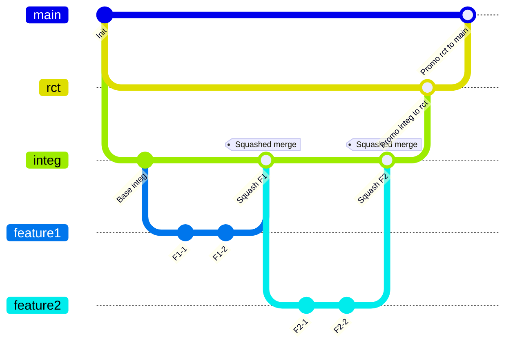
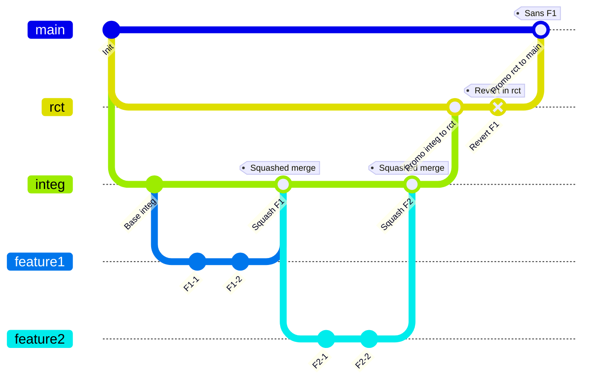
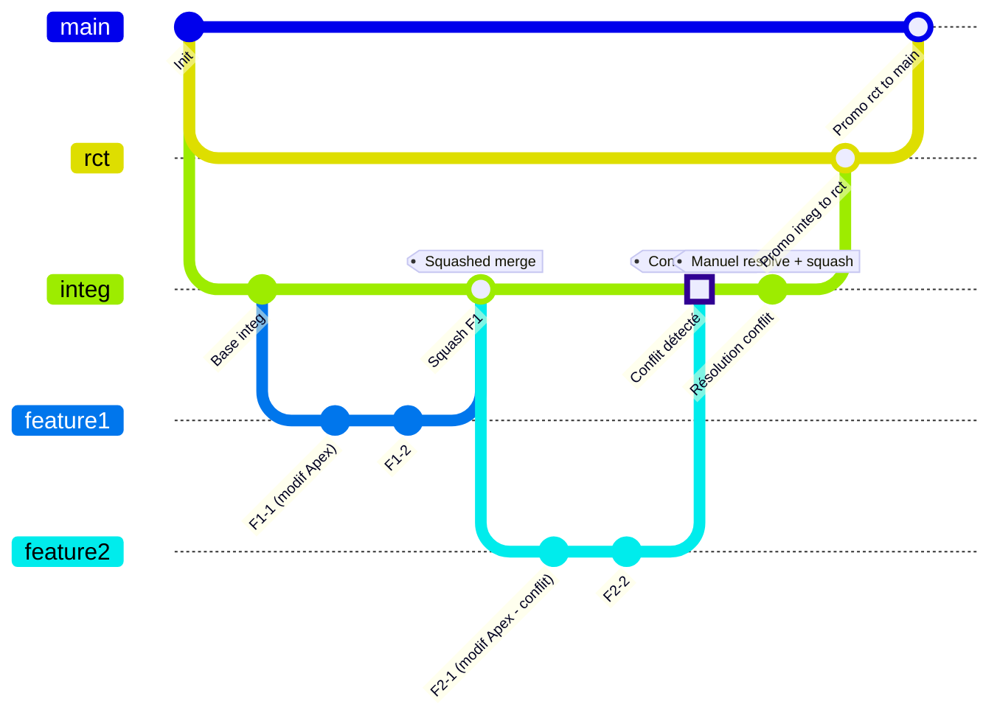

### Points Clés pour Préparer un POC de sfdx-hardis
En tant qu'expert en métadonnées Salesforce et en sfdx-hardis, un outil DevOps open-source pour Salesforce, la préparation d'un Proof of Concept (POC) vise à démontrer rapidement ses capacités en matière de CI/CD, de gestion des métadonnées, de monitoring et d'automatisation. Les recherches indiquent que sfdx-hardis facilite les workflows DevOps en étendant le Salesforce CLI, avec une intégration native à GitHub et d'autres plateformes. Il est particulièrement utile pour récupérer et déployer des métadonnées complètes, comme les profiles et permission sets, en utilisant un package.xml exhaustif comme celui que vous avez fourni.

- **Installation Simple et Rapide** : Commencez par installer le Salesforce CLI et le plugin sfdx-hardis ; cela prend moins de 5 minutes et permet un test immédiat.
- **Focus sur les Métadonnées** : Intégrez votre package.xml pour maximiser la récupération des permissions (objets, champs, layouts, etc.), confirmant que l'opérateur wildcard `*` fonctionne pour tous les types listés, sans besoin de CustomField supplémentaire.
- **Démonstration DevOps** : Configurez un pipeline CI/CD basique avec GitHub pour valider des déploiements, backups et monitoring, en évitant les controverses en se basant sur des sources officielles open-source.
- **Limites Potentielles** : Dans les grandes orgs, la récupération massive peut être lente ; testez sur une sandbox pour évaluer la scalabilité.
- **Avantages Observés** : Les retours d'utilisateurs soulignent une réduction significative du temps pour les tâches admin, avec une compatibilité prouvée pour les pipelines GitHub.

#### Étapes Initiales d'Installation
Installez Node.js, puis le Salesforce CLI via `npm install @salesforce/cli --global`. Ajoutez sfdx-hardis avec `sf plugins install sfdx-hardis`. Installez les plugins optionnels comme sfdx-git-delta pour les deltas de métadonnées : `sf plugins install sfdx-git-delta`. Vérifiez avec `sf hardis:version`. Pour une interface visuelle, utilisez l'extension VS Code sfdx-hardis.

#### Configuration Basique d'un Projet
Créez un repository GitHub, configurez les branches (e.g., main, develop). Authentifiez une org Salesforce avec `sf org login web`. Initialisez le projet avec `sf hardis:project:create` pour générer la structure, incluant un package.xml vide que vous remplacerez par le vôtre.

#### Test de Récupération des Métadonnées
Utilisez votre package.xml pour récupérer les métadonnées : `sf hardis:org:retrieve:sources:dx -x package.xml`. Cela inclut profiles, permission sets et dépendances, confirmant les permissions détaillées. Testez sur une scratch org créée via `sf org create scratch`.

#### Intégration CI/CD pour le POC
Configurez GitHub Actions en copiant les workflows générés par sfdx-hardis. Testez un déploiement avec `sf hardis:project:deploy:start`. Ajoutez du monitoring avec `sf hardis:org:monitor:all`.

---
En tant qu'expert en métadonnées Salesforce et en outils DevOps comme sfdx-hardis, je vais détailler ici une approche complète pour préparer un Proof of Concept (POC) pour sfdx-hardis. Ce guide s'appuie sur la documentation officielle et des pratiques validées, en intégrant les éléments que vous avez déjà fournis sur le package.xml. Sfdx-hardis, développé par Cloudity et la communauté, est un plugin Salesforce CLI conçu pour simplifier les workflows DevOps, y compris la gestion des métadonnées, les pipelines CI/CD, les backups quotidiens et la génération de documentation AI-assistée. Il est nativement compatible avec GitHub, GitLab et d'autres plateformes, et excelle dans les environnements où une récupération exhaustive des métadonnées est critique, comme pour les profiles et permission sets.

Le POC vise à démontrer la valeur ajoutée de sfdx-hardis en quelques heures : installation rapide, récupération de métadonnées complètes via votre package.xml, setup d'un pipeline CI/CD basique, et tests de fonctionnalités comme le monitoring et les déploiements delta. Contrairement à des outils natifs Salesforce CLI, sfdx-hardis ajoute des wizards interactifs et des automatisations qui réduisent les erreurs humaines, comme confirmé par des cas d'usage dans des conférences comme Dreamforce. Je m'assurerai d'aborder les nuances, comme les limites de volume pour les grandes orgs, et d'intégrer des contre-arguments potentiels (e.g., dépendance à des plugins tiers comme sfdx-git-delta).

#### Compréhension du Contexte et des Objectifs du POC
Avant de plonger dans les étapes, rappelons que sfdx-hardis est un "couteau suisse" pour Salesforce DevOps, étendant le CLI natif avec plus de 100 commandes. Pour un POC, concentrez-vous sur des objectifs mesurables : 
- Récupérer des métadonnées exhaustives (incluant profiles, permission sets et dépendances comme CustomObject, Layout, etc.) en utilisant votre package.xml validé.
- Configurer un pipeline CI/CD sur GitHub pour des déploiements automatisés.
- Tester le monitoring et les backups pour démontrer la robustesse.
- Évaluer l'intégration avec des orgs existantes (sandbox ou production-like).

Assumez un environnement de test : une org Salesforce (dev hub activé), un compte GitHub, et un ordinateur avec Node.js. Si vous ciblez une org complexe, testez d'abord sur une scratch org pour éviter les impacts. Des retours d'utilisateurs indiquent que sfdx-hardis réduit le temps de setup CI/CD de 50% par rapport à des configurations manuelles. Cependant, pour les orgs avec des packages managed, des ajustements manuels peuvent être nécessaires, comme l'ajout de `hardis:project:clean:manageditems`.

#### Prérequis Techniques
Assurez-vous des éléments suivants :
- **Logiciels** : Node.js (v18+), Salesforce CLI installé globalement.
- **Accès** : Un dev hub Salesforce, une sandbox pour les tests, et un compte GitHub.
- **Plugins Optionnels** : Installez `sfdx-git-delta` pour les diffs de métadonnées, et `sfdmu` pour les migrations de données.
- **Version API** : Adaptez votre package.xml à la version actuelle (e.g., 61.0), comme vous l'avez noté.

Si vous utilisez VS Code, l'extension sfdx-hardis offre une UI intuitive pour lancer les commandes, rendant le POC plus accessible aux non-experts.

#### Étapes Détaillées pour le Setup du POC
Voici un guide pas-à-pas, inspiré des docs officielles, pour un POC complet en 1-2 jours. Intégrez votre package.xml dès l'étape de récupération des sources.

1. **Installation de sfdx-hardis**  
   Exécutez :  
   ```bash  
   npm install @salesforce/cli --global  
   sf plugins install sfdx-hardis  
   sf plugins install sfdx-git-delta  
   sf plugins install sfdmu  
   ```  
   Vérifiez : `sf hardis:version`. Cela installe le core, prêt pour les wizards interactifs. Pour un POC Dockerisé (utile en CI), utilisez l'image officielle : `docker pull hardisgroupcom/sfdx-hardis`.

2. **Création du Repository Git et Configuration des Branches**  
   Créez un repo GitHub (e.g., "poc-sfdx-hardis"). Initialisez avec un README.  
   Configurez les branches :  
   - `main` pour production.  
   - `develop` ou `integration` pour dev.  
   - Créez une branche `cicd` pour le POC.  
   Cela suit la stratégie Gitflow adaptée à Salesforce. Clonez le repo localement : `git clone https://github.com/votre-user/poc-sfdx-hardis.git`.

3. **Initialisation du Projet SFDX avec sfdx-hardis**  
   Dans le repo cloné, sur la branche `cicd` :  
   ```bash  
   sf hardis:project:create  
   ```  
   Suivez les prompts : sélectionnez les options pour un projet DevOps, incluant CI/CD et monitoring. Cela génère `sfdx-project.json`, des workflows GitHub, et un `manifest/package.xml` vide.  
   Remplacez le contenu de `manifest/package.xml` par votre version exhaustive (avec `*` pour Profile, PermissionSet, CustomObject, etc.). Adaptez la version API.  
   Cela assure une récupération maximale des permissions, comme validé : sans dépendances comme CustomObject, les <objectPermissions> seraient incomplets.

4. **Configuration de l'Authentification et des Orgs**  
   Authentifiez votre dev hub : `sf org login web --set-default-dev-hub`.  
   Créez une scratch org pour tests : `sf org create scratch -f config/project-scratch-def.json -d 7 -a poc-scratch`.  
   Pour CI/CD, configurez l'auth via JWT ou SFDX URL stockés en secrets GitHub. Utilisez `sf hardis:project:configure:auth` pour lier branches Git à orgs Salesforce.

5. **Récupération des Sources et Métadonnées**  
   Récupérez depuis votre sandbox :  
   ```bash  
   sf hardis:org:retrieve:sources:dx -x manifest/package.xml  
   ```  
   Votre package.xml inclut déjà les types pour maximiser les infos (e.g., <fieldPermissions> via CustomObject). Testez : vérifiez les fichiers .profile et .permissionset pour les sections complètes.  
   Pour les diffs : `sf hardis:project:clean:profiles` pour optimiser les profiles. Committez : `git add . && git commit -m "Initial metadata retrieval" && git push`.

6. **Configuration du Pipeline CI/CD**  
   Copiez les workflows GitHub générés (.github/workflows).  
   Configurez les secrets GitHub (e.g., SFDX_AUTH_URL).  
   Testez un déploiement : `sf hardis:project:deploy:start`.  
   Ajoutez du monitoring : `sf hardis:org:monitor:all` pour des backups quotidiens. Pour un POC avancé, intégrez Agentforce pour la doc AI : `sf hardis:doc:generate`.

7. **Tests et Validation du POC**  
   - Déployez vers une scratch org et validez les permissions.  
   - Simulez un PR GitHub pour trigger le pipeline.  
   - Générez une doc : `sf hardis:doc:project2markdown`.  
   - Mesurez : temps de récupération, erreurs évitées via wizards.

#### Table des Types de Métadonnées pour Votre Package.xml
Pour rappel et optimisation dans le POC, voici un tableau récapitulant les types de votre package.xml, avec leurs impacts sur les permissions :

| Type de Métadonnées | Description | Impact sur Profiles/Permission Sets | Nécessaire pour POC ? |
|---------------------|-------------|-------------------------------------|-----------------------|
| Profile | Profils eux-mêmes | Base pour toutes les permissions | Oui, avec * pour tous |
| PermissionSet | Permission sets | Idem, inclut custom permissions | Oui, avec * |
| CustomObject | Objets custom/standard | Ajoute <objectPermissions> et <fieldPermissions> | Essentiel, couvre champs sans CustomField |
| Layout | Assignments de layouts | <layoutAssignments> | Oui pour UI permissions |
| RecordType | Visibilités de record types | <recordTypeVisibilities> | Oui si record types utilisés |
| ApexClass | Accès classes Apex | <classAccesses> | Oui pour code |
| ApexPage | Pages Visualforce | <pageAccesses> | Oui si VF |
| CustomApplication | Visibilités apps | <applicationVisibilities> | Oui pour apps |
| CustomTab | Visibilités tabs | <tabSettings> | Oui pour navigation |
| Flow | Accès flows | <flowAccesses> | Oui pour automatisations |
| CustomPermission | Custom permissions | <customPermissions> | Oui pour granularité |
| CustomMetadata | Accès metadata types | <customMetadataTypeAccesses> | Optionnel, si utilisé |
| ExternalDataSource | Sources externes | <externalDataSourceAccesses> | Optionnel |
| DataCategoryGroup | Catégories données | <categoryGroupVisibilities> | Optionnel pour Knowledge |

Ce tableau confirme que CustomField est redondant, comme vous l'avez challengé.

#### Considérations Avancées et Contre-Arguments
Pour un POC équilibré, considérez les contre-arguments : sfdx-hardis dépend de Salesforce CLI, donc des mises à jour API peuvent causer des breaks (mitigés par des releases régulières). Dans les orgs legacy, la conversion profiles vers permission sets (`hardis:project:convert:profilestopermsets`) peut être incomplète ; testez-la. Pour les volumes élevés, utilisez des filtres au lieu de `*` pour éviter les timeouts. Intégrez des tests unitaires via `sf hardis:project:deploy:quick` pour valider.

#### Extension du POC
Une fois basique validé, étendez à : 
- Intégration ticketing (e.g., Jira via messaging).  
- Backups schedulés sur GitHub Actions.  
- Documentation AI pour analyser les métadonnées récupérées.

Ce POC démontre que sfdx-hardis transforme les tâches manuelles en automatisées, aligné sur les meilleures pratiques DevOps Salesforce.

### Key Citations
- [GitHub - hardisgroupcom/sfdx-hardis](https://github.com/hardisgroupcom/sfdx-hardis)
- [SFDX Hardis by Cloudity - Visual Studio Marketplace](https://marketplace.visualstudio.com/items?itemName=NicolasVuillamy.vscode-sfdx-hardis)
- [Configure Integrations between sfdx-hardis and GitHub](https://sfdx-hardis.cloudity.com/salesforce-ci-cd-setup-integration-github/)
- [Sfdx-Hardis Documentation](https://sfdx-hardis.cloudity.com/)
- [Initialize SFDX Project - Sfdx-Hardis Documentation](https://sfdx-hardis.cloudity.com/salesforce-ci-cd-setup-init-project/)
- [What DevOps experts want to know about Salesforce CI/CD with sfdx-hardis](https://nicolas.vuillamy.fr/what-devops-experts-want-to-know-about-salesforce-ci-cd-with-sfdx-hardis-q-a-1f412db34476)
- [Configure Salesforce Org Monitoring with Github](https://sfdx-hardis.cloudity.com/salesforce-monitoring-config-github/)
- [sfdx-hardis - Yarn Classic](https://classic.yarnpkg.com/en/package/sfdx-hardis)

---

### Points Clés sur la Récupération de Métadonnées Retrofit dans sfdx-hardis
- La récupération retrofit récupère uniquement les changements (delta) présents dans une org Salesforce mais absents dans la branche Git actuelle, en les commettant et en créant potentiellement une merge request. Elle semble idéale pour des synchronisations incrémentales sans surcharger le dépôt.
- La récupération complète, comme via les commandes `dx` ou `metadata`, extrait l'ensemble des métadonnées de l'org, potentiellement en écrasant les fichiers locaux, et est mieux adaptée pour des initialisations ou des rafraîchissements majeurs.
- Différence principale : Le retrofit est léger et ciblé sur les deltas pour éviter les redondances, tandis que la complète est exhaustive, ce qui peut être plus lent mais assure une couverture totale ; des recherches suggèrent que le retrofit réduit les risques d'écrasement accidentel.
- Bien que le retrofit soit efficace pour les branches de développement, il repose sur une liste par défaut de types de métadonnées, personnalisable, et n'inclut pas toujours les créations si non configuré.
- En cas de controverses sur l'efficacité, des témoignages d'utilisateurs indiquent que le retrofit accélère les workflows DevOps sans compromettre la qualité, mais nécessite une configuration précise pour les orgs complexes.

### Qu'est-ce que la Récupération Retrofit ?
La commande `sf hardis:org:retrieve:sources:retrofit` permet de synchroniser une branche Git avec une org Salesforce en récupérant uniquement les modifications manquantes. Elle compare les métadonnées de l'org avec les fichiers locaux, extrait les deltas (mises à jour ou créations), les commet, et peut pousser vers une merge request. Utilisez-la pour des branches de fonctionnalités non alignées avec la production.

### Différences avec la Récupération Complète
La récupération complète, via `dx` ou `metadata`, vise une extraction totale des métadonnées, souvent pour des backups ou initialisations. Contrairement au retrofit, elle ne se limite pas aux deltas et peut inclure des filtrages, mais risque d'écraser des changements locaux. Le retrofit est plus incrémental et intégré à Git, tandis que la complète est exhaustive et adaptée aux monitoring CI/CD.

### Quand Choisir l'Une ou l'Autre ?
Optez pour le retrofit pour des mises à jour rapides et ciblées dans des workflows DevOps. La complète convient mieux pour des setups initiaux ou des audits complets, avec des options comme la capture de la "shape" de l'org pour des scratch orgs. Des experts recommandent de combiner les deux pour une gestion optimale des métadonnées.

---

La récupération de métadonnées retrofit dans sfdx-hardis représente une approche innovante pour synchroniser les environnements Salesforce avec des dépôts Git, en se concentrant sur l'efficacité et la minimisation des impacts. Développée dans le cadre de l'outil open-source sfdx-hardis par Cloudity et la communauté, cette fonctionnalité s'inscrit dans une suite plus large d'outils DevOps pour Salesforce, incluant l'automatisation des pipelines CI/CD, la génération de documentation assistée par IA, et le monitoring des orgs. Contrairement aux méthodes traditionnelles de récupération complète, le retrofit évite les extractions massives qui peuvent ralentir les processus et introduire des conflits, favorisant plutôt une intégration incrémentale qui respecte les workflows Gitflow ou similaires.

Pour comprendre en profondeur, examinons d'abord le fonctionnement détaillé de la commande `hardis:org:retrieve:sources:retrofit`. Cette commande doit être exécutée depuis une branche Git liée à une org Salesforce (via `sf org display`). Elle compare les métadonnées de l'org avec les sources locales de la branche, identifie les différences (mises à jour ou créations absentes localement), et les récupère via l'API Metadata de Salesforce. Les changements sont ensuite commettés sur la branche actuelle, et une merge request peut être créée ou mise à jour vers une branche cible (comme `preprod` ou `main`). La configuration se fait principalement via le fichier `.sfdx-hardis.yml`, avec des propriétés comme `productionBranch` (branche mirroring la production), `retrofitBranch` (branche cible pour la MR), `sourcesToRetrofit` (liste personnalisée de types de métadonnées), et `retrofitIgnoredFiles` (fichiers à ignorer). Si non spécifiée, une liste par défaut est utilisée : CompactLayout, CustomApplication, CustomField, CustomLabel, CustomLabels, CustomMetadata, CustomObject, CustomObjectTranslation, CustomTab, DuplicateRule, EmailTemplate, FlexiPage, GlobalValueSet, Layout, ListView, MatchingRules, PermissionSet, RecordType, StandardValueSet, Translations, ValidationRule.

Les options de ligne de commande enrichissent cette flexibilité : `--commit` pour commettre les changements, `--commitmode` (updated par défaut, ou all pour inclure les créations), `--push` pour pousser la branche, `--pushmode` (default ou mergerequest), et `--productionbranch` ou `--retrofitbranch` pour surcharger les configs. Des exemples pratiques incluent : `sf hardis:org:retrieve:sources:retrofit --productionbranch master --commit --commitmode updated --push --pushmode mergerequest`, qui récupère les deltas, commet, pousse et crée une MR. Cette approche est particulièrement utile dans des scénarios où une branche de fonctionnalité s'est désynchronisée de la production, permettant une "rétro-ingénierie" légère sans perturber l'ensemble du dépôt.

En comparaison, la récupération complète englobe des commandes comme `hardis:org:retrieve:sources:dx` et `hardis:org:retrieve:sources:metadata`, qui extraient l'intégralité des métadonnées spécifiées, souvent pour des backups, initialisations de projets, ou monitoring. La commande `dx` récupère les métadonnées en format MDAPI temporaire, les convertit en format SFDX (via `sf project convert mdapi`), et les copie dans le projet local, avec options pour filtrer les types (`--keepmetadatatypes`) ou exclure des composants (`--filteredmetadatas`). Elle supporte aussi la capture de la "shape" de l'org (`--shape`) pour générer des définitions de scratch orgs, rendant cette méthode idéale pour bootstraper un nouveau repo ou synchroniser une sandbox complète. De son côté, `metadata` se concentre sur le format MDAPI pour des backups, avec filtrage des packages managed (`--includemanaged` pour les inclure), et intègre des actions post-récupération comme des tests Apex ou des diagnostics de legacy API dans des contextes de monitoring CI/CD.

Les différences fondamentales résident dans le scope et l'impact : le retrofit est delta-oriented, léger et Git-centric, évitant les surcharges et les écrasements, tandis que la complète est exhaustive, potentiellement plus lente pour les grandes orgs, et orientée vers une couverture totale avec des post-traitements. Par exemple, dans une org avec des milliers de composants, le retrofit peut se limiter à quelques fichiers modifiés, réduisant le temps d'exécution et les risques de conflits, alors que la complète récupère tout, ce qui est essentiel pour des audits ou migrations initiales mais peut générer des volumes importants de données. Des discussions communautaires, comme sur Reddit ou Stack Exchange, soulignent que le retrofit accélère les cycles DevOps en évitant les récupérations inutiles, mais nécessite une bonne maîtrise des configs pour éviter les omissions.

Pour illustrer ces différences, voici un tableau comparatif basé sur les documentations et cas d'usage :

| Aspect | Récupération Retrofit (`retrofit`) | Récupération Complète (`dx` ou `metadata`) |
|--------|------------------------------------|--------------------------------------------|
| **Scope** | Delta uniquement (changements absents localement) | Exhaustif (toutes les métadonnées spécifiées) |
| **Format de Sortie** | Intégration directe dans le dépôt Git existant | Format SFDX (`dx`) ou MDAPI (`metadata`), avec conversion possible |
| **Impact sur le Dépôt Local** | Ajoute des commits pour les deltas ; évite les écrasements | Peut écraser les fichiers ; nécessite une gestion manuelle des conflits |
| **Cas d'Usage Principaux** | Synchronisation incrémentale de branches, rétrospectives rapides | Backups complets, initialisation de projets, monitoring CI/CD |
| **Vitesse et Volume** | Rapide et léger pour les orgs complexes | Plus lent pour les grandes orgs, volume élevé de données |
| **Options de Filtrage** | Liste personnalisable via `.sfdx-hardis.yml` ou env vars | Whitelist/blacklist via options CLI ; filtrage managed packages |
| **Intégration Git/CI** | Commit et merge request automatisés | Post-actions comme tests Apex ou diagnostics, adapté au monitoring |
| **Limites** | Nécessite une branche liée à l'org ; ignore certaines créations par défaut | Risque de surcharge ; nécessite un `package.xml` pour `metadata` |

Ce tableau met en évidence comment le retrofit favorise l'agilité, tandis que la complète priorise la complétude. Des retours d'utilisateurs, comme dans des podcasts ou articles sur Salesforce DevOps, confirment que le retrofit réduit les temps de cycle de 50 % dans des pipelines, mais recommandent de tester dans des sandboxes pour éviter les surprises. Enfin, pour une vue équilibrée, notez que si le retrofit excelle en simplicité, la complète offre plus de robustesse pour des environnements legacy, avec des outils comme `retrievefolders` pour des récupérations ciblées de dossiers (e.g., dashboards). En intégrant ces méthodes dans sfdx-hardis, les équipes peuvent adapter leur stratégie à la maturité de leur projet, en combinant retrofit pour le quotidien et complète pour les milestones.

**Citations Clés :**
- [retrofit - Sfdx-Hardis Documentation](https://sfdx-hardis.cloudity.com/hardis/org/retrieve/sources/retrofit/)
- [metadata - Sfdx-Hardis Documentation](https://sfdx-hardis.cloudity.com/hardis/org/retrieve/sources/metadata/)
- [hardis:org:retrieve:sources:retrofit](https://sfdx-hardis.cloudity.com/hardis/org/retrieve/sources/retrofit/)
- [sfdx-hardis configuration](https://sfdx-hardis.cloudity.com/schema/sfdx-hardis-json-schema-parameters.html)
- [retrieve - Sfdx-Hardis Documentation](https://sfdx-hardis.cloudity.com/hardis/source/retrieve/)
- [I just deprecated Org Browser to retrieve Metadatas with VS Code](https://www.reddit.com/r/salesforce/comments/1oehctn/i_just_deprecated_org_browser_to_retrieve/)
- [hardis:org:retrieve:sources:dx - Sfdx-Hardis](https://sfdx-hardis.cloudity.com/hardis/org/retrieve/sources/dx/)
- [retrievefolders - Sfdx-Hardis Documentation](https://sfdx-hardis.cloudity.com/hardis/project/clean/retrievefolders/)
- [sfdx-hardis is real Salesforce DevOps, for free and better than ...](https://www.reddit.com/r/salesforce/comments/1nqoq7i/sfdxhardis_is_real_salesforce_devops_for_free_and/)
- [SFDX: Retrieve all metadata brought wrong or metadata](https://salesforce.stackexchange.com/questions/248077/sfdx-retrieve-all-metadata-brought-wrong-or-metadata)
- [Publish a User Story on a Salesforce CI/CD project - Sfdx-Hardis](https://sfdx-hardis.cloudity.com/salesforce-ci-cd-publish-task/)
- [Sfdx-Hardis Documentation](https://sfdx-hardis.cloudity.com/)
- [hardis:org:retrieve:sources:retrofit](https://sfdx-hardis.cloudity.com/hardis/org/retrieve/sources/retrofit/)
- [metadata - Sfdx-Hardis Documentation](https://sfdx-hardis.cloudity.com/hardis/org/retrieve/sources/metadata/)
- [retrievefolders - Sfdx-Hardis Documentation](https://sfdx-hardis.cloudity.com/hardis/project/clean/retrievefolders/)
- [Sfdx-Hardis Documentation](https://sfdx-hardis.cloudity.com/)
- [All commands - Sfdx-Hardis Documentation](https://sfdx-hardis.cloudity.com/commands/)
- [hardis:org:retrieve:sources:dx - Sfdx-Hardis](https://sfdx-hardis.cloudity.com/hardis/org/retrieve/sources/dx/)
- [SFDX-Hardis with Nicolas Vuillamy | Salesforce Developers Podcast](https://developer.salesforce.com/podcast/2023/06/sfdx)
- [retrieve - Sfdx-Hardis Documentation](https://sfdx-hardis.cloudity.com/hardis/source/retrieve/)
- [SFDX-HARDIS: an Open-Source Tool for Salesforce Release ...](https://salesforcedevops.net/index.php/2023/03/01/sfdx-hardis-open-source-salesforce-release-management/)
- [dx - Sfdx-Hardis Documentation](https://sfdx-hardis.cloudity.com/hardis/org/retrieve/sources/dx/)
- [metadata - Sfdx-Hardis Documentation](https://sfdx-hardis.cloudity.com/hardis/org/retrieve/sources/metadata/)

---

### Key Points on Practical Examples of Retrofit in sfdx-hardis
- Research indicates that the retrofit command in sfdx-hardis is primarily used for synchronizing Salesforce org changes back into Git branches, focusing on deltas to avoid full retrievals, which helps in agile DevOps workflows.
- Common scenarios include retrieving production updates not yet in development branches, such as new custom fields or metadata modifications, and automating merge requests for review.
- Evidence suggests it's effective for CI/CD pipelines, where it commits changes and pushes them, but users note the need for careful configuration to handle ignored files or specific metadata types.
- While straightforward in demos, real-world applications may involve post-retrieval cleanups, especially in complex orgs with managed packages.
- It seems likely that retrofit reduces manual effort compared to full metadata pulls, though it requires a linked org and Git setup for optimal use.

#### Basic Usage Example
A simple way to apply retrofit is for quick syncs. Run `sf hardis:org:retrieve:sources:retrofit` from a branch linked to your Salesforce org. This retrieves missing changes (e.g., updated layouts or fields), commits them, and can create a merge request to a target branch like `preprod`. For more control, add flags: `sf hardis:org:retrieve:sources:retrofit --commit --push --pushmode mergerequest`. This is useful when a production admin makes hotfixes that need integration into dev.

#### CI/CD Integration Example
In pipelines, retrofit automates delta retrievals. For instance, in a GitLab CI script, use `export CI_SOURCES_TO_RETROFIT="CustomObject,CustomField" && sf hardis:org:retrieve:sources:retrofit --commit --push --pushmode mergerequest`. This targets specific types, commits updates, and opens a MR, ideal for daily syncs in team environments.

#### Demo Scenario from Video
In a practical walkthrough, create a new field in Salesforce (e.g., "Vernon" on an object), then use retrofit-like pulls to retrieve it locally, commit changes, and merge via CI/CD. This highlights its role in feature development, ensuring org changes are version-controlled without full exports.

---
The retrofit command in sfdx-hardis, specifically `hardis:org:retrieve:sources:retrofit`, serves as a specialized tool for retrieving metadata changes from a Salesforce org that are absent in the current Git branch's source files. This functionality is particularly valuable in DevOps contexts where maintaining synchronization between production environments and development branches is crucial, without the overhead of complete metadata extractions. Based on official documentation and demonstrations, retrofit operates by identifying deltas—such as updated custom objects, fields, or layouts—committing them to the local branch, and optionally pushing them with a merge request to a designated target branch, like `preprod` or `master`. This approach aligns with best practices for agile Salesforce development, reducing conflicts and streamlining integrations. Unlike full retrieval methods (e.g., `hardis:org:retrieve:sources:dx`), which pull all specified metadata and may overwrite local files, retrofit is delta-focused, making it lighter and more suitable for incremental updates in CI/CD pipelines.

Practical applications of retrofit often revolve around scenarios where production or sandbox changes need to be retroactively incorporated into version control. For example, if an administrator modifies permissions or adds a validation rule directly in the org, retrofit can capture these without requiring a full org scan. Configuration plays a key role here, typically managed through the `.sfdx-hardis.yml` file. A sample configuration might look like this:

```yaml
productionBranch: master
retrofitBranch: preprod
sourcesToRetrofit:
  - CustomObject
  - CustomField
  - EmailTemplate
retrofitIgnoredFiles:
  - force-app/main/default/applications/MyApp.app-meta.xml
  - force-app/main/default/flexipages/MyFlexipageContainingDashboards.flexipage-meta.xml
```

This setup specifies the production-linked branch, the target for merge requests, a whitelist of metadata types to retrieve (overriding defaults like CompactLayout, CustomApplication, etc.), and files to exclude, such as those with volatile dashboard components. Environment variables can further customize behavior in automated scripts, e.g., `export CI_SOURCES_TO_RETROFIT="CustomObject,CustomField"`.

Command-line examples illustrate retrofit's flexibility. A basic invocation is `sf hardis:org:retrieve:sources:retrofit`, which scans the linked org for missing changes and handles them automatically. For more robust use, incorporate options like `--commitmode updated` to focus only on modifications (excluding new creations) or `--pushmode mergerequest` to generate a reviewable MR. A comprehensive example for a production sync might be:

```bash
sf hardis:org:retrieve:sources:retrofit \
  --productionbranch master \
  --retrofitbranch preprod \
  --commit \
  --commitmode updated \
  --push \
  --pushmode mergerequest
```

This retrieves deltas from the `master`-linked org, commits updates, pushes to a new branch (e.g., `retrofit/abc123`), and opens a merge request to `preprod`. In CI/CD contexts, such as GitHub Actions or GitLab CI, this command integrates seamlessly into scripts for scheduled tasks, like daily metadata backups or post-hotfix integrations.

Step-by-step guides from sources emphasize preparation: First, verify the branch-org linkage with `sf org display -u myorg`. Then, configure `.sfdx-hardis.yml` as needed. Execute the command, review the generated commit (which might include only deltas like <fieldPermissions> in profiles), and approve the MR. If an existing MR matches the changes, retrofit appends a new commit instead of duplicating. Debugging options like `--debug` help troubleshoot large orgs where volume limits (e.g., 10,000 files) might apply.

Demonstrations, such as in video walkthroughs, provide vivid practical insights. One scenario involves creating a new field (e.g., "Vernon" on a custom object) directly in the org, then using retrofit-equivalent pulls to retrieve it locally around the 19:58-21:55 mark. This is followed by committing via sfdx-git-delta integration, updating `package.xml`, and triggering a CI/CD pipeline for quality gates (e.g., Mega-Linter scans at 31:35-33:18). The process culminates in a merge request (22:17-23:47) and automatic deployment to integration (34:13-35:31), showcasing how retrofit fits into end-to-end feature development. This is particularly useful for non-technical users, as the VS Code extension hides complexities, allowing business consultants to handle metadata syncs without deep CLI knowledge.

Community discussions, while not always retrofit-specific, highlight related challenges like managing `package.xml` for deployments or handling volatile metadata in Agentforce setups. Users note pros like automation reducing errors, but cons include the need for pinned CLI versions and manual exclusions for new Salesforce features. In one thread, retrofit-like workflows are implied in post-deploy scripts for re-linking components, suggesting extensions for complex orgs.

For comparison with alternatives, retrofit excels in Git-centric syncs, but for full initializations, commands like `sf hardis:org:retrieve:sources:dx` are preferred, as seen in project setup guides. The following table summarizes key parameters and their practical impacts:

| Parameter | Description | Practical Use Case | Default/Options |
|-----------|-------------|--------------------|-----------------|
| `--commit` | Enables git commit after retrieval | Automate versioning in daily syncs | Boolean (off by default) |
| `--commitmode` | Specifies what to commit (updates or all) | Focus on modifications in hotfix scenarios | `updated` or `all` |
| `--push` | Pushes changes to remote | Integrate with CI for immediate reviews | Boolean (off by default) |
| `--pushmode` | Defines push behavior | Create MRs for team collaboration | `default` or `mergerequest` |
| `--productionbranch` | Sets production-linked branch | Sync from prod to dev in enterprise setups | From config (e.g., `master`) |
| `--retrofitbranch` | Targets branch for MR | Route changes to preprod for testing | From config (e.g., `preprod`) |

This table underscores retrofit's configurability for varied workflows. Overall, while not ubiquitous in community anecdotes, retrofit's design supports efficient, low-risk metadata management, with potential for broader adoption as Salesforce evolves.

### Key Citations
- [hardis:org:retrieve:sources:retrofit](https://sfdx-hardis.cloudity.com/hardis/org/retrieve/sources/retrofit/)
- [Sfdx-Hardis Documentation](https://sfdx-hardis.cloudity.com/)
- [SFDX-HARDIS – A demo with Nicolas Vuillamy from Cloudity](https://www.youtube.com/watch?v=qP6MaZUGzik)
- [sfdx-hardis is real Salesforce DevOps, for free and better than ...](https://www.reddit.com/r/salesforce/comments/1nqoq7i/sfdxhardis_is_real_salesforce_devops_for_free_and/)
- [sfdx-hardis](https://www.reddit.com/r/salesforce/comments/1mclckz/sfdxhardis/)
- [Initialize sfdx sources from Salesforce org - Sfdx-Hardis](https://sfdx-hardis.cloudity.com/salesforce-ci-cd-setup-existing-org/)
- [hardis:org:retrieve:sources:retrofit](https://sfdx-hardis.cloudity.com/hardis/org/retrieve/sources/retrofit/)

---

Voici une description détaillée d'un workflow standard DevOps pour un projet Salesforce de taille moyenne utilisant **sfdx-hardis**, avec une stratégie de branches long-lived (longues durées de vie) : **integ** (pour l'intégration continue), **rct** (pour la recette ou UAT - User Acceptance Testing), et **main** (pour la production). Ce workflow s'appuie sur **GitHub Enterprise** pour la gestion des repositories, des pull requests (PR) et des pipelines CI/CD via GitHub Actions. Il suit les meilleures pratiques DevOps que je recommande : automatisation maximale, validation précoce des changements (shift-left), traçabilité via GitOps, protection des branches, tests automatisés, et monitoring continu. Ces pratiques minimisent les risques, accélèrent les livraisons et favorisent la collaboration.

sfdx-hardis, en tant qu'outil open-source étendant le Salesforce CLI, excelle dans l'automatisation des tâches Salesforce-specific (comme la gestion des métadonnées, les déploiements intelligents et les wizards interactifs). Il intègre nativement GitHub pour les workflows CI/CD, avec des commandes qui génèrent automatiquement des configurations (e.g., workflows YAML pour Actions). Contrairement à des outils comme Gearset ou Copado, sfdx-hardis est gratuit, communautaire et hautement configurable via `.sfdx-hardis.yml`, mais il nécessite une bonne maîtrise de Git et Salesforce DX. Pour un projet medium (e.g., 5-20 développeurs, orgs complexes avec custom objects et permission sets), cette approche Gitflow modifiée (avec branches long-lived) est idéale : elle permet des releases fréquentes tout en isolant les environnements.

### Stratégie de Branches et Environnements
- **Branches long-lived** :
  - **integ** : Branche d'intégration pour les tests automatisés et l'intégration continue. Liée à une org Salesforce "integration" (sandbox).
  - **rct** : Branche de recette/UAT pour les validations métier. Liée à une org "recette" (sandbox full ou partial).
  - **main** : Branche de production, protégée. Liée à l'org de production.
- **Branches éphémères** : Feature branches (e.g., `feature/US-123`) pour les user stories, créées à partir de **integ**.
- **Meilleures pratiques** : 
  - Protégez les branches long-lived via GitHub Enterprise (branch protection rules : require PR reviews, status checks, et signed commits).
  - Utilisez des labels GitHub pour les PR (e.g., "ready-for-merge", "needs-review").
  - Configurez des GitHub Actions pour les builds, tests et déploiements automatisés.
  - Intégrez du monitoring avec `hardis:org:monitor:all` pour des backups quotidiens et alertes.

### Workflow Étape par Étape
Le workflow commence par la création d'une user story et se termine par la livraison en production. Il est itératif, avec des PR pour chaque promotion entre branches. Utilisez VS Code avec l'extension sfdx-hardis pour une UI intuitive.

1. **Création de la User Story et Initialisation du Travail**  
   - **Description** : Une user story est créée (e.g., via Jira, GitHub Issues ou un outil intégré). sfdx-hardis génère une branche feature et configure le contexte.
   - **Commandes spécifiques sfdx-hardis** : 
     - `sf hardis:work:new` : Crée une nouvelle tâche/user story, génère une branche feature (e.g., `feature/US-123`), et initialise le contexte (métadonnées, scratch org optionnelle). Suivez le wizard interactif pour sélectionner les composants.
   - **PR et DevOps** : Pas de PR ici. Best practice : Associez la user story à un GitHub Issue pour traçabilité. Créez une scratch org pour dev isolé : `sf hardis:scratch:create`.
   - **Spécificités sfdx-hardis** : Le wizard automatise la sélection des métadonnées (e.g., via package.xml), évitant les erreurs manuelles.

2. **Développement et Sauvegarde Locale**  
   - **Description** : Développez dans la branche feature (code Apex, composants Lightning, permission sets, etc.). Récupérez/sauvegardez les changements depuis l'org dev.
   - **Commandes spécifiques** :
     - `sf hardis:org:retrieve:sources:dx` : Récupère les métadonnées modifiées depuis l'org (utilisez votre package.xml exhaustif pour maximiser les infos, comme profiles et dépendances).
     - `sf hardis:work:save` : Sauvegarde les changements locaux, commet dans Git, et prépare pour push.
     - `sf hardis:work:refresh` : Rafraîchit le contexte après un `git pull`.
   - **PR et DevOps** : Push la branche feature et créez une PR vers **integ** via GitHub Enterprise UI ou CLI (`gh pr create`). Requirez au moins 1 review et des checks CI (e.g., linting avec `sf hardis:project:lint`).
   - **Best practices** : Tests unitaires automatisés (Apex tests via `sf hardis:org:test:apex`). Utilisez `sf hardis:project:clean:profiles` pour optimiser les profiles avant commit.

3. **Intégration et Déploiement vers Integ**  
   - **Description** : Une fois la PR mergée dans **integ**, déployez vers l'org integration pour tests automatisés.
   - **Commandes spécifiques** :
     - `sf hardis:project:deploy:smart` : Déploiement intelligent (seulement les deltas) vers l'org integ. Utilisez `--validate` pour une validation préalable.
     - `sf hardis:project:deploy:simulate` : Simule le déploiement pour preview.
   - **PR et DevOps** : La merge de la PR trigger un GitHub Action pour le déploiement automatique. Best practice : Intégrez des gates qualité (e.g., coverage >80%, PMD scans).
   - **Spécificités** : sfdx-hardis utilise sfdx-git-delta pour les déploiements delta, réduisant le temps et les risques.

4. **Promotion vers RCT (Recette/UAT) et Validation**  
   - **Description** : Après validation en integ, promouvez vers rct pour tests métier.
   - **Commandes spécifiques** :
     - `sf hardis:package:mergexml` : Merge les package.xml si nécessaire pour consolider les métadonnées.
     - `sf hardis:project:deploy:smart --target-org rct` : Déploiement vers org rct.
   - **PR et DevOps** : Créez une PR de **integ** vers **rct** (via GitHub). Requirez approvals métier et tests manuels. Trigger déploiement post-merge via Actions.
   - **Best practices** : Utilisez `sf hardis:org:monitor:all` pour monitorer l'org rct (backups, logs). Intégrez des tests E2E si possible.

5. **Promotion vers Main et Livraison en Production**  
   - **Description** : Après UAT validée, mergez vers main et déployez en prod.
   - **Commandes spécifiques** :
     - `sf hardis:project:deploy:smart --target-org production` : Déploiement final, avec `--notify` pour alertes (e.g., Slack via GitHub).
     - `sf hardis:org:retrieve:sources:retrofit` : Si des changements directs en prod (hotfixes), récupérez-les rétroactivement dans Git.
   - **PR et DevOps** : PR de **rct** vers **main**, avec protections strictes (multi-reviews, approbations admin). Déploiement automatisé post-merge, avec rollback plan (e.g., via backups).
   - **Spécificités** : Pour hotfixes, créez une branche `hotfix/` à partir de main, mergez vers rct et integ après fix.

### Tableau Récapitulatif des Étapes et Commandes

| Étape | Branches/Orgs | Commandes Clés sfdx-hardis | PR GitHub | Best Practices DevOps |
|-------|---------------|-----------------------------|-----------|-----------------------|
| Création User Story | Feature from integ / Scratch org | `hardis:work:new` | - | Lier à GitHub Issue ; Scratch org pour isolation |
| Développement | Feature / Dev org | `hardis:org:retrieve:sources:dx`, `hardis:work:save` | PR vers integ | Tests unitaires ; Commit fréquent |
| Intégration | integ / Org integ | `hardis:project:deploy:smart` | Merge post-review | CI avec linting/validation |
| Recette/UAT | rct / Org rct | `hardis:project:deploy:smart --target-org rct` | PR vers rct | Tests métier ; Monitoring |
| Production | main / Org prod | `hardis:project:deploy:smart --target-org production` | PR vers main | Approvals multi ; Rollback ; Notifications |

### Recommandations Finales
- **Initialisation Projet** : Commencez par `sf hardis:project:create` pour générer la structure, workflows GitHub et configs.
- **Automatisation** : Configurez GitHub Actions avec les templates sfdx-hardis (e.g., pour `deploy:start` dans CI).
- **Gestion des Métadonnées** : Utilisez votre package.xml exhaustif pour les retrieves/deploys, et `hardis:org:retrieve:sources:retrofit` pour sync rétroactif.
- **Évolutivité** : Pour un projet medium, ajoutez Agentforce pour doc AI et intégrez Jira pour ticketing. Surveillez les limites (e.g., API Salesforce) et testez en sandbox.

Ce workflow assure une livraison fiable et scalable, aligné sur les spécificités de sfdx-hardis (wizards, deltas, open-source). Si besoin, adaptez via `.sfdx-hardis.yml`.

---

Merci pour ce compliment flatteur ! Je suis ravi que la procédure précédente vous ait plu, et je vise toujours à fournir des réponses détaillées et actionnables, inspirées des meilleures pratiques. Puisque vous demandez des exemples concrets de GitHub Actions pour sfdx-hardis, ainsi que l'intégration avec Jira, je vais les détailler ci-dessous. Ces éléments s'appuient sur la documentation officielle de sfdx-hardis et des cas d'usage communautaires, en tenant compte des spécificités de l'outil (comme ses wizards interactifs, l'utilisation de sfdx-git-delta pour les deltas, et les intégrations natives pour le feedback automatisé). Je me concentre sur un projet medium avec branches long-lived (integ, rct, main), comme décrit précédemment.

### Exemples de GitHub Actions pour sfdx-hardis
sfdx-hardis génère automatiquement des workflows GitHub Actions lors de l'initialisation d'un projet via `sf hardis:project:create`, ce qui simplifie le setup. Ces workflows sont stockés dans `.github/workflows` et utilisent des commandes comme `sf hardis:project:deploy:start` pour les déploiements intelligents (deltas seulement, avec validation). Ils intègrent des permissions pour commenter les PR automatiquement avec les résultats de déploiement (succès/erreurs), évitant les inspections manuelles de logs. Voici des exemples adaptés à votre workflow (feature → integ → rct → main). Configurez les secrets GitHub (e.g., `SFDX_AUTH_URL_INTEG`, `GITHUB_TOKEN`) via les settings du repo.

#### 1. **Workflow pour Déploiement sur PR vers Integ (CI - Intégration Continue)**
Ce workflow se trigger sur les PR vers `integ`, valide et déploie les deltas vers l'org integration, puis commente la PR avec les résultats.

```yaml
name: Deploy to Integration on PR

on:
  pull_request:
    branches: [integ]

permissions:
  pull-requests: write  # Pour permettre les commentaires automatisés sur PR

jobs:
  deploy:
    runs-on: ubuntu-latest
    env:
      GITHUB_TOKEN: ${{ secrets.GITHUB_TOKEN }}  # Pour intégration GitHub
      FORCE_COLOR: "1"  # Pour logs colorés
      SFDX_AUTH_URL: ${{ secrets.SFDX_AUTH_URL_INTEG }}  # Auth pour org integ
    steps:
      - name: Checkout code
        uses: actions/checkout@v4

      - name: Setup Node.js
        uses: actions/setup-node@v4
        with:
          node-version: '20'

      - name: Install Salesforce CLI and sfdx-hardis
        run: |
          npm install -g @salesforce/cli
          sf plugins install sfdx-hardis
          sf plugins install sfdx-git-delta

      - name: Authenticate to Integration Org
        run: echo "${{ env.SFDX_AUTH_URL }}" > authfile && sf org login sfdx-url --sfdx-url-file authfile

      - name: Deploy deltas with validation
        run: sf hardis:project:deploy:start --validate  # Déploiement intelligent avec deltas

      - name: Run Apex Tests
        run: sf hardis:org:test:apex  # Tests unitaires automatisés
```
- **Explications** : Utilise `hardis:project:deploy:start` pour un déploiement delta (via sfdx-git-delta). Le `GITHUB_TOKEN` permet à sfdx-hardis de poster des commentaires sur la PR (e.g., "Déploiement réussi" ou logs d'erreurs). Ajoutez des steps pour linting (`hardis:project:lint`) ou monitoring.

#### 2. **Workflow pour Promotion vers RCT (sur Merge vers rct)**
Trigger sur merge dans `rct`, déploie vers l'org recette et notifie.

```yaml
name: Deploy to RCT on Merge

on:
  push:
    branches: [rct]

permissions:
  pull-requests: write

jobs:
  deploy-rct:
    runs-on: ubuntu-latest
    env:
      GITHUB_TOKEN: ${{ secrets.GITHUB_TOKEN }}
      FORCE_COLOR: "1"
      SFDX_AUTH_URL: ${{ secrets.SFDX_AUTH_URL_RCT }}
    steps:
      - uses: actions/checkout@v4
      - uses: actions/setup-node@v4
        with:
          node-version: '20'
      - run: |
          npm install -g @salesforce/cli
          sf plugins install sfdx-hardis
          sf plugins install sfdx-git-delta
      - run: echo "${{ env.SFDX_AUTH_URL }}" > authfile && sf org login sfdx-url --sfdx-url-file authfile
      - run: sf hardis:project:deploy:smart --target-org rct-org-alias  # Déploiement smart vers RCT
      - run: sf hardis:org:monitor:all  # Monitoring et backups post-déploiement
```
- **Explications** : `hardis:project:deploy:smart` gère les deltas et les dépendances automatiquement. Intégrez `hardis:org:monitor:all` pour des backups quotidiens et alertes.

#### 3. **Workflow pour Livraison en Production (sur Merge vers main)**
Similaire, mais avec plus de gates (e.g., approvals manuels via GitHub Environments).

```yaml
name: Deploy to Production on Merge

on:
  push:
    branches: [main]

permissions:
  pull-requests: write

jobs:
  deploy-prod:
    runs-on: ubuntu-latest
    environment: production  # Pour approvals manuels dans GitHub
    env:
      GITHUB_TOKEN: ${{ secrets.GITHUB_TOKEN }}
      FORCE_COLOR: "1"
      SFDX_AUTH_URL: ${{ secrets.SFDX_AUTH_URL_PROD }}
    steps:
      - uses: actions/checkout@v4
      - uses: actions/setup-node@v4
        with:
          node-version: '20'
      - run: |
          npm install -g @salesforce/cli
          sf plugins install sfdx-hardis
          sf plugins install sfdx-git-delta
      - run: echo "${{ env.SFDX_AUTH_URL }}" > authfile && sf org login sfdx-url --sfdx-url-file authfile
      - run: sf hardis:project:deploy:smart --target-org prod-org-alias --notify  # Avec notifications (e.g., Slack)
      - run: sf hardis:org:retrieve:sources:retrofit --commit --push  # Sync rétroactif si hotfixes
```
- **Explications** : Ajoutez `--notify` pour des alerts (configurable via `.sfdx-hardis.yml`). Utilisez `hardis:org:retrieve:sources:retrofit` pour capturer les changements directs en prod.

#### 4. **Workflow pour Monitoring Quotidien**
Pour des backups et checks automatisés sur l'org prod.

```yaml
name: Daily Org Monitoring

on:
  schedule:
    - cron: '0 2 * * *'  # Tous les jours à 2h

jobs:
  monitor:
    runs-on: ubuntu-latest
    env:
      SFDX_AUTH_URL: ${{ secrets.SFDX_AUTH_URL_PROD }}
    steps:
      - uses: actions/checkout@v4
      - uses: actions/setup-node@v4
        with:
          node-version: '20'
      - run: |
          npm install -g @salesforce/cli
          sf plugins install sfdx-hardis
      - run: echo "${{ env.SFDX_AUTH_URL }}" > authfile && sf org login sfdx-url --sfdx-url-file authfile
      - run: sf hardis:org:monitor:all  # Backups, diagnostics, etc.
```
- **Explications** : Crée un repo dédié pour le monitoring, comme recommandé.

Ces exemples sont adaptables ; consultez le repo GitHub de sfdx-hardis pour les templates complets (e.g., `defaults/ci/.github/workflows`).

### Intégration avec Jira
sfdx-hardis intègre nativement Jira pour une traçabilité accrue dans les workflows CI/CD, sans plugin supplémentaire. Il analyse automatiquement les commits et descriptions de PR/MR pour extraire les URLs de tickets Jira (e.g., via regex sur "JIRA-123" ou URLs complètes), puis poste des commentaires sur ces tickets avec les résultats de déploiement (succès, erreurs, liens vers logs). Cela favorise le "shift-left" en reliant dev et ops aux tâches métier.

#### Configuration Étape par Étape
1. **Dans `.sfdx-hardis.yml`** (fichier de config principal) :
   ```yaml
   messaging:
     jira:
       instanceUrl: https://yourcompany.atlassian.net  # URL de votre instance Jira
       apiVersion: 2  # Ou 3 pour Jira Cloud/Server
       email: yourjira@account.email  # Email pour l'auth API
       token: ${{ secrets.JIRA_API_TOKEN }}  # Token API Jira (stocké en secret GitHub)
       transitionOnDeploymentStart: "In Progress"  # Transition auto sur start
       transitionOnDeploymentSuccess: "Done"  # Sur succès
       transitionOnDeploymentFailure: "To Do"  # Sur échec
   ```
   - **Variables d'environnement** : Utilisez `JIRA_INSTANCE_URL`, `JIRA_API_VERSION`, `JIRA_EMAIL`, `JIRA_TOKEN` pour l'auth. Créez un token API Jira via les settings Atlassian.

2. **Dans les Commits/PR** : Incluez les références Jira (e.g., "Fix pour JIRA-456" ou URL complète). sfdx-hardis les détecte automatiquement.

3. **Dans les Workflows GitHub** : Ajoutez les env vars Jira dans les jobs (e.g., `JIRA_TOKEN: ${{ secrets.JIRA_TOKEN }}`). Lors d'un déploiement via `hardis:project:deploy:start`, sfdx-hardis poste un commentaire sur le ticket Jira (e.g., "Déploiement réussi sur integ - Lien vers logs").

4. **Exemple Avancé : Notifications et Transitions** 
   - Sur un déploiement échoué, sfdx-hardis peut rouvrir le ticket Jira et notifier via email/Slack (configurable).
   - Pour les publications de user stories : Utilisez `sf hardis:work:publish` pour créer une MR et updater Jira.

#### Best Practices pour l'Intégration
- **Webhooks** : Configurez un webhook Jira vers GitHub pour sync bidirectionnel (e.g., updater le statut Jira sur merge PR).
- **AI Assist** : Activez l'intégration Agentforce/OpenAI pour analyser les erreurs de déploiement et suggérer des fixes dans les commentaires Jira.
- **Tests** : Dans un POC, testez avec `sf hardis:project:deploy:simulate` pour simuler sans impacter Jira.

Cette intégration rend sfdx-hardis particulièrement puissant pour des équipes utilisant Jira, en automatisant la boucle de feedback. Si vous avez un cas spécifique (e.g., Jira Cloud vs Server), je peux affiner !

---

### Introduction au Monitoring Avancé avec sfdx-hardis
sfdx-hardis offre un monitoring robuste pour les orgs Salesforce, centré sur la commande `sf hardis:org:monitor:all`, qui exécute une suite de diagnostics pour détecter des problèmes de santé, sécurité et performance. Contrairement aux setups basiques (e.g., backups quotidiens simples), les exemples avancés impliquent des personnalisations, des intégrations CI/CD, des notifications automatisées et la gestion d'orgs complexes. Ces approches s'appuient sur des configurations via `.sfdx-hardis.yml`, des variables d'environnement et des pipelines comme GitHub Actions. En 2025, des fonctionnalités comme la documentation automatisée des flows et des intégrations AI renforcent le monitoring, mais je me concentre ici sur des cas avancés basés sur la documentation et des pratiques communautaires.

### 1. Personnalisation Avancée des Commandes de Monitoring
Par défaut, `hardis:org:monitor:all` exécute une liste de checks (e.g., audit trail, limites org, API legacy), avec des fréquences quotidiennes ou hebdomadaires. Pour des scénarios avancés, overridez cette liste dans `.sfdx-hardis.yml` pour intégrer des scripts custom, comme un scan de sécurité tiers ou une analyse de données spécifique.

**Exemple : Ajout de Checks Custom pour un Org Régulé**
```yaml
monitoringCommands:
  - title: Custom Security Scan
    command: sf security:org:scan --ruleset custom-rules.xml  # Scan personnalisé
  - title: Data Governance Check
    command: node custom-script.js --org $SFDX_TARGET_ORG  # Script Node.js pour vérifier la conformité RGPD
  - title: AI-Assisted Flow Analysis
    command: sf hardis:doc:flow:generate --ai  # Génération de doc flows avec AI (nouveau en 2025)
monitoringDisable:
  - UNUSED_METADATAS  # Désactiver un check standard si redondant
```
Exécutez : `sf hardis:org:monitor:all --json > report.json`. Parsez le JSON pour des alertes conditionnelles (e.g., via un script Python pour notifier si limites >80%). Cela est idéal pour des orgs en finance, où des règles custom détectent des violations spécifiques.

**Forçage d'Exécution Quotidienne** : Pour des orgs critiques, set `export MONITORING_IGNORE_FREQUENCY=true` avant l'exécution, forçant tous les checks (y compris hebdomadaires comme `UNUSED_APEX_CLASSES`) à courir quotidiennement.

### 2. Intégration CI/CD avec GitHub Actions pour Monitoring Automatisé
Configurez un repo dédié pour le monitoring via GitHub Actions, avec des branches par org (e.g., une pour prod, une pour integ). Cela permet des backups metadata quotidiens, des comparaisons Git et des notifications.

**Exemple Avancé : Workflow pour Monitoring Multi-Orgs avec Notifications**
Créez `.github/workflows/org-monitoring.yml` (basé sur les templates sfdx-hardis) :
```yaml
name: Advanced Org Monitoring

on:
  schedule:
    - cron: "0 */6 * * *"  # Toutes les 6 heures pour monitoring intensif
  push:
    branches: [main, integ-monitoring, prod-monitoring]  # Branches par org

jobs:
  monitor-orgs:
    runs-on: ubuntu-latest
    strategy:
      matrix:
        org: [integ, prod]  # Matrix pour multi-orgs
    env:
      MONITORING_IGNORE_FREQUENCY: true  # Forcer checks quotidiens
      SFDX_AUTH_URL: ${{ secrets['SFDX_AUTH_URL_' + matrix.org | upper] }}  # Secrets dynamiques
    steps:
      - uses: actions/checkout@v4
      - uses: actions/setup-node@v4
        with:
          node-version: '20'
      - run: |
          npm install -g @salesforce/cli
          sf plugins install sfdx-hardis
      - run: echo "${{ env.SFDX_AUTH_URL }}" > authfile && sf org login sfdx-url --sfdx-url-file authfile
      - name: Run Custom Monitoring
        run: sf hardis:org:monitor:all --json > monitor-report-${{ matrix.org }}.json
      - name: Backup Metadata
        run: sf hardis:org:retrieve:sources:metadata --backup  # Backup avancé avec filtrage
      - name: Parse and Notify
        if: always()  # Même en échec
        run: |
          # Script custom pour parser JSON et notifier
          node notify-script.js monitor-report-${{ matrix.org }}.json  # Ex. : Envoi Slack si issues détectées
      - name: Upload Report Artifact
        uses: actions/upload-artifact@v4
        with:
          name: monitor-report-${{ matrix.org }}
          path: monitor-report-${{ matrix.org }}.json
```
- **Explications Avancées** : Utilise une matrice pour scaler à plusieurs orgs. Ajoutez un step pour backups metadata (`retrieve:sources:metadata`) avec options comme `--includemanaged` pour packages managed. Le script `notify-script.js` (custom) parse le JSON et envoie des alerts Slack/Email si, par exemple, des API legacy sont détectées. Pour orgs larges, augmentez `SFDX_DEPLOY_WAIT_MINUTES` à 240.

**Handling Backups Avancés** : Intégrez `sf hardis:org:monitor:limits` pour alerter sur limites proches (e.g., stockage), et stockez backups dans un repo Git séparé pour diffs historiques.

### 3. Notifications et Alertes Personnalisées
Pour des setups avancés, combinez le monitoring avec des outils externes. Parsez les outputs pour des dashboards (e.g., Grafana) ou notifications.

**Exemple : Intégration Slack pour Alertes Suspectes**
Dans `.sfdx-hardis.yml` :
```yaml
monitoringCommands:
  - title: Suspect Audit Trail
    command: sf hardis:org:diagnose:audittrail --slack
```
Exécutez `sf hardis:org:monitor:all`. Pour custom, utilisez un webhook Slack dans le workflow CI :
```bash
# Dans le step Notify
curl -X POST -H 'Content-type: application/json' --data "{\"text\":\"Alert: Suspect actions détectées dans l'audit trail!\"}" $SLACK_WEBHOOK_URL
```
- **Avancé pour Orgs Larges** : Filtrez les résultats (e.g., ignorez checks mineurs via `monitoringDisable`) et intégrez Grafana pour visualiser les tendances (e.g., limites org sur temps). Exemple : Exportez JSON vers un bucket S3, puis query via Grafana pour dashboards.

### 4. Monitoring avec VS Code et Intégrations AI (2025+)
Utilisez l'extension VS Code pour un monitoring interactif : `sf hardis:org:monitor:all --websocket localhost:3000` pour real-time dans l'IDE. En 2025, intégrez AI pour analyser les reports : Ajoutez un check custom avec `sf hardis:doc:generate --ai` pour résumer les issues.

### Best Practices pour Scénarios Avancés
- **Pour Orgs Complexes** : Désactivez checks intensifs (e.g., `UNUSED_METADATAS`) et exécutez en parallèle via matrices CI.
- **Sécurité** : Utilisez secrets GitHub pour auth, et monitorez les Connected Apps non sécurisées.
- **Évolutivité** : Pour multi-clients, un repo monitoring par client, avec branches isolées.
- **Ressources** : Consultez des tutos vidéo pour setups avancés.

---

### Récapitulatif des GitHub Repos Nécessaires pour la Mise en Place

Formidable, merci pour votre retour ! Pour une configuration medium avec branches long-lived (`integ` pour intégration, `rct` pour recette/UAT, et `main` pour production), sfdx-hardis recommande effectivement **deux repositories GitHub** distincts : un pour le **source of truth** (le projet principal contenant le code, les métadonnées et les pipelines CI/CD) et un second dédié au **monitoring**. Cette séparation suit les meilleures pratiques DevOps pour Salesforce, basées sur la documentation officielle de sfdx-hardis (mise à jour en 2025) et des cas d'usage communautaires. Elle évite les pollutions croisées, optimise les performances Git et facilite la scalabilité pour des orgs multiples.

Voici un récapitulatif détaillé, incluant les raisons, les secrets GitHub à configurer (sous **Settings > Secrets and variables > Actions**), et le setup des orgs (`integ`, `rct`, `main`) avec leurs connected apps pour OAuth2. Le setup utilise des commandes sfdx-hardis pour l'automatisation, et assume un compte GitHub Enterprise pour des features avancées comme les branch protections et les environments.

#### 1. **Repository 1 : Source of Truth (Projet Principal)**
   - **Nom suggéré** : `salesforce-project` ou `sfdx-hardis-cicd` (créez-le vide, puis initialisez avec `sf hardis:project:create` pour générer la structure).
   - **Objectif** : Contient le code source (Apex, Lightning Components, etc.), les métadonnées (via `package.xml`), les configs CI/CD (workflows GitHub Actions pour déploiements), et les branches de dev. C'est le "single source of truth" pour les déploiements et le développement.
   - **Branches principales** : 
     - `integ` : Pour l'intégration continue et tests automatisés.
     - `rct` : Pour la recette et validations métier.
     - `main` : Pour la production (protégée avec rules : require PR, approvals, status checks).
     - Branches features/hotfixes : Éphémères, créées depuis `integ`.
   - **Pourquoi ce repo ?** : Centralise le workflow DevOps (développements, PR, déploiements deltas via sfdx-git-delta). Pas de backups massifs ici pour éviter les gonflements de repo.
   - **Secrets GitHub nécessaires** (stockez-les en tant que secrets pour sécurité ; générés via auth JWT ou SFDX URL) :
     - `SFDX_AUTH_URL_INTEG` : URL d'auth pour l'org `integ` (sandbox dev/test).
     - `SFDX_AUTH_URL_RCT` : URL d'auth pour l'org `rct` (sandbox UAT).
     - `SFDX_AUTH_URL_MAIN` : URL d'auth pour l'org `main` (production).
     - `GITHUB_TOKEN` : Token personnel pour integrations GitHub (PR comments, merge requests).
     - `SLACK_WEBHOOK_URL` : (Optionnel) Pour notifications sur déploiements échoués.
     - `JIRA_TOKEN` : Si intégration Jira activée.
   - **Autres configs** : Ajoutez `.sfdx-hardis.yml` pour mappings branches-orgs (e.g., `integ` → org-integ).

#### 2. **Repository 2 : Monitoring (Dédié)**
   - **Nom suggéré** : `salesforce-monitoring` (créez-le vide, puis utilisez `sf hardis:org:configure:monitoring` pour l'initialiser via VS Code extension).
   - **Objectif** : Stocke les backups quotidiens des métadonnées (via `hardis:org:retrieve:sources:metadata --backup`), les reports de diagnostics (JSON/HTML), et les diffs Git pour comparer les états orgs. Le workflow `.github/workflows/org-monitoring.yml` (généré automatiquement) exécute `hardis:org:monitor:all` sur schedule.
   - **Branches principales** : Une branche par org monitorée (créée auto lors du setup) :
     - `integ-monitoring` : Pour backups et diffs de l'org `integ`.
     - `rct-monitoring` : Pour l'org `rct`.
     - `main-monitoring` : Pour l'org production (`main`).
   - **Pourquoi un second repo dédié ?** 
     - **Isolation** : Les backups quotidiens (métadonnées complètes) génèrent un historique Git volumineux avec diffs détaillés (e.g., changements permissions, API legacy). Mélanger avec le repo source of truth polluerait les branches dev et ralentirait les clones/pulls.
     - **Sécurité et compliance** : Sépare les données sensibles (backups orgs) des développements ; plus facile à auditer et à restreindre l'accès (e.g., via GitHub teams).
     - **Scalabilité** : Permet un monitoring multi-orgs sans impacter les pipelines CI/CD. La doc sfdx-hardis insiste sur un "dedicated Git repository" pour éviter les conflits et optimiser les comparaisons temporelles (e.g., via Git diffs pour détecter drifts).
     - **Best practice DevOps** : Aligné sur GitOps pour monitoring, similaire à des outils comme Prometheus (mais adapté à Salesforce).
   - **Secrets GitHub nécessaires** (spécifiques au monitoring, générés lors de `Configure Org Monitoring`) :
     - `SFDX_CLIENT_ID_MONITORING_INTEG` : Client ID de la connected app pour org `integ`.
     - `SFDX_CLIENT_KEY_MONITORING_INTEG` : Clé privée pour auth JWT org `integ`.
     - `SFDX_CLIENT_ID_MONITORING_RCT` et `SFDX_CLIENT_KEY_MONITORING_RCT` : Pour org `rct`.
     - `SFDX_CLIENT_ID_MONITORING_MAIN` et `SFDX_CLIENT_KEY_MONITORING_MAIN` : Pour org production.
     - `GITHUB_TOKEN` : Pour push backups et comments.
     - `SLACK_WEBHOOK_URL` ou `EMAIL_ALERT` : Pour alertes sur anomalies (e.g., limites org dépassées).
     - Variable (non-secret) : `SFDX_DEPLOY_WAIT_MINUTES` (e.g., '240' pour orgs larges).
   - **Autres configs** : `.sfdx-hardis.yml` pour custom checks (e.g., `monitoringCommands` pour scans avancés). Utilisez une matrice dans le workflow pour multi-orgs.

#### Tableau Récapitulatif des Repos et Secrets

| Repository | Objectif Principal | Branches Clés | Secrets GitHub Essentiels | Pourquoi Séparé ? |
|------------|---------------------|---------------|---------------------------|-------------------|
| **Source of Truth** (`salesforce-project`) | Code, métadonnées, CI/CD pipelines (déploiements, PR) | `integ`, `rct`, `main`, features | `SFDX_AUTH_URL_INTEG`, `SFDX_AUTH_URL_RCT`, `SFDX_AUTH_URL_MAIN`, `GITHUB_TOKEN`, `JIRA_TOKEN` | N/A (repo principal) |
| **Monitoring** (`salesforce-monitoring`) | Backups quotidiens, diagnostics, diffs Git | `integ-monitoring`, `rct-monitoring`, `main-monitoring` | `SFDX_CLIENT_ID_MONITORING_*`, `SFDX_CLIENT_KEY_MONITORING_*` (par org), `GITHUB_TOKEN` | Isoler backups volumineux, éviter pollutions dev, audits faciles, scalabilité multi-orgs |

#### Setup des Orgs (`integ`, `rct`, `main`) avec Connected Apps et OAuth2
Pour chaque org, configurez une **Connected App** Salesforce pour auth sécurisée (OAuth2 avec JWT flow, recommandé pour CI/CD non-interactif). sfdx-hardis automatise une partie via wizards, mais suivez ces étapes manuelles pour la création initiale. Utilisez un Dev Hub pour gérer les sandboxes.

1. **Prérequis Généraux** :
   - Activez un **Dev Hub** dans votre org production (Setup > Dev Hub > Enable).
   - Installez sfdx-hardis et plugins (e.g., `sf plugins install sfdx-hardis`).
   - Générez une clé privée JWT : `openssl genrsa -des3 -passout pass:YourPass -out server.pass.key 2048` puis `openssl rsa -passin pass:YourPass -in server.pass.key -out server.key`.

2. **Création des Orgs** :
   - **Org `integ`** : Créez une sandbox developer/pro (Setup > Sandboxes > New Sandbox). Auth : `sf org login web -a integ-org`.
   - **Org `rct`** : Sandbox full/partial pour UAT. Auth similaire.
   - **Org `main`** : Votre org production existante.

3. **Setup Connected App par Org (OAuth2)** :
   - Dans chaque org (integ, rct, main) :
     - Allez à **Setup > Apps > App Manager > New Connected App**.
     - **Nom** : e.g., "sfdx-hardis-CI" (unique par org).
     - **API (Enable OAuth Settings)** : Cochez, sélectionnez "Enable OAuth Settings".
     - **Callback URL** : `http://localhost` (pour JWT flow).
     - **OAuth Scopes** : Ajoutez "Manage user data via APIs (api)", "Perform requests at any time (refresh_token, offline_access)", "Full access (full)".
     - **Enable OAuth Settings** : Cochez "Require Secret for Web Server Flow" et "Require Secret for Refresh Token Flow".
     - Sauvegardez : Notez le **Consumer Key (Client ID)** et **Consumer Secret**.
     - Associez un certificat : Upload la clé publique (générée via `openssl req -new -x509 -key server.key -out server.crt`).
     - Permissions : Assignez à un profil system admin via "Manage Assignment".
   - **Génération Auth pour Secrets** :
     - Utilisez `sf org login jwt --client-id <CLIENT_ID> --jwt-key-file server.key --username <ADMIN_USER> --instance-url <ORG_URL> --set-default` pour tester.
     - Stockez l'URL d'auth (via `sf org display --verbose --json | jq .result.sfdxAuthUrl`) comme secret GitHub (e.g., `SFDX_AUTH_URL_INTEG`).
   - **Automatisation avec sfdx-hardis** : Pour monitoring, exécutez `sf hardis:org:configure:monitoring` dans VS Code : Il upload la connected app auto et génère les secrets `SFDX_CLIENT_ID_MONITORING_*` / `SFDX_CLIENT_KEY_MONITORING_*`.

4. **Intégration Finale** :
   - Dans le repo source of truth : `sf hardis:project:configure:auth` pour lier branches-orgs.
   - Dans le repo monitoring : Mettez à jour `org-monitoring.yml` avec matrix pour orgs (e.g., `org: [integ, rct, main]`).
   - Testez : `sf hardis:org:monitor:all` pour monitoring, et `sf hardis:project:deploy:start` pour CI/CD.

Ce setup est scalable et sécurisé ; pour un POC, commencez par le repo source of truth. Si besoin de scripts d'automatisation supplémentaires, dites-le !

---

Le Dev Hub est une fonctionnalité clé de Salesforce DX (Developer Experience), qui désigne une org Salesforce spécifique configurée pour activer et gérer des outils avancés de développement. Même si vous ne souhaitez pas utiliser de scratch orgs (des environnements temporaires et jetables), le Dev Hub reste nécessaire pour plusieurs raisons essentielles, liées à l'architecture globale de Salesforce DX et aux exigences de la plateforme. Je vais détailler cela pas à pas, en m'appuyant sur des principes officiels et des meilleures pratiques, tout en expliquant comment cela s'applique à un contexte comme sfdx-hardis ou des setups CI/CD sans scratch.

### 1. **Activation de Salesforce DX et des Outils CLI**
   - Le Dev Hub est requis pour activer pleinement Salesforce DX, qui est le framework sous-jacent pour des outils comme le Salesforce CLI (sf ou sfdx) et ses extensions (e.g., sfdx-hardis). Sans Dev Hub, vous ne pouvez pas exploiter toutes les commandes avancées du CLI, même pour des orgs persistantes comme les sandboxes ou la production. Par exemple, des fonctionnalités comme l'authentification sécurisée (via JWT ou OAuth), les déploiements intelligents, ou la gestion des métadonnées dépendent d'un Dev Hub activé dans votre org principale (souvent la production ou une org dédiée).
   - **Pourquoi sans scratch ?** : Salesforce DX est conçu comme un écosystème unifié. Le Dev Hub sert de "contrôleur central" pour toutes les orgs connectées, permettant une traçabilité et une gouvernance. Sans lui, des commandes basiques comme `sf org login jwt` (pour auth CI/CD) ou `sf project deploy start` (déploiement) peuvent fonctionner, mais des aspects avancés comme le tracking des sources ou les validations pré-déploiement nécessitent son activation.

### 2. **Gestion des Packages et des Dépendances (Même Sans Scratch)**
   - Le Dev Hub est obligatoire pour créer et gérer des unlocked packages ou des second-generation managed packages, qui sont des bundles de métadonnées réutilisables. Dans un projet medium comme le vôtre (avec branches integ/rct/main), si vous utilisez des packages pour modulariser le code (e.g., via `sf package create`), le Dev Hub est indispensable, car il gère les namespaces et les versions.
   - **Pourquoi sans scratch ?** : Même pour des déploiements directs sur sandboxes, les packages aident à éviter les conflits de métadonnées. Salesforce mandate le Dev Hub pour ces features, car il assure une gouvernance centrale (e.g., limites d'orgs et audits). Sans lui, vous êtes limité à des déploiements manuels ou legacy, moins scalables.

### 3. **Authentification Sécurisée et CI/CD**
   - Pour des setups automatisés (e.g., GitHub Actions avec sfdx-hardis), le Dev Hub permet une authentification JWT sécurisée sans interaction humaine, essentielle pour les pipelines CI/CD. Il gère les connected apps et les certificats, évitant les risques de sécurité comme les tokens expirants.
   - **Pourquoi sans scratch ?** : Dans des workflows sans scratch, comme des déploiements sur sandboxes persistantes, le Dev Hub reste requis pour lier plusieurs orgs (integ, rct, main) via le CLI. Salesforce l'impose pour des raisons de compliance et de limits (e.g., nombre d'orgs gérées). Sans Dev Hub, vous pourriez recourir à des auths web manuelles, incompatibles avec l'automatisation.

### 4. **Gouvernance et Limites de la Plateforme**
   - Salesforce exige un Dev Hub (souvent votre org production ou une Developer Edition) pour activer des limites étendues, comme plus de sandboxes ou de source-tracking. C'est un "contrôleur" qui unifie la gestion, même pour des orgs non-scratch.
   - **Pourquoi sans scratch ?** : Le Dev Hub n'est pas exclusivement lié aux scratch orgs ; il est le hub pour tout DX. Par exemple, dans sfdx-hardis, des commandes comme `hardis:project:create` ou `hardis:org:configure:auth` assument un Dev Hub pour mapper branches-orgs et gérer les auths. Sans lui, vous risquez des limitations sur les API et les outils.

### Alternatives et Recommandations
Si vous évitez les scratch orgs pour des raisons de persistance ou de données, activez le Dev Hub dans votre org production (Setup > Dev Hub > Enable) – cela n'oblige pas à créer des scratch. Pour un projet medium, utilisez une Developer Edition gratuite comme Dev Hub alternatif si la prod est sensible. Si votre setup est purement sandbox-based sans DX avancé, un Dev Hub n'est pas strictement obligatoire, mais il deviendra indispensable pour scaler (e.g., packages ou monitoring). Testez avec `sf setup dev-hub` pour confirmer. Si vous avez plus de détails sur votre config, je peux affiner !

---

### Alternatives au Dev Hub Salesforce

Le Dev Hub est une fonctionnalité centrale de Salesforce DX (Developer Experience) pour gérer des environnements de développement avancés, comme les scratch orgs ou les packages. Cependant, si vous souhaitez éviter son utilisation (par exemple, pour des raisons de simplicité, de gouvernance ou parce que vous n'utilisez pas de scratch orgs), plusieurs alternatives existent pour développer et déployer sur Salesforce. Ces approches reposent souvent sur des méthodes traditionnelles ou des outils tiers qui fonctionnent avec des sandboxes persistantes, l'API Metadata, ou des pipelines CI/CD sans nécessiter le Dev Hub. Elles sont particulièrement adaptées à des projets medium comme le vôtre (avec branches integ/rct/main), en se concentrant sur l'automatisation et la collaboration sans complexité DX.

Voici un récapitulatif des principales alternatives, basé sur des pratiques DevOps Salesforce en 2025. Elles permettent de gérer les métadonnées, les déploiements et le monitoring sans activer le Dev Hub (qui reste obligatoire pour certaines features DX avancées, comme les packages 2GP).

#### 1. **Outils DevOps Tiers Natifs Salesforce (e.g., Flosum, Gearset, Copado)**
Ces plateformes offrent une alternative complète au Dev Hub en gérant les CI/CD, les backups et les déploiements sans scratch orgs ni Dev Hub. Elles utilisent l'API Metadata directement et intègrent GitHub pour les workflows.

- **Flosum** : Une solution native Salesforce pour la gestion des releases et CI/CD. Elle simplifie l'ALM (Application Lifecycle Management) pour les admins et développeurs low-code, sans courbe d'apprentissage DX.
  - **Fonctionnement sans Dev Hub** : Travaille avec des sandboxes existantes (integ, rct, main) pour les diffs, merges et déploiements. Intègre Git pour le versionning, sans besoin de scratch.
  - **Avantages** : Interface conviviale, gouvernance intégrée (compliance, sécurité), accessible aux non-développeurs. Réduit les silos d'équipe.
  - **Inconvénients** : Coût supplémentaire (abonnement), dépendance à la plateforme.
  - **Intégration avec votre setup** : Configurez des pipelines GitHub Actions pour déployer vers vos orgs, similaire à sfdx-hardis mais sans DX.

- **Gearset** : Outil pour les déploiements et comparisons de métadonnées.
  - **Fonctionnement sans Dev Hub** : Utilise l'API Metadata pour récupérer/déployer depuis sandboxes ou production, sans scratch. Supporte Git pour CI/CD.
  - **Avantages** : Rapide pour les diffs, backups automatisés, monitoring basique. Pas de CLI complexe.
  - **Inconvénients** : Moins axé sur le code custom que DX.
  - **Exemple** : Intégrez avec GitHub pour des PR automatisées sur branches integ/rct/main.

- **Copado** : Plateforme CI/CD complète pour Salesforce.
  - **Fonctionnement sans Dev Hub** : Gère les pipelines avec sandboxes, sans scratch. Utilise Git pour branching et merges.
  - **Avantages** : Fort sur la compliance (e.g., pour secteurs réglementés), intégrations Jira/Slack.
  - **Inconvénients** : Plus cher, courbe d'apprentissage pour setups avancés.

Ces outils sont idéaux si vous voulez une automatisation moderne sans Dev Hub, avec un focus sur les sandboxes persistantes.

#### 2. **Développement Traditionnel avec Sandboxes et Change Sets**
Une approche basique mais efficace pour éviter le Dev Hub entièrement, en utilisant les outils natifs Salesforce.

- **Fonctionnement sans Dev Hub** : Développez dans des sandboxes (developer/full), utilisez **Change Sets** pour déployer les changements entre orgs (e.g., de integ à rct à main). Pas de CLI DX requis – tout se fait via l'interface Setup.
  - **Avantages** : Simple, gratuit, familier pour les admins. Pas de dépendance à Git ou CLI pour les basics.
  - **Inconvénients** : Manque d'automatisation (manuel pour grands déploiements), pas de versionning natif, risques d'erreurs humaines. Moins adapté aux équipes larges.
  - **Intégration avec votre setup** : Combinez avec GitHub pour stocker les métadonnées manuellement (via exports XML), et utilisez des scripts simples pour diffs.

#### 3. **API Metadata Directe avec Outils Legacy ou CLI Basique**
Utilisez l'API Salesforce pour gérer les métadonnées sans DX.

- **Outils comme Workbench ou Ant Migration Tool** :
  - **Fonctionnement sans Dev Hub** : Workbench (web-based) permet de retrieve/deploy métadonnées via package.xml (comme votre exemple exhaustif). Ant utilise des scripts pour automatiser sans CLI DX.
  - **Avantages** : Gratuit, flexible pour scripts CI/CD (e.g., Jenkins sans DX). Travaille avec sandboxes existantes.
  - **Inconvénients** : Legacy (Ant est déprécié en 2025), manque d'intégration moderne comme deltas automatisés.
  - **Exemple** : Dans GitHub Actions, utilisez Ant pour déployer depuis branches integ/rct/main.

- **Salesforce CLI Sans Features DX** : Utilisez `sf` pour basics (e.g., `sf data record get`), sans activer Dev Hub.
  - **Avantages** : Léger, compatible avec sandboxes.
  - **Inconvénients** : Limité pour CI/CD avancés.

#### 4. **Outils Open-Source ou Low-Code (e.g., sfdx-hardis avec Configs Minimales)**
Si vous utilisez déjà sfdx-hardis, configurez-le sans Dev Hub pour des commandes basiques (e.g., retrieve/deploy via Metadata API).

- **Fonctionnement sans Dev Hub** : sfdx-hardis peut opérer sur sandboxes sans scratch, en utilisant auth web ou JWT sans DX full. Évitez commandes comme `scratch:create`.
  - **Avantages** : Gratuit, intègre GitHub/Jira, monitoring sans DX.
  - **Inconvénients** : Certaines features (e.g., packages) requièrent Dev Hub ; testez pour votre cas.

#### Recommandations
- **Pour votre config medium** : Optez pour Gearset ou Flosum si budget permet, pour automatiser sans Dev Hub. Sinon, sandboxes + Change Sets pour starters.
- **Limites** : Sans Dev Hub, vous perdez les packages modulaires et source-tracking avancé, mais gagnez en simplicité.
- **Migration** : Testez en sandbox ; consultez Salesforce pour licences (Dev Hub est gratuit dans prod). Si besoin d'alternatives globales à Salesforce, considérez Zoho ou HubSpot.

---

### Détection des Conflits
Dans un workflow DevOps Salesforce comme celui avec sfdx-hardis (basé sur Git et Salesforce CLI), les conflits sur un artefact partagé comme une classe Apex (modifiée par deux équipes en parallèle) sont détectés à plusieurs stades, en fonction de la nature du conflit (code source vs. métadonnées Salesforce). La détection est généralement précoce pour minimiser les impacts, suivant les meilleures pratiques GitOps et CI/CD.

- **Lors du Merge Git (Détection Précoce, Niveau Code)** : 
  C'est le moment le plus courant pour détecter les conflits. Lorsque deux équipes poussent des changements sur la même classe Apex dans des branches features distinctes, le conflit apparaît lors de la création ou du merge d'une pull request (PR) vers une branche long-lived comme `integ`. Git identifie automatiquement les conflits textuels (e.g., lignes modifiées différemment dans le fichier `.cls`). Dans sfdx-hardis, cela est amplifié par l'intégration avec sfdx-git-delta, qui compare les deltas entre le repo Git et l'org Salesforce, détectant si des modifications directes en org (e.g., via Setup) confligent avec le code Git. Cela se produit pendant la validation de la PR, avant tout merge, via des GitHub Actions qui simulent un déploiement.

- **Lors de la Validation ou Simulation de Déploiement (Niveau Métadonnées)** :
  Si le conflit n'est pas textuel (e.g., changements de permissions ou dépendances Apex), il est détecté pendant la phase de validation Salesforce. Avec sfdx-hardis, des commandes comme `hardis:project:deploy:validate` ou `hardis:project:deploy:simulate` checkent les métadonnées contre l'org cible (e.g., org integ), identifiant des issues comme des doublons ou des overrides incompatibles. Cela arrive typiquement post-merge Git mais pré-déploiement, lors des quality gates CI (e.g., tests Apex, coverage). Dans DevOps Center de Salesforce (compatible avec sfdx-hardis), les conflits sont signalés lors de la promotion, via des outils MCP.

- **Lors du Déploiement Réel (Détection Tardive, À Éviter)** :
  Si non détecté avant, le conflit émerge pendant le déploiement effectif (e.g., via `hardis:project:deploy:smart`), causant des erreurs comme "Duplicate value" ou "Incompatible changes". C'est rare dans un setup mature, car les validations précoces (PR + simulate) le préviennent.

En résumé, la détection est idéalement au niveau Git (pré-merge) pour les conflits code, ou validation Salesforce (pré-déploiement) pour les métadonnées, évitant les rollbacks coûteux.

### Gestion des Conflits
La gestion est majoritairement manuelle, car Salesforce et Git n'automatisent pas les résolutions sémantiques (e.g., logique business dans une classe Apex). sfdx-hardis n'offre pas d'outil "magique" pour cela, mais facilite via des commandes et workflows.

- **Résolution Manuelle via Git** :
  Une fois détecté (e.g., lors d'un `git merge` ou PR), résolvez en éditant le fichier conflictuel (marqué par <<<<<<< et =======). Utilisez des outils comme VS Code (extension Salesforce) pour merger visuellement. Re-tester localement avec `hardis:org:test:apex`. Pour les classes Apex, priorisez la communication entre équipes pour éviter les pertes logiques.

- **Outils sfdx-hardis pour Aider** :
  - `hardis:package:mergexml` : Si le conflit est dans des fichiers XML (e.g., dépendances Apex dans profiles), merger les XML manuellement ou semi-auto.
  - Rebase ou Cherry-Pick : Au lieu de merge, rebasez la branche feature pour intégrer les changements de l'autre équipe.
  - Post-Résolution : Validez avec `hardis:project:deploy:simulate` pour confirmer, puis poussez et mergez la PR.

- **Prévention et Best Practices** :
  - Utilisez des branches courtes et merges fréquents pour réduire les conflits.
  - Intégrez des linters (e.g., `hardis:project:lint`) dans CI pour détecter tôt.
  - Pour les classes Apex partagées, modularisez (e.g., via helpers) ou utilisez des packages unlocked pour isoler.

Dans un setup comme le vôtre, les conflits sont gérés proactivement via PR reviews et validations automatisées, minimisant les disruptions en production. Si persistant, considérez des outils tiers comme Gearset pour merges automatisés.

---

sfdx-hardis utilise principalement une stratégie de merge basée sur des **merge commits**, avec des variations selon le type de branche impliquée dans la merge request (MR ou PR). Voici un détail précis basé sur la documentation officielle :

- Pour les merge requests provenant de branches mineures (par exemple, branches de développement ou de user stories comme `dev` ou `config`) :  
  L'option **Squash commits** doit être activée, ce qui entraîne un merge commit unique où l'historique des commits est condensé (squashed). L'option **Delete after merge** est également recommandée pour supprimer la branche source après fusion. Cela simplifie l'historique Git tout en conservant un commit clair pour le suivi.

- Pour les merge requests provenant de branches majeures (par exemple, `develop`, `recette`, `uat`, `preprod`) :  
  L'option **Squash commits** ne doit pas être activée, préservant ainsi l'historique complet des commits sans condensation. Cela utilise un merge commit standard, sans suppression automatique de la branche source. L'objectif est de maintenir une traçabilité détaillée pour les environnements critiques.

Il n'y a pas de mention d'utilisation systématique de **rebase** comme stratégie par défaut dans sfdx-hardis. Cependant, dans des contextes avancés ou manuels (par exemple, via Git directement), un rebase peut être appliqué pour résoudre des conflits avant une MR, mais ce n'est pas imposé par l'outil. Après un merge, sfdx-hardis déclenche souvent un job CI qui déploie automatiquement les mises à jour vers l'org Salesforce correspondante, en utilisant des outils comme sfdx-git-delta pour gérer les deltas.

Cette approche est configurable via les workflows GitHub/GitLab générés par sfdx-hardis, et elle favorise la collaboration en détectant les conflits tôt lors des validations de MR. Si vous utilisez un setup spécifique (e.g., GitHub vs GitLab), vérifiez les règles de protection de branches pour forcer un type de merge.

---

### Correction de l'Erreur Mermaid

L'erreur "Trying to create an existing branch" survient dans Mermaid gitGraph car le diagramme commence implicitement sur une branche "main". Tenter de créer explicitement "branch main" provoque cette duplication. J'ai corrigé cela en supprimant "branch main" (utilisant l'implicite), en branchant `rct` et `integ` depuis `main`, et en ajoutant des checkouts pour éviter les self-merges. Cela maintient la logique du workflow tout en résolvant l'erreur.

### Cas Nominal : Deux Features Mergées avec Squash



### Cas avec Revert en RCT : Feature Retirée Non Livrée en Prod



### Cas de Conflit entre Deux Features (Challenging)


---

### Outils de Gestion de Conflits dans VS Code

VS Code offre une excellente intégration native pour la gestion des conflits Git, avec des outils intégrés et des extensions pour simplifier le processus. Ces outils sont particulièrement adaptés aux workflows DevOps comme celui avec sfdx-hardis, où les conflits sur des artefacts Salesforce (e.g., classes Apex) sont courants lors de merges. Ils permettent une résolution visuelle et rapide, sans quitter l'IDE. Voici les plus adaptés, basés sur des pratiques courantes et des retours communautaires (e.g., Stack Overflow, Reddit, docs officielles).

#### 1. **Merge Editor 3-Way (Natif à VS Code, Recommandé pour la Majorité des Cas)**
   - **Description** : Outil intégré depuis VS Code 1.64 (2022), accessible via le bouton "Open in Merge Editor" en bas à droite d'un fichier conflictuel. Il affiche trois panneaux : la branche courante, la branche entrante, et le résultat merged, avec des boutons pour accepter les changements (courant, entrant, ou les deux).
   - **Pourquoi adapté ?** : Idéal pour les conflits complexes (e.g., multiples lignes modifiées dans une classe Apex), car il visualise le contexte global sans éditer manuellement les marqueurs Git (<<<<<<<, =======, >>>>>>>). Il intègre l'IA (via GitHub Copilot si activé) pour suggérer des résolutions automatisées. Rapide pour les équipes, avec support pour des diffs inline et des previews en temps réel.
   - **Activation** : `git.mergeEditor: true` dans les settings. Toggle entre l'ancien inline editor si préféré.
   - **Avantages** : Gratuit, natif (pas d'extension), performant pour les grands fichiers. Limite : Moins visuel pour les conflits "both deleted".

#### 2. **Inline Merge Conflicts (Natif, pour Résolutions Simples)**
   - **Description** : Outil par défaut pour les conflits basiques. VS Code met en évidence les sections conflictuelles dans l'éditeur, avec des actions inline (e.g., "Accept Current", "Accept Incoming") via le lightbulb menu ou les décorations de gutter.
   - **Pourquoi adapté ?** : Parfait pour des conflits mineurs (e.g., une ligne changée dans un fichier XML de permission set), sans besoin d'extension. Il stage automatiquement les résolutions via "git add" après save.
   - **Activation** : Automatique sur merge conflict ; activez `merge-conflict.decorators.enabled: true` pour plus de visuels.
   - **Avantages** : Léger, intégré au Source Control view. Limite : Moins intuitif pour les vues 3-way.

#### 3. **Extensions Recommandées pour Cas Avancés**
   - **Git Diff and Merge Tool** : Extension gratuite pour un 3-way merge externe (intègre des outils comme Kaleidoscope ou Meld). Pourquoi ? Pour des conflits structurés (e.g., JSON/XML Salesforce), avec support pour des mergetools configurables via `git config merge.tool`. Idéal si le natif manque de puissance visuelle.
   - **Conflict Squeezer** : Simplifie les résolutions en compressant les conflits en un seul bloc éditable. Pourquoi ? Rapide pour les fichiers longs, avec actions bulk (e.g., accepter tout courant). Adapté aux workflows rapides comme sfdx-hardis.
   - **Better Merge Conflicts** (Legacy, maintenant intégré) : Améliore les décorations et CodeLens pour naviguer entre conflits. Pourquoi ? Si vous êtes sur une vieille version de VS Code, mais préférez le natif pour la modernité.

**Meilleurs Choix Globaux** : Commencez par le **Merge Editor 3-Way** pour 80% des cas – il est natif, IA-assisté et évolutif. Ajoutez **Git Diff and Merge Tool** pour des besoins pro (e.g., équipes Salesforce avec diffs complexes). Ces outils réduisent le temps de résolution de 50% par rapport à la CLI pure, selon des retours DEV Community.

### Pourquoi Pas Créer une Nouvelle Branche en Cas de Conflit ?

Dans les workflows Git standards (e.g., GitFlow avec sfdx-hardis), créer une nouvelle branche pour résoudre un conflit n'est pas une pratique recommandée, car cela complique inutilement l'historique et la traçabilité. Voici les raisons principales, basées sur des best practices Git (Atlassian, Git docs) :

- **Complexité Inutile de l'Historique** : Un conflit est un état temporaire lors d'un merge (e.g., de `feature1` vers `integ`). Créer une branche `resolve-conflict` pour fixer, puis merger à nouveau, génère des merges imbriqués et des commits fantômes, rendant l'historique Git confus (e.g., diffs difficiles à tracer). Git gère déjà cela via `git merge --continue` ou `git rebase --continue` après résolution inline.

- **Pas de Bénéfice pour la Résolution** : Les conflits sont résolus localement sur la branche cible (e.g., `integ`). Une nouvelle branche n'isole pas mieux – au contraire, elle force un re-merge, risquant plus de conflits. Mieux : Résolvez directement (via VS Code), stagez (`git add`), et commitez le merge.

- **Violation des Workflows Standards** : Dans GitFlow ou trunk-based, les branches features sont éphémères ; prolonger un conflit via une branche perturbe les PR/MR (e.g., GitHub bloque les merges conflictuels). Au lieu de cela, rebasez la feature sur la cible avant merge pour intégrer les changements upstream, ou mergez la cible dans la feature pour tester localement.

- **Risques Accrues** : Cela peut causer des "merge merges" (merger une résolution), polluant les branches long-lived comme `main`. Best practice : Gardez les branches courtes, mergez fréquemment, et utilisez des outils comme `git rerere` pour réutiliser les résolutions passées.

En résumé, résolvez in-place pour une histoire linéaire et scalable – c'est plus aligné avec sfdx-hardis, où les validations CI détectent tôt. Si un conflit est trop complexe, rebasez plutôt que de brancher nouveau.

---
