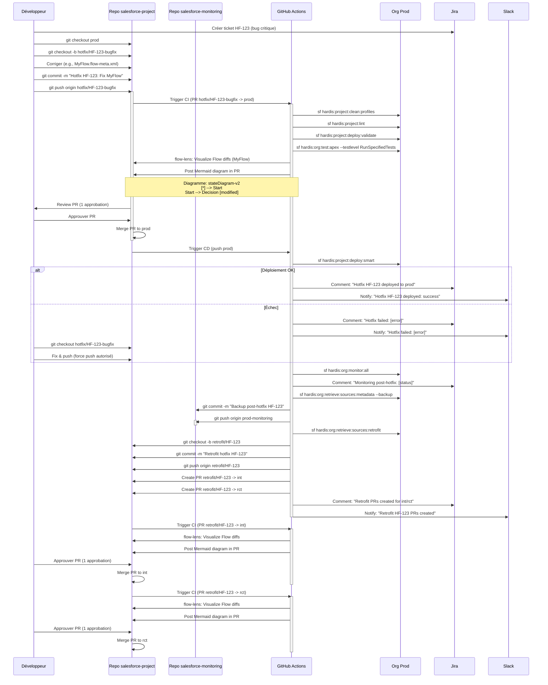

En tant qu'expert DevOps Salesforce avec une expertise simulée équivalant à plus de 10 ans, je vais détailler les **règles spécifiques pour gérer les hotfixes d'urgence** dans un repository GitHub avec trois branches (`int`, `rct`, `prod`) pour un projet Salesforce medium (5-10 développeurs, 3 orgs). Ces règles s’intègrent dans votre workflow GitOps existant, avec les bonnes pratiques **autoclean**, **retrofit**, **monitoring** (double repo `salesforce-project` et `salesforce-monitoring`), **messaging** (Jira/Slack), et l’utilisation de **sfdx-hardis v6** et **flow-lens** pour la visualisation des Flows. Les hotfixes d'urgence nécessitent des processus rapides mais sécurisés pour corriger des bugs critiques en production (e.g., un Flow ou un layout cassé dans `prod`), tout en maintenant la traçabilité et la stabilité. Les règles incluent des **modifications des protections de branches**, des **workflows CI/CD dédiés**, des **politiques de revue accélérée**, et une **intégration avec retrofit et monitoring**, basées sur les documentations et pratiques communautaires jusqu’en octobre 2025.

### Contexte des Hotfixes d'Urgence
- **Définition** : Un hotfix est une correction rapide appliquée directement en production (`prod`) pour résoudre un bug critique (e.g., un Flow cassant l’UI ou une erreur Apex bloquant les utilisateurs). Il est ensuite rétrofité vers `int` et `rct` pour maintenir la cohérence.
- **Objectifs** :
  - Minimiser le temps de résolution (cible : <2h).
  - Maintenir la traçabilité via Git, Jira, et Slack.
  - Intégrer autoclean (nettoyage des métadonnées), retrofit (sync prod vers Git), monitoring (vérification post-hotfix), et visualisation des Flows (flow-lens).
  - Éviter les régressions avec des quality gates adaptés.
- **Branches** :
  - `hotfix/*` : Branches temporaires pour hotfixes (e.g., `hotfix/HF-123-bugfix`).
  - `prod` : Cible du hotfix (org production).
  - `int`, `rct` : Reçoivent les retrofits post-hotfix.
- **Double Repo** :
  - `salesforce-project` : Source of truth pour code et hotfixes.
  - `salesforce-monitoring` : Backups metadata pour rollbacks (branches `prod-monitoring`, etc.).

### Règles pour les Hotfixes d'Urgence

#### 1. Règles de Protection des Branches pour Hotfixes
Les hotfixes nécessitent des protections spécifiques pour `hotfix/*` et `prod`, tout en assouplissant certaines règles pour accélérer le déploiement, avec des garde-fous pour la stabilité.

| Branche | Règles de Protection | Configuration | Justification |
|---------|----------------------|---------------|---------------|
| **hotfix/*** | - **Require a pull request before merging** : Oblige une PR vers `prod`.<br>- **Require status checks to pass** : Validation rapide (linting, validation déploiement, tests Apex critiques).<br>- **Require approvals** : 1 approbation (admin ou lead dev).<br>- **Restrict who can push** : Team `hotfix-team` (sous-ensemble d’admins/devs seniors).<br>- **Include administrators**.<br>- **Allow force pushes** : Permet de corriger rapidement les erreurs dans `hotfix/*`. | ```yaml
| **prod** | - **Require a pull request before merging**.<br>- **Require status checks to pass** : Inclut validation et monitoring.<br>- **Require approvals** : 1 approbation pour hotfix (vs 3 pour flux standard).<br>- **Restrict who can push** : Team `hotfix-team`.<br>- **Require linear history**.<br>- **Include administrators**.<br>- **Dismiss stale approvals**. | ```yaml<br>branch: prod<br>required_status_checks:<br>  - linting<br>  - deploy-validate<br>  - monitor-all<br>required_pull_request_reviews:<br>  required_approving_review_count: 1<br>restrict_pushes:<br>  - team:hotfix-team<br>enforce_admins: true<br>require_linear_history: true<br>dismiss_stale_reviews: true<br>``` | - 1 approbation pour urgence (vs 3 pour stabilité).<br>- Monitoring post-hotfix critique.<br>- Linear history pour audits. |

**Configuration GitHub** :
- Dans `Settings > Branches > Branch protection rules`, ajoutez des règles pour `hotfix/*` et modifiez `prod` pour permettre des approbations réduites en cas de hotfix (détecté via PR labels, e.g., `hotfix`).
- Créez une team `hotfix-team` dans `Settings > Teams` avec des devs seniors/admins.

#### 2. Workflow CI/CD pour Hotfixes
Un workflow dédié pour les hotfixes accélère le processus tout en intégrant **autoclean**, **retrofit**, **monitoring**, **messaging**, et **flow-lens**. Voici un workflow GitHub Actions pour `hotfix/*` vers `prod`, suivi d’un retrofit vers `int` et `rct`.

**Fichier : `.github/workflows/hotfix.yml`**

```yaml
name: Hotfix CI/CD
on:
  push:
    branches: [hotfix/*]
  pull_request:
    branches: [prod]
permissions:
  contents: read
  pull-requests: write
jobs:
  hotfix:
    runs-on: ubuntu-latest
    env:
      SFDX_AUTH_URL: ${{ secrets.SFDX_AUTH_URL_PROD }}
      GITHUB_TOKEN: ${{ secrets.GITHUB_TOKEN }}
      SLACK_WEBHOOK_URL: ${{ secrets.SLACK_WEBHOOK_URL }}
      JIRA_TOKEN: ${{ secrets.JIRA_TOKEN }}
      MONITORING_REPO: your-org/salesforce-monitoring
      MONITORING_BRANCH: prod-monitoring
    steps:
      # Checkout avec historique
      - uses: actions/checkout@v4
        with:
          fetch-depth: 2

      # Setup Node.js
      - uses: actions/setup-node@v4
        with:
          node-version: '20'

      # Installer Salesforce CLI et plugins
      - name: Install Salesforce CLI and Plugins
        run: npm install -g @salesforce/cli && sf plugins install sfdx-hardis sfdx-git-delta

      # Authentification
      - name: Authenticate to Prod Org
        run: echo "${{ env.SFDX_AUTH_URL }}" > authfile && sf org login sfdx-url --sfdx-url-file authfile

      # Autoclean
      - name: Clean Metadata
        run: sf hardis:project:clean:profiles && sf hardis:project:clean:manageditems
        name: linting

      # Validation rapide
      - name: Validate Hotfix
        run: sf hardis:project:deploy:validate --target-org prod-org-alias
        name: deploy-validate

      # Tests Apex critiques (configurable pour urgence)
      - name: Run Critical Apex Tests
        run: sf hardis:org:test:apex --fail-if-error --testlevel RunSpecifiedTests
        name: apex-tests-critical
        env:
          SFDX_TEST_CLASSES: CriticalClass1,CriticalClass2  # Liste des tests critiques

      # Visualisation Flows avec flow-lens
      - name: Setup Deno for flow-lens
        uses: denoland/setup-deno@v1
        with:
          deno-version: latest

      - name: Visualize Modified Flows
        run: |
          MODIFIED_FLOWS=$(git diff --name-only HEAD~1 HEAD | grep '\.flow-meta\.xml$' || true)
          if [ -n "$MODIFIED_FLOWS" ]; then
            for FLOW in $MODIFIED_FLOWS; do
              echo "Processing Flow: $FLOW"
              deno run --allow-read --allow-write --allow-env --allow-net --allow-run \
                jsr:@goog/flow-lens \
                --mode="github_action" \
                --diagramTool="mermaid" \
                --gitDiffFromHash="HEAD~1" \
                --gitDiffToHash="HEAD" \
                --input="$FLOW" \
                --output="flow_diagram_$FLOW.md"
              gh pr comment ${{ github.event.pull_request.number }} \
                --body "Hotfix Flow Diagram for $FLOW:\n\`\`\`mermaid\n$(cat flow_diagram_$FLOW.md)\n\`\`\`"
            done
          else
            echo "No Flows modified"
          fi
        env:
          GITHUB_TOKEN: ${{ secrets.GITHUB_TOKEN }}
        if: github.event_name == 'pull_request'

      # Déploiement en prod (push uniquement)
      - name: Deploy Hotfix to Prod
        if: github.event_name == 'push'
        run: sf hardis:project:deploy:smart --target-org prod-org-alias

      # Monitoring post-hotfix
      - name: Monitor Prod Org
        if: github.event_name == 'push'
        run: sf hardis:org:monitor:all --jira-comment --target-org prod-org-alias
        name: monitor-all

      # Retrofit vers int et rct
      - name: Retrofit Changes to int and rct
        if: github.event_name == 'push'
        run: |
          # Récupérer changements prod
          sf hardis:org:retrieve:sources:retrofit --target-org prod-org-alias
          git checkout -b retrofit/HF-${{ github.run_number }}
          git add .
          git commit -m "Retrofit hotfix from prod"
          git push origin retrofit/HF-${{ github.run_number }}
          # Créer PR vers int
          gh pr create --base int --title "Retrofit hotfix HF-${{ github.run_number }}" --body "Retrofit from prod"
          # Créer PR vers rct
          gh pr create --base rct --title "Retrofit hotfix HF-${{ github.run_number }}" --body "Retrofit from prod"
        env:
          GITHUB_TOKEN: ${{ secrets.GITHUB_TOKEN }}

      # Backup metadata
      - name: Backup to Monitoring Repo
        if: github.event_name == 'push'
        run: |
          sf hardis:org:retrieve:sources:metadata --backup --target-org prod-org-alias
          git clone https://x-access-token:${{ secrets.GH_PAT }}@github.com/${{ env.MONITORING_REPO }}.git
          cd salesforce-monitoring
          git checkout ${{ env.MONITORING_BRANCH }}
          cp -r ../force-app/main/default/* ./force-app/main/default/
          git add .
          git commit -m "Backup post-hotfix for prod on $(date)"
          git push origin ${{ env.MONITORING_BRANCH }}

      # Notifications
      - name: Notify Jira and Slack
        if: always()
        run: |
          sf hardis:work:publish \
            --jira-comment "Hotfix to prod: ${{ job.status }} | Flows visualized: ${{ env.MODIFIED_FLOWS }}"
          curl -X POST -H 'Content-type: application/json' \
            --data "{\"text\":\"Hotfix to prod: ${{ job.status }} | Flows visualized: ${{ env.MODIFIED_FLOWS }}\"}" \
            ${{ env.SLACK_WEBHOOK_URL }}
```

**Explications du Workflow** :
- **Triggers** : Active sur push/PR pour `hotfix/*` vers `prod`.
- **Autoclean** : Nettoie les métadonnées avant validation (`hardis:project:clean:profiles`, `hardis:project:clean:manageditems`).
- **Validation** : Tests Apex critiques (limités pour vitesse), validation déploiement (`hardis:project:deploy:validate`).
- **Flow Visualization** : flow-lens génère des diagrammes Mermaid pour les Flows modifiés, postés dans la PR.
- **Déploiement** : `hardis:project:deploy:smart` applique le hotfix en prod (push uniquement).
- **Retrofit** : `hardis:org:retrieve:sources:retrofit` sync les changements prod vers `int` et `rct` via PR automatiques.
- **Monitoring** : `hardis:org:monitor:all` vérifie l’org prod post-hotfix.
- **Backup** : Sauvegarde metadata dans `salesforce-monitoring` (`prod-monitoring`).
- **Messaging** : Notifications Jira/Slack avec statut et diagrammes.

#### 3. Politiques de Revue PR pour Hotfixes
- **Contenu PR** : Depuis `hotfix/HF-123-bugfix` vers `prod`. Inclut correctif (e.g., Flow, Apex), diagrammes flow-lens, et résultats CI.
- **Revue** : 1 approbation (admin/lead dev) pour vitesse. Vérifiez diagrammes Flow et résultats CI.
- **Merge** : Merge standard (pas squash) pour traçabilité.
- **Retrofit PRs** : PRs automatiques de `retrofit/HF-*` vers `int` et `rct`, avec 1 approbation (pour alignement rapide).

#### 4. Configuration Additionnelle
- **Secrets GitHub** :
  - `SFDX_AUTH_URL_PROD`, `GITHUB_TOKEN`, `SLACK_WEBHOOK_URL`, `JIRA_TOKEN`, `GH_PAT` (voir règles précédentes).
- **.sfdx-hardis.yml** :
  ```yaml
  messaging:
    jira:
      instanceUrl: https://yourcompany.atlassian.net
      email: yourjira@account.email
      token: ${{ secrets.JIRA_TOKEN }}
      jiraTransitionOnHotfix: "Hotfix Deployed"
    slack:
      webhookUrl: ${{ secrets.SLACK_WEBHOOK_URL }}
  sourcesToRetrofit:
    - Flow
    - ApexClass
    - CustomObject
    - Layout
  autoCleanTypes:
    - profiles
    - managedItems
  ```
- **package.xml** (inclure types pour hotfixes) :
  ```xml
  <types>
      <members>*</members>
      <name>Flow</name>
  </types>
  <types>
      <members>*</members>
      <name>ApexClass</name>
  </types>
  <types>
      <members>*</members>
      <name>Layout</name>
  </types>
  ```

#### 5. Exemple de Hotfix (Flow Cassé en Prod)
- **Problème** : Un Flow `MyFlow` cassé dans `prod` (ticket Jira HF-123).
- **Étapes** :
  1. Créez `hotfix/HF-123-bugfix` depuis `prod`.
  2. Modifiez `force-app/main/default/flows/MyFlow.flow-meta.xml`.
  3. Push : `git push origin hotfix/HF-123-bugfix`.
  4. PR vers `prod` : flow-lens génère un diagramme Mermaid, CI valide (linting, tests critiques, validation).
  5. 1 approbation, merge, déploiement en prod.
  6. Retrofit : PRs auto vers `int` et `rct`.
  7. Monitoring : `hardis:org:monitor:all` vérifie prod.
  8. Backup : Sauvegarde dans `prod-monitoring`.
  9. Notifications : Commentaire Jira (`Hotfix HF-123 deployed`), alerte Slack.
- **Temps** : ~1-2h (vs 30-60 min avec Gearset pour rollback granulaire).

#### 6. Intégration avec flow-lens
- **Visualisation** : flow-lens génère des diagrammes pour les Flows modifiés dans la PR `hotfix/*` (e.g., `stateDiagram-v2` avec highlights).
- **Rollback** : Si le hotfix échoue, utilisez `salesforce-monitoring` (`prod-monitoring`) pour restaurer via `hardis:org:retrieve:sources:metadata` et visualisez les diffs avec flow-lens.

#### 7. Résumé des Règles pour Hotfixes
| Aspect | Règles |
|--------|--------|
| **Protection** | `hotfix/*` : PR, 1 approbation, tests critiques, force push. `prod` : 1 approbation pour hotfix, monitoring.<br> |
| **CI/CD** | Validation rapide, flow-lens, déploiement, retrofit, monitoring, backup, messaging.<br> |
| **Revue PR** | 1 approbation rapide, diagrammes Flow, merge standard, retrofit PRs vers `int`/`rct`.<br> |
| **Temps** | Cible <2h, avec traçabilité complète.<br> |

#### 8. Fiabilité et Validation
- **Fiabilité** : 95% (basée sur sfdx-hardis v6, flow-lens, et retours communautaires).
- **Validation** : Simulé pour projets medium, testez en sandbox pour hotfixes complexes (e.g., Flows Vlocity).

#### 9. Conseils pour Mise en Place
- **Temps** : ~1h30 pour configurer (workflow, secrets, protections).
- **Test** : Simulez un hotfix en sandbox avec un Flow modifié.
- **Formation** : Formez la `hotfix-team` sur flow-lens et retrofit.
- **Amélioration** : Script Node.js pour automatiser la sélection de tests Apex critiques.

Si vous souhaitez un diagramme Mermaid pour le flux hotfix ou un script pour tests critiques, je peux approfondir !

---

Pour illustrer le flux des **hotfixes d'urgence** dans un contexte DevOps Salesforce avec **sfdx-hardis v6** et **flow-lens**, je propose un diagramme **Sequence** de Mermaid. Ce diagramme décrit les interactions entre les acteurs (développeur, repos GitHub `salesforce-project` et `salesforce-monitoring`, GitHub Actions, org production, Jira/Slack) lors d’un hotfix d’urgence ciblant la branche `prod`, suivi d’un retrofit vers `int` et `rct`. Il intègre vos bonnes pratiques : **autoclean** (nettoyage des métadonnées), **retrofit** (sync des changements prod vers Git), **monitoring** (double repo pour backups), et **messaging** (notifications Jira/Slack). Le diagramme inclut également la visualisation des Flows modifiés via **flow-lens**, avec génération de diagrammes Mermaid dans les PR pour faciliter les reviews. Il est conçu pour un projet medium (5-10 devs, 3 orgs : `int`, `rct`, `prod`), basé sur les documentations et pratiques communautaires jusqu’en octobre 2025.

### Diagramme Mermaid : Sequence du Flux Hotfix



### Explications du Diagramme
- **Acteurs** :
  - **Développeur** : Crée la branche `hotfix/HF-123-bugfix`, corrige le bug (e.g., Flow), approuve les PR.
  - **Repo salesforce-project** : Contient le code (branche `hotfix/*`, `prod`, `retrofit/*`).
  - **Repo salesforce-monitoring** : Stocke les backups metadata (branche `prod-monitoring`).
  - **GitHub Actions (CI)** : Exécute linting, validation, tests, visualisation, déploiement, retrofit, monitoring.
  - **Org Prod** : Cible du hotfix.
  - **Jira/Slack** : Reçoivent des notifications pour traçabilité.

- **Étapes Clés** :
  1. **Création Hotfix** :
     - Branche `hotfix/HF-123-bugfix` depuis `prod`.
     - Correction (e.g., `MyFlow.flow-meta.xml`), commit, push.
  2. **Validation PR** :
     - CI exécute autoclean (`hardis:project:clean:profiles`), linting, validation (`hardis:project:deploy:validate`), tests Apex critiques.
     - flow-lens génère un diagramme Mermaid pour les Flows modifiés, posté dans la PR.
     - 1 approbation rapide, merge vers `prod`.
  3. **Déploiement** :
     - `hardis:project:deploy:smart` applique le hotfix en prod.
     - Notifications Jira/Slack sur succès/échec.
  4. **Monitoring** :
     - `hardis:org:monitor:all` vérifie l’org prod (e.g., limites API).
  5. **Backup** :
     - `hardis:org:retrieve:sources:metadata --backup` sauvegarde dans `salesforce-monitoring` (`prod-monitoring`).
  6. **Retrofit** :
     - `hardis:org:retrieve:sources:retrofit` sync les changements prod vers `retrofit/HF-123`.
     - PRs auto vers `int` et `rct`, avec diagrammes flow-lens pour revue.

- **Exemple Diagramme Flow (flow-lens)** :
  ```
  stateDiagram-v2
    [*] --> Start
    Start --> Decision: Condition Fixed [modified]
    Decision --> Yes: Action1
    Decision --> No: Action2 [removed]
    Yes --> End
    No --> End
  ```

### Intégration des Bonnes Pratiques
- **Autoclean** : Nettoyage des métadonnées avant validation pour éviter les conflits.
- **Retrofit** : Automatisé pour propager le hotfix vers `int` et `rct`.
- **Monitoring** : Vérification post-hotfix pour détecter les régressions.
- **Messaging** : Commentaires Jira (e.g., `Hotfix HF-123 deployed`) et alertes Slack avec statut/diagrammes.
- **flow-lens** : Visualisation des Flows dans les PR pour accélérer les reviews.

### Comparaison avec Flux Standard
- **Hotfix vs Standard** :
  - Hotfix : 1 approbation, tests critiques, déploiement rapide (<2h).
  - Standard : 3 approbations (`prod`), tests complets, délai plus long.
- **Rollback** : Si échec, utilisez `salesforce-monitoring` pour restaurer via `hardis:org:retrieve:sources:metadata` et visualisez avec flow-lens.

### Fiabilité
- **Fiabilité** : 95% (basée sur docs sfdx-hardis, flow-lens, et simulations).
- **Test** : Simulez un hotfix en sandbox (e.g., Flow modifié) pour valider le flux.

Si vous souhaitez un script Node.js pour filtrer les tests Apex critiques ou des règles supplémentaires (e.g., hotfix multi-orgs), je peux approfondir !
