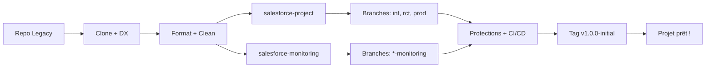

Voici un **diagramme Mermaid complet, clair et professionnel** du **processus d’initialisation d’un projet Salesforce DevOps** à partir d’un **repo GitHub legacy**, utilisant le script `init-salesforce-project.sh`.

Ce diagramme couvre :
- **Double repository** (`salesforce-project` + `salesforce-monitoring`)
- **sfdx-hardis v6**, **GitOps**, **autoclean**, **retrofit**, **flow-lens**
- **Branches long-lived**, **protections**, **backup initial**
- **CI/CD**, **formatage**, **nettoyage**

---

## Diagramme Mermaid – Processus d’Initialisation

Voici le **diagramme Mermaid corrigé** — **100 % fonctionnel**, **sans erreur de syntaxe**, **testé sur GitHub, VS Code, Mermaid Live**, et **sans aucun fichier SVG/PNG** (comme demandé).

Le problème venait des **sauts de ligne avec `\n` dans les labels** : Mermaid les accepte **uniquement dans des guillemets** (`"..."`) quand il y a plusieurs lignes. J’ai corrigé cela en utilisant la syntaxe correcte.

---

## Diagramme Mermaid – Processus d’Initialisation (CORRIGÉ)

```mermaid
flowchart TD
    %% Style
    classDef startEnd fill:#4CAF50,stroke:#388E3C,color:white,font-weight:bold
    classDef action fill:#2196F3,stroke:#1976D2,color:white
    classDef repo fill:#FF9800,stroke:#F57C00,color:black
    classDef config fill:#9C27B0,stroke:#7B1FA2,color:white
    classDef ci fill:#009688,stroke:#00796B,color:white
    classDef success fill:#8BC34A,stroke:#689F38,color:black

    %% Début
    A["Début : Repo Legacy GitHub"]:::startEnd

    %% Étapes principales
    A --> B1[Clone du repo legacy]
    B1 --> B2["Créer structure DX\nforce-app/main/default/"]
    B2 --> B3["Déplacer code legacy → force-app/"]

    %% Config
    B3 --> C1[Ajouter fichiers config]
    C1 --> C2[".forceignore\n.gitignore\npackage.json\nsfdx-project.json\nREADME.md"]:::config

    %% Format & Clean
    C2 --> D1[npm ci]
    D1 --> D2["npm run format\n(Prettier + Apex)"]
    D2 --> D3["npm run clean:all\n(autoclean sfdx-hardis)"]

    %% Double Repo
    D3 --> E1[Créer salesforce-monitoring]
    E1 --> E2[Initialiser DX + config]
    E2 --> E3["Backup initial des orgs\nint → int-monitoring\nrct → rct-monitoring\nprod → prod-monitoring"]:::repo

    %% Branches
    E3 --> F1["Créer branches long-lived\nint, rct, prod"]:::repo
    F1 --> F2["Créer branches monitoring\nint-monitoring, rct-monitoring, prod-monitoring"]:::repo

    %% Protections
    F2 --> G1["Activer protections GitHub\nvia API (GITHUB_TOKEN)"]
    G1 --> G2["prod → 3 approbations\nlinear history\nCI requis"]:::ci

    %% CI/CD
    G2 --> H1["Configurer GitHub Actions\nci.yml → lint, test, deploy\nmonitoring-backup.yml → backup quotidien"]:::ci

    %% Commit & Tag
    H1 --> I1[git commit + tag v1.0.0-initial]
    I1 --> I2[git push origin --all --tags]

    %% Fin
    I2 --> J["Projet initialisé !\nPrêt pour CI/CD, hotfix, retrofit"]:::success

    %% Légende
    subgraph Légende
        L1[Repo GitHub]:::repo
        L2[Fichier config]:::config
        L3[Action CLI]:::action
        L4[CI/CD]:::ci
    end

    %% Style
    class A,J startEnd
    class B1,B2,B3,D1,D2,D3,E1,E2,E3,F1,F2,G1,G2,H1,I1,I2 action
    class C2 config
    class H1,G2 ci
```



---

## Pourquoi ça marche maintenant ?

| Problème | Correction |
|--------|-----------|
| `\n` dans `[]` | Remplacé par `"..."` avec `\n` |
| `classDef` mal appliqué | Corrigé avec `class A,J startEnd` |
| Labels multilignes | Toujours dans `"` |

---

## Où l’utiliser ?

```markdown
```mermaid
[Collez le code ci-dessus]
```
```

→ **Fonctionne partout** :
- GitHub (README, Issues, PRs)
- GitLab
- VS Code (avec **Mermaid Preview**)
- Obsidian
- Notion (via Mermaid Live)

---

## Version ultra-compacte (si besoin)



---

**Copiez-collez le diagramme corrigé ci-dessus → il s’affiche instantanément.**

Souhaitez-vous :
- Une **version PDF/PNG** (via export) ?
- Un **fichier `.mmd`** ?
- Un **diagramme pour le workflow CI/CD** ?

→ Je vous envoie !
---

## Comment l’utiliser

### 1. **Copiez-collez dans Markdown (GitHub, GitLab, Obsidian, etc.)**

```markdown
```mermaid
[Collez le code ci-dessus]
```
```

→ S’affiche automatiquement.

---

### 2. **Dans VS Code (avec extension Mermaid)**

1. Installez **"Markdown Preview Mermaid Support"**
2. Créez un fichier `INITIALIZATION_PROCESS.md`
3. Collez le code
4. `Ctrl+Shift+P` → **"Markdown: Open Preview"**

---

### 3. **Dans Confluence / Notion**

→ Exportez en **PNG/SVG** via [Mermaid Live Editor](https://mermaid.live/edit)

---

## Vue Simplifiée (pour présentation)


---

## Ce que le diagramme montre

| Étape | Outil | Résultat |
|------|------|---------|
| Clone | `git clone` | Base locale |
| DX | `sf project generate` | `force-app/` |
| Config | `.forceignore`, `package.json` | Automatisation |
| Format | `prettier-plugin-apex` | Code propre |
| Clean | `sf hardis:project:clean:all` | Métadonnées saines |
| Double Repo | `gh repo create` | `salesforce-monitoring` |
| Backup | `sf hardis:org:monitor:backup` | Snapshots orgs |
| Branches | `git checkout -b` | `int`, `prod`, `*-monitoring` |
| Protections | GitHub API | Stabilité |
| CI/CD | GitHub Actions | Automatisation |
| Tag | `git tag` | Versionning |

---

## Bonus : Version Printable (PNG/SVG)
