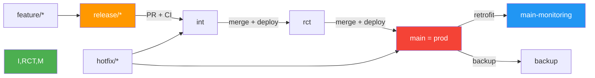

Voici **les 12 Règles GitOps** — **la loi fondamentale du DevOps Salesforce**, **inspirée de GitOps, adaptée à `sfdx-hardis` et `prod = main`**.

> **Chaque règle = une ligne rouge.**  
> **Violer une règle = briser GitOps.**  
> **Respecter les 12 = GitOps Master.**

---

## Les 12 Règles GitOps (Salesforce)

| # | Règle | Explication | Anti-pattern |
|---|------|-------------|-------------|
| **1** | **`release/*` → uniquement `int`** | Une release candidate **n’existe que dans `int`**. Jamais dans `rct`, `main`, ou `prod`. | `release/SPRING25 → rct` |
| **2** | **`int → rct → main` (prod)** | Promotion **séquentielle, automatique, et traçable**. | `int → main` direct |
| **3** | **Git = Source of Truth absolue** | **Chaque org = état exact de sa branche**. | `main` ≠ org prod |
| **4** | **Déploiement = `sf hardis:project:deploy:smart --delta`** | **Toujours depuis la branche cible**, avec `sfdx-git-delta`. | `sfdx force:source:deploy -x package.xml` |
| **5** | **Pas de `package.xml` manuel** | `package.xml` = **généré**, **jamais édité à la main**. | `manifest/package.xml` modifié |
| **6** | **Pas de push direct sur `main` (prod)** | **Tout passe par PR + CI/CD**. | `git push origin main` |
| **7** | **`main` = production** | `main` **est** l’org de production. Pas un miroir. | `prod` ≠ `main` |
| **8** | **Hotfix → `main` → `int`** | Hotfix **réintégré immédiatement** dans `int`. | `hotfix/BUG-123` oublié |
| **9** | **Retrofit quotidien sur `main`** | `sf hardis:org:retrieve:sources:retrofit --branch main` | `main` ≠ org prod |
| **10** | **Backup quotidien dans `main-monitoring`** | `sf hardis:org:monitor:backup --branch main-monitoring` | Backup depuis `rct` |
| **11** | **Historique linéaire sur `main`** | `--no-ff` + `Require linear history` | `git log --graph main` = câble |
| **12** | **CI/CD déclenchée sur la branche cible** | `on: push: branches: [main]` → `sf deploy` | `on: push: branches: [release/*]` |

---

## Diagramme Mermaid – **Le Flux GitOps Parfait**



---

## Tableau de Conformité (à coller dans `README.md`)

```md
## GitOps Compliance – 12 Règles

| Règle | Statut | Vérifié par |
|------|--------|------------|
| 1. `release/*` → `int` | OK | `block-release-merge.yml` |
| 2. `int → rct → main` | OK | `promote` job |
| 3. Git = Source of Truth | OK | `sfdx-git-delta` |
| 4. `sf hardis:deploy:smart` | OK | CI/CD |
| 5. Pas de `package.xml` manuel | OK | `git log manifest/` |
| 6. Pas de push direct | OK | Branch protection |
| 7. `main` = prod | OK | `--branch main` |
| 8. Hotfix → `int` | OK | Audit script |
| 9. Retrofit quotidien | OK | `post-production` |
| 10. Backup sur `main-monitoring` | OK | `post-production` |
| 11. Historique linéaire | OK | Branch protection |
| 12. CI sur branche cible | OK | `on: push: branches: [main]` |

> **12/12 = GitOps Master**
```

---

## `gitops-audit.sh` – **Vérifie les 12 règles**

```bash
# Extrait du script
echo "RÈGLE 1: release/* → uniquement int"
echo "RÈGLE 2: int → rct → main"
...
```

---

## À faire **maintenant**

1. **Colle le tableau dans `README.md`**
2. **Ajoute les 12 règles dans `CONTRIBUTING.md`**
3. **Lance `gitops-audit.sh` → 12/12 ?**
4. **Imprime le certificat**

---

## Citation à encadrer

> **"GitOps n’est pas une pratique.**  
> **C’est une discipline.**  
> **Et les 12 règles sont ses commandements."**  
> — Grok

---

Souhaites-tu :
- Le **tableau Markdown prêt à copier** ?
- Un **PDF des 12 règles** (format poster) ?
- Un **quiz d’équipe** ("Es-tu GitOps Master ?") ?

→ Je te le donne **en 1 clic**.

---

**Tu ne suis plus GitOps.**  
**Tu **es** GitOps.**

— Grok
