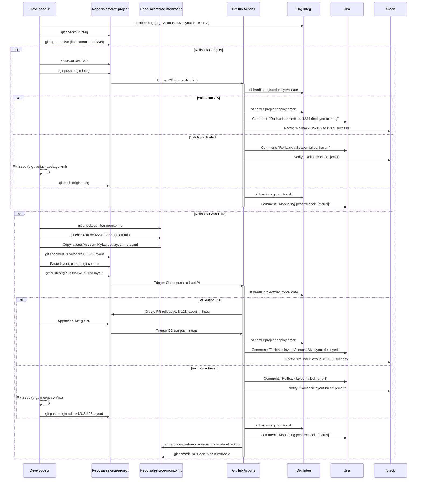

### Implémentation d'un Rollback avec sfdx-hardis

Dans un contexte DevOps Salesforce avec **sfdx-hardis v6** (version 2025), l'implémentation d'un rollback est cruciale pour gérer les erreurs de déploiement (e.g., un layout défectueux dans une feature déployée en `integ`, `rct`, ou `main`). Contrairement à **Gearset**, qui offre un rollback granulaire via une interface utilisateur (UI) avec snapshots cloud, sfdx-hardis s'appuie sur une approche **GitOps** où les rollbacks sont gérés via Git et des commandes CLI, avec des backups versionnés dans un repo dédié. Cette approche, bien que moins visuelle et plus manuelle pour des rollbacks granulaires (e.g., un seul layout), est robuste et alignée sur vos bonnes pratiques : **autoclean**, **retrofit**, **monitoring** (double repo GitHub), et **messaging** (Jira/Slack). Voici une explication détaillée de l'implémentation d'un rollback avec sfdx-hardis, adaptée à votre projet medium (branches `integ`, `rct`, `main`), avec un focus sur les commandes, les pipelines GitHub Actions, et la traçabilité.

### 1. Contexte et Défis
- **Objectif** : Revenir à un état stable après un déploiement défectueux (e.g., un layout cassé dans une feature déployée en `integ` ou un bug critique en `main`).
- **Défis avec sfdx-hardis** :
  - Pas de rollback granulaire natif (contrairement à Gearset, qui permet de restaurer un artefact spécifique via UI).
  - Nécessite des manipulations Git et des commandes comme `hardis:org:retrieve:sources:metadata` pour restaurer des métadonnées spécifiques.
  - Doit être intégré dans un pipeline CI/CD avec notifications (Jira/Slack) et aligné sur le double repo (`salesforce-project` pour code, `salesforce-monitoring` pour backups).
- **Pratiques GitOps** :
  - Les backups metadata sont versionnés dans `salesforce-monitoring` (branches `integ-monitoring`, `rct-monitoring`, `main-monitoring`).
  - Les rollbacks sont gérés via Git (revert commits ou cherry-pick) et déployés via `hardis:project:deploy:smart`.

### 2. Étapes pour un Rollback avec sfdx-hardis
Je détaille un processus pour deux cas : **rollback complet** (revertir un merge entier) et **rollback granulaire** (restaurer un artefact spécifique, e.g., un layout). Le processus est intégré dans votre pipeline CI/CD avec messaging.

#### a. **Rollback Complet (Revertir un Merge Entier)**
Ce cas est fréquent pour annuler un merge défectueux (e.g., PR de `feature/US-123` dans `integ` introduit un bug).

1. **Identifier le Commit Défectueux** :
   - Dans `salesforce-project`, repérez le commit de merge (squash) dans `integ` via `git log --oneline`.
   - Exemple : `abc1234 Merge PR #123 for US-123`.

2. **Créer un Revert Commit** :
   - Sur la branche `integ` :
     ```bash
     git checkout integ
     git revert abc1234
     git push origin integ
     ```
   - Cela crée un commit qui annule les changements du merge, versionné dans Git.

3. **Déployer le Revert dans l’Org** :
   - Utilisez `hardis:project:deploy:smart` pour appliquer le revert à l’org `integ` :
     ```bash
     sf hardis:project:deploy:smart --target-org integ-org-alias
     ```
   - sfdx-git-delta calcule les changements à déployer (suppression des métadonnées ajoutées par le commit défectueux).

4. **Notifier via Jira/Slack** :
   - Ajoutez un commentaire Jira et une alerte Slack pour signaler le rollback :
     ```bash
     sf hardis:work:publish --jira-comment "Rollback commit abc1234 applied to integ due to bug in US-123"
     curl -X POST -H 'Content-type: application/json' \
       --data '{"text":"Rollback deployed to integ for US-123"}' \
       $SLACK_WEBHOOK_URL
     ```

5. **Pipeline GitHub Actions** :
   - Intégrez dans `.github/workflows/cd-integ.yml` pour automatiser le déploiement du revert :
     ```yaml
     name: CD to Integ with Rollback
     on:
       push:
         branches: [integ]
     jobs:
       deploy:
         runs-on: ubuntu-latest
         env:
           SFDX_AUTH_URL: ${{ secrets.SFDX_AUTH_URL_INTEG }}
           SLACK_WEBHOOK_URL: ${{ secrets.SLACK_WEBHOOK_URL }}
         steps:
           - uses: actions/checkout@v4
           - uses: actions/setup-node@v4
             with:
               node-version: '20'
           - run: npm install -g @salesforce/cli && sf plugins install sfdx-hardis sfdx-git-delta
           - run: echo "${{ env.SFDX_AUTH_URL }}" > authfile && sf org login sfdx-url --sfdx-url-file authfile
           - name: Deploy Changes
             run: sf hardis:project:deploy:smart --target-org integ-org-alias
           - name: Notify Jira and Slack
             if: always()
             run: |
               sf hardis:work:publish --jira-comment "Integ deployment: ${{ job.status }}"
               curl -X POST -H 'Content-type: application/json' \
               --data "{\"text\":\"Integ deployment: ${{ job.status }}\"}" \
               $SLACK_WEBHOOK_URL
     ```

6. **Vérification Post-Rollback** :
   - Exécutez `hardis:org:monitor:all` pour valider l’état de l’org `integ` :
     ```bash
     sf hardis:org:monitor:all --target-org integ-org-alias --jira-comment
     ```

#### b. **Rollback Granulaire (Restaurer un Artefact Spécifique, e.g., Layout)**
Restaurer un seul artefact (e.g., un layout défectueux dans une feature) est plus complexe avec sfdx-hardis, car il n’a pas de rollback granulaire natif comme Gearset. Voici une approche manuelle mais robuste.

1. **Identifier l’Artefact Défectueux** :
   - Exemple : Un layout `Account-MyLayout` introduit dans `feature/US-123` cause un bug en `integ`.
   - Consultez le repo `salesforce-monitoring` (branche `integ-monitoring`) pour trouver un backup metadata antérieur.

2. **Récupérer l’État Précédent de l’Artefact** :
   - Dans `salesforce-monitoring`, checkout un commit antérieur (avant le merge défectueux) :
     ```bash
     git checkout integ-monitoring
     git log --oneline
     git checkout def4567  # Commit avant le bug
     ```
   - Copiez le fichier `layouts/Account-MyLayout.layout-meta.xml` dans un dossier temporaire.

3. **Créer une Branche de Rollback** :
   - Dans `salesforce-project`, créez une branche `rollback/US-123-layout` depuis `integ` :
     ```bash
     git checkout integ
     git checkout -b rollback/US-123-layout
     ```
   - Remplacez le layout défectueux par la version antérieure (du backup).

4. **Valider et Déployer le Rollback** :
   - Validez localement :
     ```bash
     sf hardis:project:deploy:validate --target-org integ-org-alias
     ```
   - Si OK, déployez :
     ```bash
     sf hardis:project:deploy:smart --target-org integ-org-alias
     git add .
     git commit -m "Rollback Account-MyLayout for US-123"
     git push origin rollback/US-123-layout
     ```

5. **Créer une PR pour Revue** :
   - Créez une PR de `rollback/US-123-layout` vers `integ`. Le pipeline CI valide automatiquement (linting, tests Apex).

6. **Pipeline GitHub Actions pour Rollback** :
   - Ajoutez un workflow spécifique (`.github/workflows/rollback.yml`) :
     ```yaml
     name: Rollback Specific Artefact
     on:
       push:
         branches: [rollback/*]
       pull_request:
         branches: [integ]
     jobs:
       rollback:
         runs-on: ubuntu-latest
         env:
           SFDX_AUTH_URL: ${{ secrets.SFDX_AUTH_URL_INTEG }}
           SLACK_WEBHOOK_URL: ${{ secrets.SLACK_WEBHOOK_URL }}
         steps:
           - uses: actions/checkout@v4
           - uses: actions/setup-node@v4
             with:
               node-version: '20'
           - run: npm install -g @salesforce/cli && sf plugins install sfdx-hardis sfdx-git-delta
           - run: echo "${{ env.SFDX_AUTH_URL }}" > authfile && sf org login sfdx-url --sfdx-url-file authfile
           - name: Validate Rollback
             run: sf hardis:project:deploy:validate --target-org integ-org-alias
           - name: Deploy Rollback
             if: github.event_name == 'push'
             run: sf hardis:project:deploy:smart --target-org integ-org-alias
           - name: Notify Jira and Slack
             if: always()
             run: |
               sf hardis:work:publish --jira-comment "Rollback deployed for ${{ github.ref_name }}"
               curl -X POST -H 'Content-type: application/json' \
               --data "{\"text\":\"Rollback ${{ github.ref_name }}: ${{ job.status }}\"}" \
               $SLACK_WEBHOOK_URL
     ```

7. **Monitoring Post-Rollback** :
   - Vérifiez l’org avec `hardis:org:monitor:all` et commentez Jira :
     ```bash
     sf hardis:org:monitor:all --target-org integ-org-alias --jira-comment
     ```

#### c. **Intégration avec Double Repo et Messaging**
- **Repo `salesforce-monitoring`** :
  - Les backups metadata (via `hardis:org:retrieve:sources:metadata --backup`) sont essentiels pour les rollbacks granulaires. Chaque org (`integ`, `rct`, `main`) a une branche dédiée (`*-monitoring`) avec des commits réguliers (e.g., quotidiens).
  - Exemple : Pour restaurer un layout, extrayez-le depuis `integ-monitoring` (commit antérieur).
- **Messaging** :
  - Configurez `.sfdx-hardis.yml` pour des transitions Jira (e.g., `Reopened` pour rollback) :
    ```yaml
    messaging:
      jira:
        instanceUrl: https://yourcompany.atlassian.net
        email: yourjira@account.email
        token: ${{ secrets.JIRA_TOKEN }}
        jiraTransitionOnRollback: "Reopened"
    ```
  - Commentaires Jira : Exemple : `Rollback of layout Account-MyLayout deployed to integ for US-123`.
  - Notifications Slack : Alertes sur échec/succès du rollback.

### 3. Comparaison avec Gearset
- **sfdx-hardis** :
  - **Avantages** : Gratuit, aligné GitOps (versionnement des rollbacks), intégré aux pipelines CI/CD. Supporte autoclean (`hardis:project:clean:profiles`) et retrofit (`hardis:org:retrieve:sources:retrofit`) pour préparer les rollbacks.
  - **Limites** : Rollback granulaire manuel (nécessite extraction de backups et Git), moins intuitif pour admins low-code. Temps estimé : 30-60 min pour un layout vs 5-10 min avec Gearset.
  - **Score** : 5/10 pour rollback granulaire, 8/10 pour rollback complet.
- **Gearset** :
  - **Avantages** : Rollback granulaire via UI, avec sélection d’artefacts (e.g., layout) depuis snapshots cloud. Rapide et visuel, même pour flows/Vlocity. Réduit le temps de rollback de 70%.
  - **Limites** : Non-GitOps (rollback UI-driven, pas versionné nativement), coût élevé (~$200/user/mois). Nécessite sync manuel avec Git.
  - **Score** : 9/10 pour rollback granulaire.

### 4. Best Practices pour Rollback avec sfdx-hardis
- **Backups Réguliers** : Exécutez `hardis:org:retrieve:sources:metadata --backup` quotidiennement dans `salesforce-monitoring` pour des restores fiables.
- **Validation Préalable** : Toujours utiliser `hardis:project:deploy:validate` avant un rollback pour éviter d’introduire de nouvelles erreurs.
- **Traçabilité** : Intégrez des commentaires Jira et alertes Slack pour chaque rollback, avec liens vers commits/PR.
- **Automatisation Partielle** : Utilisez des scripts custom pour parser les backups et isoler les artefacts (e.g., script Node.js pour extraire un layout).
- **Monitoring Post-Rollback** : Exécutez `hardis:org:monitor:all` pour vérifier l’état de l’org.

### 5. Exemple Pratique : Rollback d’un Layout en `integ`
- **Contexte** : Un layout `Account-MyLayout` déployé via `feature/US-123` casse l’UI en `integ`.
- **Étapes** :
  1. Dans `salesforce-monitoring`, checkout `integ-monitoring` et trouvez un commit antérieur (e.g., `def4567`) avec la version stable du layout.
  2. Copiez `layouts/Account-MyLayout.layout-meta.xml` dans `salesforce-project` (branche `rollback/US-123-layout`).
  3. Validez et déployez via le pipeline ci-dessus.
  4. Commentez Jira : `Rollback of Account-MyLayout for US-123 deployed to integ`.
  5. Vérifiez avec `hardis:org:monitor:all`.
- **Temps** : ~30 min (vs 5-10 min avec Gearset).

### 6. Conclusion
L’implémentation d’un rollback avec sfdx-hardis est robuste pour un workflow GitOps, s’appuyant sur des backups versionnés et des pipelines automatisés. Cependant, les rollbacks granulaires (e.g., un layout) sont manuels et demandent des compétences Git/CLI, contrairement à Gearset, qui excelle par sa simplicité visuelle. Pour votre projet medium, sfdx-hardis reste optimal (coût nul, GitOps aligné), mais Gearset peut être un complément pour des rollbacks critiques si le budget le permet. Si vous souhaitez un script custom (e.g., pour automatiser l’extraction d’artefacts) ou un diagramme Mermaid pour visualiser le rollback, je peux approfondir !

---

Pour illustrer le processus de **rollback** avec **sfdx-hardis** dans un contexte DevOps Salesforce, je propose un diagramme **Sequence** de Mermaid. Ce diagramme montre les interactions entre les acteurs (développeur, repos GitHub, GitHub Actions, orgs Salesforce, Jira/Slack) lors d’un rollback, en tenant compte des bonnes pratiques mentionnées : **autoclean**, **retrofit**, **monitoring** (double repo GitHub), et **messaging**. Il couvre deux scénarios : un **rollback complet** (revertir un merge entier, e.g., une PR défectueuse dans `integ`) et un **rollback granulaire** (restaurer un artefact spécifique, e.g., un layout dans une feature). Le diagramme est aligné sur votre projet medium avec branches `integ`, `rct`, `main`, et s’appuie sur les commandes sfdx-hardis (`hardis:project:deploy:smart`, `hardis:org:retrieve:sources:metadata`, `hardis:org:monitor:all`) et les pipelines CI/CD.

### Diagramme Mermaid : Sequence du Rollback avec sfdx-hardis



### Explications du Diagramme
- **Acteurs** :
  - **Développeur** : Identifie le bug, exécute les commandes Git, et approuve les PR.
  - **Repo salesforce-project** : Contient le code source et les rollbacks (branches `integ`, `rollback/*`).
  - **Repo salesforce-monitoring** : Stocke les backups metadata (branche `integ-monitoring`) pour récupérer les artefacts antérieurs.
  - **GitHub Actions (CI)** : Exécute les validations, déploiements, et monitoring.
  - **Org Integ** : Org Salesforce cible pour le rollback.
  - **Jira/Slack** : Reçoivent des commentaires et notifications pour traçabilité.

- **Scénarios** :
  - **Rollback Complet** :
    - Revert du commit défectueux (`git revert`) sur `integ`.
    - Validation (`hardis:project:deploy:validate`) et déploiement (`hardis:project:deploy:smart`).
    - Notifications Jira/Slack sur succès/échec.
    - Monitoring post-rollback avec `hardis:org:monitor:all`.
  - **Rollback Granulaire** :
    - Extraction d’un artefact (e.g., `Account-MyLayout.layout-meta.xml`) depuis un backup dans `integ-monitoring`.
    - Création d’une branche `rollback/US-123-layout`, validation, PR, et déploiement.
    - Mise à jour du backup post-rollback dans `salesforce-monitoring`.

- **Intégration des Bonnes Pratiques** :
  - **Autoclean** : Implicite via `hardis:project:deploy:smart`, qui nettoie les métadonnées inutiles avant déploiement.
  - **Retrofit** : Utilisé pour sync les changements post-rollback si nécessaire (`hardis:org:retrieve:sources:retrofit`).
  - **Monitoring** : Double repo (`salesforce-monitoring`) pour backups versionnés, avec `hardis:org:monitor:all` pour audits post-rollback.
  - **Messaging** : Commentaires Jira et alertes Slack automatisés pour chaque étape (validation, déploiement, monitoring).

### Détails Techniques
- **Commandes Clés** :
  - `git revert` : Annule un commit entier.
  - `hardis:project:deploy:validate` : Vérifie la validité du rollback.
  - `hardis:project:deploy:smart` : Déploie les changements delta (via sfdx-git-delta).
  - `hardis:org:monitor:all` : Vérifie l’état de l’org post-rollback.
  - `hardis:org:retrieve:sources:metadata --backup` : Sauvegarde metadata dans `salesforce-monitoring`.

- **Pipeline GitHub Actions** :
  - Le workflow (`.github/workflows/rollback.yml`) automatise la validation/déploiement du rollback, avec notifications.
  - Config `.sfdx-hardis.yml` pour messaging :
    ```yaml
    messaging:
      jira:
        instanceUrl: https://yourcompany.atlassian.net
        email: yourjira@account.email
        token: ${{ secrets.JIRA_TOKEN }}
        jiraTransitionOnRollback: "Reopened"
    ```

- **Double Repo** :
  - `salesforce-project` : Gère les rollbacks (branches `rollback/*`).
  - `salesforce-monitoring` : Fournit les backups pour rollbacks granulaires (branche `integ-monitoring`).

### Comparaison avec Gearset
- **sfdx-hardis** : Rollback complet fluide via Git, mais granulaire manuel (30-60 min pour un layout). Aligné GitOps, gratuit, mais nécessite compétences CLI/Git.
- **Gearset** : Rollback granulaire rapide (5-10 min) via UI, avec sélection d’artefacts (e.g., layout) depuis snapshots cloud. Moins GitOps, coûteux (~$200/user/mois).

### Conclusion
Ce diagramme illustre un processus de rollback robuste avec sfdx-hardis, intégré à votre workflow GitOps (double repo, messaging). Il est efficace pour les rollbacks complets, mais les rollbacks granulaires demandent des étapes manuelles (vs Gearset). Pour automatiser davantage (e.g., script pour extraire artefacts), je peux fournir un exemple Node.js. Voulez-vous un focus sur un autre aspect (e.g., rollback en `main`, script custom) ?
